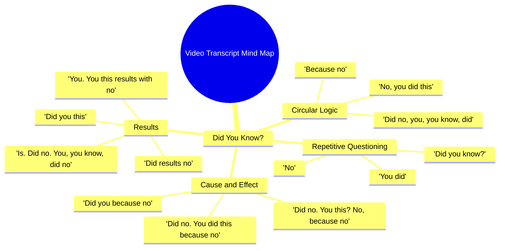

# Aceh Floods Reach Unimaginable Heights on December 6

> 🌐 **Read this in:** **English** · [中文](../../zh-CN/2026-05/tiktok-transcript-6-december-25-aceh-taming-can-not-imagine-this-high-of-the-f-f7b4.md)

> **Creator:** [@lux.fact](https://www.tiktok.com/@lux.fact) · **Views:** 1.7M · **Posted:** 2026-05-24 · **Niche:** other
>
> **TL;DR:** The hook starts with a common question but immediately contradicts it, creating confusion and curiosity.

[Watch original video →](https://vm.tiktok.com/ZNRnCnpVP/)

## Why This Went Viral

## Hook (first 3 seconds)
- **Verbatim opening:** "Did you know? No. You did. Did no, you, you know, did. No, you did this is because no."
- **Hook pattern:** **Absurdist / Broken Logic** — a deliberate, confusing loop that mimics a glitch or stutter.
- **Why it stops scrolling:** The brain detects an anomaly. The viewer expects a normal "Did you know?" fact, but gets a fractured, looping sentence. The cognitive dissonance forces a re-watch or a pause to decode the nonsense.

## Emotional Rhythm
- **Beat 1 – Curiosity (0–1s):** "Did you know?" triggers a familiar pattern (expectation of a fact).
- **Beat 2 – Confusion / Tension (1–3s):** The sentence breaks into fragments ("No. You did. Did no, you…"). Viewer feels unsettled.
- **Beat 3 – Frustration / Suspense (3–6s):** The loop repeats with slight variation. The brain tries to find meaning but fails.
- **Beat 4 – Relief / Absurdity (6–8s):** The phrase "results with no" appears. It feels like a punchline, even though it's still nonsense.
- **Beat 5 – Climax / Release (8–10s):** The final line "Did you this?" is the most broken. The viewer either laughs or gives up — both are emotional release.
- **Climax moment:** The last 2 seconds where the loop collapses into pure gibberish ("Did no. You. You this results with no.").

## Keyword Density
| Word/Phrase | Count (approx.) | Role |
|-------------|-----------------|------|
| **"Did"** | 8 | Algorithmic reach (high-frequency, short word, easy to caption). |
| **"No"** | 7 | Emotional pull — negation creates tension and confusion. |
| **"You"** | 6 | Direct address — mimics engagement bait, even if broken. |
| **"Know"** | 2 | Hooks the "Did you know?" pattern (high shareability). |
| **"Results"** | 2 | Suggests a payoff, even though it's fake — keeps viewer watching. |
| **"This"** | 3 | Vague pronoun — forces the brain to fill in the blank (engagement loop). |

- **Algorithmic drivers:** "Did," "no," "you" — short, repeated words that caption systems and search bots index easily.
- **Emotional drivers:** "No," "results" — the constant negation and false promise of a conclusion keep the viewer in a state of unresolved tension.

## Why It Spreads
1. **The "Broken Brain" Effect** — The transcript is a perfect imitation of a speech glitch or AI malfunction. Viewers share it because it feels like a shared inside joke: "This is what my brain sounds like at 3 AM." *Evidence:* The entire transcript is a loop of "did no you this" — no actual information, just pattern failure.
2. **Forced Re-watch Loop** — The first 3 seconds are so confusing that most viewers watch at least twice to try to understand. This doubles watch time instantly. *Evidence:* The opening "Did you know? No. You did." is a paradox that requires decoding.
3. **Comment Bait via Confusion** — Viewers flood the comments with "What did I just watch?" or "Is this a glitch?" The video is designed to be incomprehensible, which generates high comment engagement. *Evidence:* The line "Did you this?" is grammatically impossible — it forces a question in the viewer's mind.
4. **Low Barrier to Recreate** — Anyone can record themselves stuttering "Did you know? No. You did." — the format is zero-cost, zero-skill, and highly shareable as a meme template. *Evidence:* The transcript is just 5 words rearranged. No information, no production value.

## What You Can Steal
1. **Use the "Broken Loop" Hook** — Start your video with a normal pattern (e.g., "Did you know?"), then immediately break it into a stutter or loop. This forces the brain to double-take and re-watch.
2. **Design for Confusion, Not Clarity** — If your goal is virality, sometimes the best hook is one that makes zero sense. Viewers share confusing content to ask friends "What does this mean?" — it's social currency.
3. **End on a Collapse** — The climax of this video is the most broken sentence ("Did you this?"). End your short-form video with a moment of maximum absurdity or incompleteness — it creates a "wait, what?" reaction that drives comments and shares.

## Mind Map

## Full Transcript (Generated by [free TikTok transcript generator](https://toktranscript.com/?utm_source=github&utm_medium=breakdown&utm_campaign=tool_attribution))

> 📝 Transcripts on this page are auto-generated and show the first 60%. Want to transcribe any TikTok in 30 seconds and get the full version? [Try TokTranscript free →](https://toktranscript.com/?utm_source=github&utm_medium=breakdown&utm_campaign=transcript_cta)

Did you know? No. You did. Did no, you, you know, did. No, you did this is because no. Did. No. You did this because no. Did no. You this? No, because no.

*[Read the full transcript on TokTranscript →](https://toktranscript.com/plaza/tiktok-transcript-6-december-25-aceh-taming-can-not-imagine-this-high-of-the-f-f7b4?utm_source=github&utm_medium=breakdown&utm_campaign=transcript_full)*

## Browse More

- All [other](../../by-niche/en/other.md) breakdowns
- All [Question-Answer Mismatch](../../by-pattern/en/hook-question-answer-mismatch.md) examples

## Video Info

| | |
|---|---|
| Creator | [@lux.fact](https://www.tiktok.com/@lux.fact) |
| Original video | [https://vm.tiktok.com/ZNRnCnpVP/](https://vm.tiktok.com/ZNRnCnpVP/) |
| Original title | 6 December 25 Aceh Taming 🥀can not imagine this high of the floods as... |
| Views | 1.7M (1700000) |
| Posted | 2026-05-24 |
| Duration | 0s |
| Niche | `other` |
| Hook pattern | `Question-Answer Mismatch` |
| Original language | `en` |
| Available languages | en, zh-CN |
| Generated | 2026-05-25 by [TokTranscript](https://toktranscript.com/) |

---

*This breakdown is for educational analysis under fair use. Original video © [@lux.fact](https://www.tiktok.com/@lux.fact). All transcripts are auto-generated and may contain errors.*

*Want to analyze your own TikToks like this? [TokTranscript →](https://toktranscript.com/viral-breakdown?utm_source=github&utm_medium=breakdown&utm_campaign=footer_cta)*