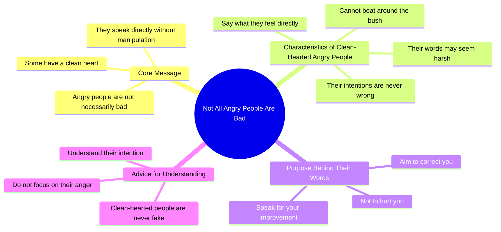

# Not Everyone Who Gets Angry Is Bad

> 🌐 **Read this in:** **English** · [中文](../../zh-CN/2026-05/tiktok-transcript-984k-views-453k-reactions-trendingreels-reelitfeelit-hindire-eb72.md)

> **Creator:** [@crowdworkmaayra ](https://www.tiktok.com/@crowdworkmaayra ) · **Views:** 9.1M · **Posted:** 2026-05-30 · **Niche:** other
>
> **TL;DR:** Challenges a common negative assumption about angry people by revealing a hidden positive trait.

[Watch original video →](https://www.facebook.com/share/r/1Ly8HAyAvA/?mibextid=wwXIfr)

## Why This Went Viral

## Hook (first 3 seconds)
- **Verbatim opening line:** "हर गुस्सा करने वाला इंसान बुरा नहीं होता" (Every angry person is not bad)
- **Hook pattern:** Bold claim + contrast (angry ≠ bad)
- **Why it stops scrolling:** It flips a universal negative assumption about anger. Viewers who identify as "angry but good-hearted" instantly feel seen, and those who judge angry people feel challenged — both reactions force a pause.

## Emotional Rhythm
1. **Curiosity + validation** (0–3s): The claim that anger doesn't equal badness creates intrigue for anyone who's felt misunderstood.
2. **Tension** (3–8s): "Some are angry but have clean hearts... they can't beat around the bush" — builds empathy for blunt people.
3. **Resonance** (8–12s): "They say what they feel directly, so their words seem harsh" — viewers who are direct communicators feel personally described.
4. **Twist/climax** (12–15s): "They don't speak to hurt you, they speak to correct you" — reframes anger as care, creating an emotional pivot.
5. **Resolution** (15–18s): "Don't look at their anger, understand their intention" — delivers a memorable, quotable lesson.
6. **Final resonance** (18–20s): "A clean-hearted person is never fake" — closes with a strong, affirming statement.

## Keyword Density
| Keyword/Phrase | Count (approx.) | Driver |
|---|---|---|
| गुस्सा / गुस्से (anger/angry) | 4 | Algorithmic — high-search emotional keyword |
| दिल का साफ (clean-hearted) | 3 | Emotional pull — defines the core identity |
| नियत (intention) | 2 | Emotional pull — reframes judgment |
| बोलते / बोल देते (speak/say directly) | 2 | Emotional pull — relatable trait |
| बुरा / बुरी (bad) | 2 | Contrast hook — algorithmic + emotional |
| सच (truth) | 1 | Emotional pull — authority signal |
| फेक (fake) | 1 | Emotional pull — modern slang, high resonance |

**Algorithmic drivers:** "गुस्सा" and "बुरा" are high-volume Hindi keywords. **Emotional drivers:** "दिल का साफ" and "नियत" create identity-based resonance that fuels comments and shares.

## Why It Spreads
1. **Identity validation for a misunderstood group** — "Some angry people have clean hearts" directly validates the self-image of blunt, hot-tempered individuals. They share it as a personal badge.
2. **Reframing creates a teachable moment** — "Don't look at their anger, understand their intention" turns a common flaw into a virtue. Viewers share this as "wisdom" to others, making them feel insightful.
3. **Universal relationship conflict hook** — Almost everyone knows someone they've judged as "just angry." The video offers a new lens, triggering shares in friend groups and family chats.
4. **Short, rhythmic, quotable structure** — Lines like "जो दिल का साफ होता है वो फेक नहीं होता" are easily memorized and reposted as statuses or captions.
5. **High emotional contrast in 20 seconds** — Moves from "anger is bad" to "anger is love" in under 20 seconds. This emotional whiplash makes it more memorable and share-worthy.

## What You Can Steal
1. **Flip a negative trait into a virtue** — Pick a commonly disliked behavior (stubbornness, shyness, overthinking) and reframe it as a hidden strength. The contrast hook works because it challenges existing beliefs.
2. **End with a one-liner that sounds like a proverb** — The final line "जो दिल का साफ होता है वो फेक नहीं होता" is simple, rhyming, and quotable. Craft a closing line that could be a WhatsApp status.
3. **Use "you" language to create personal stakes** — The entire script addresses "you" (your intention, your anger, your heart). This makes viewers feel the video is speaking directly to them, increasing engagement and saves.

## Mind Map

## Full Transcript (Generated by [try this transcription tool](https://toktranscript.com/?utm_source=github&utm_medium=breakdown&utm_campaign=tool_attribution))

> 📝 Transcripts on this page are auto-generated and show the first 60%. Want to transcribe any TikTok in 30 seconds and get the full version? [Try TokTranscript free →](https://toktranscript.com/?utm_source=github&utm_medium=breakdown&utm_campaign=transcript_cta)

हर गुष्सा करने वाला इंसान बुरा नहीं होता कुछ लोग गुष्से वाले जरूर होते हैμं पर दिल के बहुत साफ होते हैं उन्हें बाते गुमा फिरा करना नहीं आता जो महसूस करते हैं सीधा बोल देते हैं इसलिए उनकी बाते बुरी लग जाती हैं पर सच ये है उनकी नियत कभी गल

*[Read the full transcript on TokTranscript →](https://toktranscript.com/plaza/tiktok-transcript-984k-views-453k-reactions-trendingreels-reelitfeelit-hindire-eb72?utm_source=github&utm_medium=breakdown&utm_campaign=transcript_full)*

## Browse More

- All [other](../../by-niche/en/other.md) breakdowns
- All [Contrasting Assumption](../../by-pattern/en/hook-contrasting-assumption.md) examples

## Video Info

| | |
|---|---|
| Creator | [@crowdworkmaayra ](https://www.tiktok.com/@crowdworkmaayra ) |
| Original video | [https://www.facebook.com/share/r/1Ly8HAyAvA/?mibextid=wwXIfr](https://www.facebook.com/share/r/1Ly8HAyAvA/?mibextid=wwXIfr) |
| Original title | 984K views · 453K reactions | “जो सीधा बोलता है… वो गलत नहीं होता…” #trendingreels #reelitfeelit #hindireels #emotionalreels #lifetruth | crowdworkmaayra |
| Views | 9.1M (9054945) |
| Posted | 2026-05-30 |
| Duration | 0s |
| Niche | `other` |
| Hook pattern | `Contrasting Assumption` |
| Original language | `en` |
| Available languages | en, zh-CN |
| Generated | 2026-05-31 by [TokTranscript](https://toktranscript.com/) |

---

*This breakdown is for educational analysis under fair use. Original video © [@crowdworkmaayra ](https://www.tiktok.com/@crowdworkmaayra ). All transcripts are auto-generated and may contain errors.*

*Want to analyze your own TikToks like this? [free TikTok transcript generator →](https://toktranscript.com/viral-breakdown?utm_source=github&utm_medium=breakdown&utm_campaign=footer_cta)*