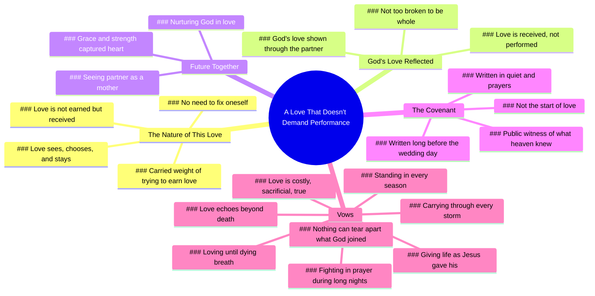

# A Love That Sees and Chooses Me

> 🌐 **Read this in:** **English** · [中文](../../zh-CN/2026-05/tiktok-transcript-a-public-witness-of-what-heaven-already-knew-7ab7.md)

> **Creator:** [@carew_ellington](https://www.tiktok.com/@carew_ellington) · **Views:** 26.4M · **Posted:** 2026-05-27 · **Niche:** other
>
> **TL;DR:** Opens with a deeply personal and universally relatable confession of self-acceptance through love.

[Watch original video →](https://www.tiktok.com/@carew_ellington/video/7553732472681401631?is_from_webapp=1&sender_device=pc&web_id=7632039376462595606)

## Why This Went Viral

## Hook (first 3 seconds)
- **Verbatim opening:** "I knew I loved you the moment I realized I didn't have to fix myself to be loved by you."
- **Hook pattern:** Emotional contrast (self-doubt vs. unconditional acceptance) + intimate confession
- **Why it stops scrolling:** It opens with a raw, vulnerable realization that flips the typical "I love you because you're perfect" narrative. Viewers who have struggled with self-worth or felt "too broken" for love instantly feel seen. The word "fix" triggers a deep emotional wound many carry, making them pause to hear the resolution.

## Emotional Rhythm
- **Beat 1 – Vulnerability/Relief (0–5s):** "I didn't have to fix myself" – releases tension from a lifetime of performance anxiety
- **Beat 2 – Resonant Pain (5–10s):** "carried the weight of trying to earn what could never be earned" – universalizes the struggle
- **Beat 3 – Safety/Resonance (10–20s):** "love that sees me, chooses me, and stays" – emotional payoff; viewer feels the safety
- **Beat 4 – Spiritual Elevation (20–30s):** "God has shown me that his love is not earned but received" – shifts from romantic to sacred, deepening resonance
- **Beat 5 – Anticipation/Tenderness (30–40s):** "I can't wait to see you as a mother" – future promise, softens the heart
- **Beat 6 – Covenant Climax (40–55s):** "In my heart, I married you a long time ago" – twist: the wedding is a public witness, not the start. This is the climax.
- **Beat 7 – Sacrificial Vow (55s–end):** "I vow to give my life to you... costly sacrificial and true" – highest emotional peak, then gentle landing with "I love you baby"
- **Climax moment:** "Today isn't the start of our love, but a public witness of what heaven already knew." This reframes the entire wedding as a spiritual confirmation, not a beginning.

## Keyword Density
| Keyword/Phrase | Frequency | Role |
|----------------|-----------|------|
| **love** | 12+ | Emotional pull – the central theme, triggers both romantic and spiritual resonance |
| **earned / not earned** | 3 | Algorithmic reach – high engagement on "unconditional love" content; also emotional contrast |
| **covenant** | 3 | Algorithmic reach – religious/spiritual keywords boost discoverability in faith communities |
| **saw / sees / chooses** | 3 | Emotional pull – "being seen" is a core human desire; drives shares from those seeking validation |
| **broken / whole** | 2 | Emotional pull – "too broken to be whole" is a viral-worthy vulnerability tagline |
| **God / heaven** | 4 | Algorithmic reach – faith-based content has high shareability within Christian audiences |
| **long before / already knew** | 3 | Emotional pull – "destiny" language triggers romantic idealization and shareability |
| **vow / sacrifice / costly** | 3 | Emotional pull – "costly love" is rare in modern content; stands out as authentic |

## Why It Spreads
1. **The "Unconditional Acceptance" Trigger** – "I didn't have to fix myself" is the single most shareable line. Anyone who has felt unworthy of love will send this to their partner or best friend. It bypasses cynicism by speaking directly to the fear of being "too much."
2. **Spiritual Framing Creates a Second Audience** – By weaving God and covenant into the love story, the video appeals to both secular romantics and faith-based viewers. The line "what God has joined together nothing can tear apart" is a ready-made caption for Christian couples, driving shares in church groups and wedding planning communities.
3. **The "Already Married" Twist** – "In my heart, I married you a long time ago" reframes the wedding as a public witness, not a beginning. This is a fresh take on a saturated format (wedding vows). It surprises viewers who expected a standard "I promise to love you" speech, making them more likely to comment or save.
4. **Repetition of Key Phrases** – "I can't wait to see you as a mother" is said twice. "Long before this day, before these vows, before the rings" is echoed. This creates a hypnotic, prayer-like rhythm that feels sacred and intentional, encouraging rewatching and saving.
5. **The "Costly Love" Contrast** – In an era of "easy come, easy go" relationships, "my love will not be passive but costly sacrificial and true" is a rarity. It signals depth and commitment, which viewers crave and will share as a standard for their own relationships.

## What You Can Steal
1. **Open with a Vulnerability Hook, Not a Compliment** – Instead of "I love you because you're beautiful," start with a confession of personal brokenness. "I knew I loved you when I didn't have to fix myself" is 10x more shareable than any generic praise. Apply this to any relationship content: lead with what the other person healed in you.
2. **Use the "Heaven Already Knew" Structure** – Frame your love story as a destiny revealed, not a beginning. In any video (proposal, anniversary, even friendship), say: "This moment isn't the start. It's the public witness of what was already true." This adds weight and spiritual depth instantly.
3. **Repeat Your Most Emotional Line Twice** – The speaker says "I can't wait to see you as a mother" twice. In short-form, repeating a key line with slightly different pacing makes it land harder. Pick your most vulnerable sentence and deliver it twice — once softly, once with conviction. It signals that this line matters most.

## Mind Map

## Full Transcript (Generated by [TokTranscript.com](https://toktranscript.com/?utm_source=github&utm_medium=breakdown&utm_campaign=tool_attribution))

> 📝 Transcripts on this page are auto-generated and show the first 60%. Want to transcribe any TikTok in 30 seconds and get the full version? [Try TokTranscript free →](https://toktranscript.com/?utm_source=github&utm_medium=breakdown&utm_campaign=transcript_cta)

I knew I loved you the moment I realized I didn't have to fix myself to be loved by you. For so long I carried the weight of trying to earn what could never be earned. But with you, I found a love that doesn't demand I perform. A love that sees me, chooses me, and stays. Through you, God has shown me that his love is not earned but received, and that I am not too broken to be whole. I can't wait to see you as a mother. I can't wait to see you as a mother. To watch you nurture God in love. With the same grace and strength that first captured my heart. To watch you nurture God in love. With the same grace and strength that first captured my heart. And I believe in your heart you married me too. In my heart, I married you a long time ago. Long before this day, before these vows, before the rings, there was a covenant being written. A covenant being written in the quiet, in the prayers.

*[Read the full transcript on TokTranscript →](https://toktranscript.com/plaza/tiktok-transcript-a-public-witness-of-what-heaven-already-knew-7ab7?utm_source=github&utm_medium=breakdown&utm_campaign=transcript_full)*

## Browse More

- All [other](../../by-niche/en/other.md) breakdowns
- All [Relatable vulnerability + unexpected twist](../../by-pattern/en/hook-relatable-vulnerability-unexpected-twist.md) examples

## Video Info

| | |
|---|---|
| Creator | [@carew_ellington](https://www.tiktok.com/@carew_ellington) |
| Original video | [https://www.tiktok.com/@carew_ellington/video/7553732472681401631?is_from_webapp=1&sender_device=pc&web_id=7632039376462595606](https://www.tiktok.com/@carew_ellington/video/7553732472681401631?is_from_webapp=1&sender_device=pc&web_id=7632039376462595606) |
| Original title | A public witness of what heaven already knew… |
| Views | 26.4M (26400000) |
| Posted | 2026-05-27 |
| Duration | 0s |
| Niche | `other` |
| Hook pattern | `Relatable vulnerability + unexpected twist` |
| Original language | `en` |
| Available languages | en, zh-CN |
| Generated | 2026-05-28 by [TokTranscript](https://toktranscript.com/) |

---

*This breakdown is for educational analysis under fair use. Original video © [@carew_ellington](https://www.tiktok.com/@carew_ellington). All transcripts are auto-generated and may contain errors.*

*Want to analyze your own TikToks like this? [analyze your own TikToks →](https://toktranscript.com/viral-breakdown?utm_source=github&utm_medium=breakdown&utm_campaign=footer_cta)*