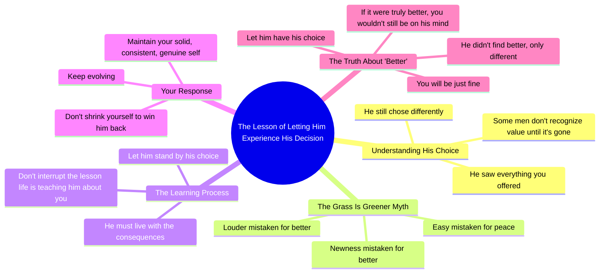

# Let Him Fully Experience That Decision

> 🌐 **Read this in:** **English** · [中文](../../zh-CN/2026-05/tiktok-transcript-baby-let-him-experience-that-decision-fully-nopryorwarning-a115.md)

> **Creator:** [@thearielpryor](https://www.tiktok.com/@thearielpryor) · **Views:** 6.3M · **Posted:** 2026-05-25 · **Niche:** other
>
> **TL;DR:** Poses a relatable scenario and immediately offers a counterintuitive action, creating curiosity.

[Watch original video →](https://www.tiktok.com/@thearielpryor/video/7616817814384446750?is_from_webapp=1&sender_device=pc&web_id=7569766293202830868)

## Why This Went Viral

## Hook (first 3 seconds)
- **Verbatim opening line:** "If he looked at everything you brought to the table and still chose different, let him experience that decision fully."
- **Hook pattern:** Bold claim + direct address ("you") + implied contrast (what you brought vs. what he chose)
- **Why it stops scrolling:** It names a painful, universal experience (being undervalued in a relationship) in a single sentence, creating instant emotional resonance. The phrasing "let him experience that decision fully" feels like permission-giving, not advice — which triggers a "tell me more" response.

## Emotional Rhythm
- **Beat 1 (0–3s):** Validation — "If he looked at everything you brought…" — viewer feels seen.
- **Beat 2 (3–8s):** Tension — "Some men don't understand value until they lose it" — introduces conflict.
- **Beat 3 (8–15s):** Frustration release — "They think louder means better… easier means peace" — naming the opponent's flawed logic.
- **Beat 4 (15–20s):** Elevated wisdom — "You don't interrupt the lesson that god is teaching somebody about you" — spiritual/authoritative twist.
- **Beat 5 (20–28s):** Empowerment shift — "Let him stand on that. Meanwhile, you keep evolving." — turns pain into agency.
- **Climax (28–34s):** The twist — "He did not find better. He found different." — re-frames the entire narrative, delivering a satisfying mic-drop moment.

## Keyword Density
| Keyword/Phrase | Frequency | Function |
|---|---|---|
| "better" | 4x | Algorithmic (contrast keyword) + emotional (core wound) |
| "different" | 3x | Algorithmic (distinction keyword) + emotional (re-framing) |
| "let him" | 3x | Emotional pull — permission-giving, detachment |
| "value" | 2x | Emotional — core self-worth concept |
| "evolve / evolving" | 2x | Emotional + aspirational — growth mindset |
| "you don't lose" | 1x | Viral punchline — absolute statement |
| "lesson" | 1x | Algorithmic (wisdom content) + emotional |

- **Algorithmic drivers:** "better," "different," "lesson" — these are high-search-volume relationship terms that platforms surface.
- **Emotional drivers:** "let him," "value," "evolve" — these trigger identity attachment and shareability (viewers tag friends who "need to hear this").

## Why It Spreads
1. **The re-frame twist is shareable.** The line "He did not find better. He found different." is a self-contained viral quote — viewers screenshot it, repost it, or text it to friends. It flips a painful narrative into a power move.
2. **Permission-giving language drives engagement.** "Let him experience that decision fully" and "let him stand on that" feel like a coach giving you permission to stop chasing. This triggers comments like "I needed to hear this" and saves.
3. **Spiritual authority builds trust.** "The lesson that god is teaching somebody about you" adds a higher-stakes frame. It makes the advice feel unarguable, increasing the likelihood of shares in faith-based communities.
4. **The "you don't lose" absolute creates debate.** The claim "If you were solid, consistent, genuine, you don't lose in a scenario" is intentionally provocative — some viewers will push back in comments, boosting the algorithm.
5. **Universal pain point + specific enemy.** The video names a specific "him" (the man who undervalues you) without being overly gendered, making it relatable to anyone who's felt rejected. The enemy is clear, so the advice feels targeted.

## What You Can Steal
1. **The "re-frame" structure.** Take a common painful belief (e.g., "I wasn't good enough") and flip it into an empowering truth ("You weren't the wrong choice — you were the different choice"). This creates a shareable mental shift.
2. **Permission-giving phrasing.** Instead of "you should leave him," say "let him experience that decision fully." The "let him" frame removes pressure and makes the viewer feel in control.
3. **The "god lesson" authority layer.** If your niche allows it, add a spiritual or universal wisdom line near the middle. It elevates the content from "opinion" to "truth" and increases trust-based saves and shares.

## Mind Map

## Full Transcript (Generated by [free TikTok transcript generator](https://toktranscript.com/?utm_source=github&utm_medium=breakdown&utm_campaign=tool_attribution))

> 📝 Transcripts on this page are auto-generated and show the first 60%. Want to transcribe any TikTok in 30 seconds and get the full version? [Try TokTranscript free →](https://toktranscript.com/?utm_source=github&utm_medium=breakdown&utm_campaign=transcript_cta)

If he looked at everything you brought to the table and still chose different, let him experience that decision fully. Some men don't understand value until they lose it. They think the grass is greener because it's new. They think louder means better. They think easy means peace. And sometimes the only way they learn is by living it. You don't interrupt the lesson that god is teaching somebody about you. If he thought she was better, okay, cool. Let him stand on that.

*[Read the full transcript on TokTranscript →](https://toktranscript.com/plaza/tiktok-transcript-baby-let-him-experience-that-decision-fully-nopryorwarning-a115?utm_source=github&utm_medium=breakdown&utm_campaign=transcript_full)*

## Browse More

- All [other](../../by-niche/en/other.md) breakdowns
- All [Conditional Challenge](../../by-pattern/en/hook-conditional-challenge.md) examples

## Video Info

| | |
|---|---|
| Creator | [@thearielpryor](https://www.tiktok.com/@thearielpryor) |
| Original video | [https://www.tiktok.com/@thearielpryor/video/7616817814384446750?is_from_webapp=1&sender_device=pc&web_id=7569766293202830868](https://www.tiktok.com/@thearielpryor/video/7616817814384446750?is_from_webapp=1&sender_device=pc&web_id=7569766293202830868) |
| Original title | Baby let him experience that decision fully ! @Nopryorwarning  |
| Views | 6.3M (6300000) |
| Posted | 2026-05-25 |
| Duration | 0s |
| Niche | `other` |
| Hook pattern | `Conditional Challenge` |
| Original language | `en` |
| Available languages | en, zh-CN |
| Generated | 2026-05-26 by [TokTranscript](https://toktranscript.com/) |

---

*This breakdown is for educational analysis under fair use. Original video © [@thearielpryor](https://www.tiktok.com/@thearielpryor). All transcripts are auto-generated and may contain errors.*

*Want to analyze your own TikToks like this? [TokTranscript.com →](https://toktranscript.com/viral-breakdown?utm_source=github&utm_medium=breakdown&utm_campaign=footer_cta)*