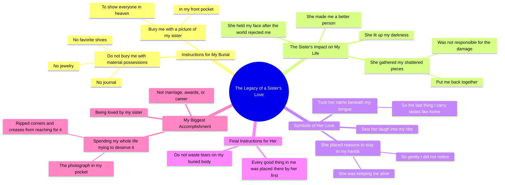

# Bury Me With a Picture of My Sister in My Front Pocket

> 🌐 **Read this in:** **English** · [中文](../../zh-CN/2026-05/tiktok-transcript-bury-me-with-a-picture-of-my-sister-in-my-front-pocket-inspo-4ad4.md)

> **Creator:** [@hayleygracepoetry](https://www.tiktok.com/@hayleygracepoetry) · **Views:** 3.2M · **Posted:** 2026-05-29 · **Niche:** entertainment
>
> **TL;DR:** The hook subverts expectations by listing typical sentimental items then immediately rejecting them, creating curiosity.

[Watch original video →](https://www.tiktok.com/t/ZP8pwYdpY/)

## Why This Went Viral

## Hook (first 3 seconds)
- **Verbatim opening line:** "When I die, do not bury me with my jewelry or my journal or my favourite pair of shoes."
- **Hook pattern:** **Contrast** (rejection of expected sentimental objects) + **Scene-setting** (death as a narrative frame)
- **Why it stops scrolling:** The abrupt, morbid premise ("When I die") plus the unexpected rejection of typical keepsakes ("jewelry... journal... shoes") creates immediate curiosity. The viewer's brain pauses: *What would they want instead?* That gap forces a second of attention.

## Emotional Rhythm
- **Beat 1 — Curiosity + Tension:** "When I die, do not bury me with..." (audience leans in, confused)
- **Beat 2 — Emotional anchor (Resonance):** "...with a picture of my sister in my front pocket" (specific, personal, relatable sibling bond)
- **Beat 3 — Sensory intimacy:** "Sew the soundtrack of her laugh... tuck her name beneath my tongue" (visceral, poetic, elevates from statement to feeling)
- **Beat 4 — Vulnerability + Pain:** "held my face in her hands after the world had already spit me back out" (shared trauma, dark backstory hinted)
- **Beat 5 — Redemption:** "she gathered every shattered piece of me and put me back together" (emotional payoff)
- **Beat 6 — Twist/Climax:** "tell her not to waste her tears on the body that they bury — because every good thing they ever loved about me was something she placed there first" (reversal: the speaker owes their entire identity to her)
- **Beat 7 — Final emotional punch (Resonance + Resolution):** "my biggest accomplishment was being loved by my sister and spending my whole life trying to deserve it" (humble, aspirational, tear-jerking)

## Keyword Density
| Word/Phrase | Frequency (approx.) | Algorithmic Reach Driver | Emotional Pull Driver |
|-------------|---------------------|--------------------------|------------------------|
| **sister** | 6 | High (relatable family keyword) | High (core emotional anchor) |
| **die / died / bury / earth / heaven** | 8 | High (mortality = high engagement) | High (universal, serious tone) |
| **me / my** | 20+ | Low (generic) | High (personal, confessional) |
| **tell them / tell her** | 6 | Medium (direct address = shareability) | High (creates intimacy, listener feels spoken to) |
| **loved / love** | 4 | High (love = evergreen emotional keyword) | High (core theme) |
| **accomplishment** | 2 | Medium (self-improvement niche) | High (contrasts material vs. relational success) |
| **home / taste like home** | 1 | Low (poetic, not searchable) | High (sensory, nostalgic) |
| **shattered / broken / damage** | 3 | Medium (mental health niche) | High (vulnerability, shared pain) |

**Key insight:** "Sister" + "die/bury/heaven" + "loved" form the viral trifecta — family + mortality + love. These three clusters are algorithmically favored (high share rate, high comment likelihood) and emotionally potent.

## Why It Spreads
1. **Universal emotional hook disguised as a personal poem.** The transcript reads like a eulogy for a sibling, but the emotion is so specific it feels universal. Anyone with a close sibling (or who wishes they had one) immediately shares it. *Concrete line:* "she gathered every shattered piece of me and put me back together."
2. **The twist flips the expected narrative.** Most "when I die" content is about the speaker's life. Here, the speaker credits their entire goodness to the sister. That reversal is surprising and memorable — it forces a re-watch. *Concrete line:* "every good thing they ever loved about me was something she placed there first."
3. **High emotional stakes + low barrier to comment.** The poem invites people to tag their own siblings. Comments flood with "tag your sister" or "I'm crying." That drives engagement signals. *Concrete line:* "Let me point to the photograph crumpled in my pocket... let me say my biggest accomplishment was being loved by my sister."
4. **Poetic rhythm + short-form pacing.** The transcript uses repetition ("tell them... tell them... tell her...") and short, punchy clauses. This works perfectly for TikTok/Reels — each line can be a new visual cut, keeping retention high. *Concrete line:* "Tell them she lit the world up for me after I had already condemned to the darkness."
5. **Mortality + gratitude = shareable grief.** Videos about death that end in gratitude (not despair) get shared as "healing content." People send them to friends going through loss. *Concrete line:* "tell her not to waste her tears on the body that they bury."

## What You Can Steal
1. **The "rejection + replacement" hook pattern.** Open by rejecting a common expectation ("do not bury me with...") then immediately offer a surprising alternative ("bury me with a picture of my sister"). This pattern works for any topic: "Don't tell me to calm down — tell me why you're angry."
2. **The "reverse credit" emotional twist.** Instead of listing your own achievements, credit someone else for them. This creates humility and emotional depth. In a video about a mentor, partner, or friend, say: "Every success I have was something they placed there first."
3. **Sensory specificity as emotional glue.** "Sew the soundtrack of her laugh in the center of my ribs" — use one concrete, slightly surreal sensory detail (sound, smell, touch) to make an abstract emotion feel real. In your next video, pick one sense and describe one memory through it.

## Mind Map

## Full Transcript (Generated by [TokTranscript](https://toktranscript.com/?utm_source=github&utm_medium=breakdown&utm_campaign=tool_attribution))

> 📝 Transcripts on this page are auto-generated and show the first 60%. Want to transcribe any TikTok in 30 seconds and get the full version? [Try TokTranscript free →](https://toktranscript.com/?utm_source=github&utm_medium=breakdown&utm_campaign=transcript_cta)

When I die, do not bury me with my jewelry or my journal or my favourite pair of shoes. When I die, bury me with a picture of my sister in my front pocket so I can show everyone in heaven who made me a better person. Sew the soundtrack of her laugh in the center of my ribs and tuck her name beneath my tongue so the last thing I carry with me can taste like home. Tell them this is the girl who held my face in her hands after the world had already spit me back out. Tell them she lit the world up for me after I had already condemned to the darkness. Tell them she gathered every shattered piece of me and put me back together, even when she wasn't responsible for the damage. Tell them she is the reason I had many tomorrows. Tell them she placed little reasons to stay into the palms of my hands so gently I did not even realise she was keeping me alive.

*[Read the full transcript on TokTranscript →](https://toktranscript.com/plaza/tiktok-transcript-bury-me-with-a-picture-of-my-sister-in-my-front-pocket-inspo-4ad4?utm_source=github&utm_medium=breakdown&utm_campaign=transcript_full)*

## Browse More

- All [entertainment](../../by-niche/en/entertainment.md) breakdowns
- All [Unexpected Reversal](../../by-pattern/en/hook-unexpected-reversal.md) examples

## Video Info

| | |
|---|---|
| Creator | [@hayleygracepoetry](https://www.tiktok.com/@hayleygracepoetry) |
| Original video | [https://www.tiktok.com/t/ZP8pwYdpY/](https://www.tiktok.com/t/ZP8pwYdpY/) |
| Original title | bury me with a picture of my sister in my front pocket…🌷🤍 inspo: @hea... |
| Views | 3.2M (3200000) |
| Posted | 2026-05-29 |
| Duration | 0s |
| Niche | `entertainment` |
| Hook pattern | `Unexpected Reversal` |
| Original language | `en` |
| Available languages | en, zh-CN |
| Generated | 2026-05-30 by [TokTranscript](https://toktranscript.com/) |

---

*This breakdown is for educational analysis under fair use. Original video © [@hayleygracepoetry](https://www.tiktok.com/@hayleygracepoetry). All transcripts are auto-generated and may contain errors.*

*Want to analyze your own TikToks like this? [try this transcription tool →](https://toktranscript.com/viral-breakdown?utm_source=github&utm_medium=breakdown&utm_campaign=footer_cta)*