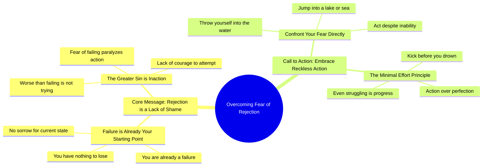

# Today's Advice: Fear of Rejection Is Lack of Shame

> 🌐 **Read this in:** **English** · [中文](../../zh-CN/2026-05/tiktok-transcript-consejo-de-hoy-5a21.md)

> **Creator:** [@locodelaselva504](https://www.tiktok.com/@locodelaselva504) · **Views:** 3.1M · **Posted:** 2026-05-22 · **Niche:** other
>
> **TL;DR:** Directly challenges the viewer's self-perception with an aggressive, unexpected twist.

[Watch original video →](https://vt.tiktok.com/ZSxUYptN4/)

## Why This Went Viral

## Hook (first 3 seconds)
- **Verbatim opening line:** "Your fear of rejection is pure lack of shame."
- **Hook pattern:** Bold claim + insult (direct confrontation).
- **Why it stops scrolling:** The phrase "pure lack of shame" reframes a common fear as a character flaw. It’s unexpected, aggressive, and challenges the viewer’s self-perception — forcing an immediate "Wait, what?" reaction.

## Emotional Rhythm
- **Beat 1 – Shock/Confrontation:** "Your fear of rejection is pure lack of shame. Son of a bitch." — Viewer is jolted.
- **Beat 2 – Contradiction/Curiosity:** "You have no sorrow? You do nothing for fear of failing." — Creates cognitive dissonance (fear vs. shame).
- **Beat 3 – Escalation/Insult:** "Cerote. Maje. Culero." — Raw, untranslated Spanish insults add authenticity and tension.
- **Beat 4 – Twist/Reframe:** "Worse than failing is not even not trying." — Shifts from shame to action.
- **Beat 5 – Climax/Command:** "Throw yourself in the water, you son of a bitch. Throw yourself in a lake. Throw yourself in the sea." — Metaphor for taking risk, delivered as a violent order.
- **Beat 6 – Resolution/Relief:** "Even if you can't swim, but at least before you drown you're going to be kicking. Potatoes." — Dark humor ("potatoes") releases tension and makes the message memorable.

## Keyword Density
- **"Fear" / "afraid"** — repeated 3 times (drives algorithmic reach via high-arousal emotion)
- **"Shame" / "lack of shame"** — repeated 2 times (emotional pull: reframes fear as weakness)
- **"Failure" / "failing"** — repeated 3 times (algorithmic reach + universal pain point)
- **"Throw yourself"** — repeated 3 times (call to action, high memorability)
- **"Son of a bitch" / "Culero" / "Cerote"** — repeated 4 times (emotional pull: shock, authenticity, rawness)
- **"Nothing to lose"** — repeated 2 times (emotional pull: reframes risk as freedom)
- **"Kicking" / "potatoes"** — repeated 2 times (emotional pull: absurdist humor, makes the metaphor stick)

## Why It Spreads
1. **Aggressive reframe of a universal pain point** — "Your fear of rejection is pure lack of shame" flips a common fear into a moral failing. Viewers share it because it feels like a truth they needed to hear (or a wake-up call).
2. **Code-switching + raw language** — The mix of Spanish insults ("Cerote. Maje. Culero.") and English creates authenticity and signals "no filter." This triggers higher engagement (comments, saves, shares) because it feels real, not scripted.
3. **Climactic metaphor with absurd twist** — "Throw yourself in the water… even if you can't swim, but at least before you drown you're going to be kicking. Potatoes." The unexpected "potatoes" makes the metaphor sticky and shareable — it’s both violent and funny.
4. **High-arousal emotional rollercoaster** — Shock → insult → reframe → command → dark humor. This sequence keeps viewers watching to the end (high retention), which triggers the algorithm to push it further.
5. **Direct call to action embedded in insult** — "Hartate. Your mother. Throw yourself in the water." The command is impossible to ignore. It forces a reaction (comment, save, or rewatch) — all signals for virality.

## What You Can Steal
1. **Open with a reframe, not a question.** Instead of "Are you afraid of rejection?" say "Your fear of rejection is pure lack of shame." The bold claim pattern triggers immediate attention.
2. **Use code-switching or raw language for authenticity.** Even one untranslated word or a mild insult in your native language signals "no filter" and increases emotional resonance.
3. **End with an absurd, memorable metaphor.** Don’t just say "take risks." Say "throw yourself in the water even if you can't swim — at least you'll be kicking. Potatoes." The weird detail makes it stick.

## Mind Map

## Full Transcript (Generated by [TokTranscript.com](https://toktranscript.com/?utm_source=github&utm_medium=breakdown&utm_campaign=tool_attribution))

> 📝 Transcripts on this page are auto-generated and show the first 60%. Want to transcribe any TikTok in 30 seconds and get the full version? [Try TokTranscript free →](https://toktranscript.com/?utm_source=github&utm_medium=breakdown&utm_campaign=transcript_cta)

Your fear of rejection is pure lack of shame. Son of a bitch. You have no sorrow? You do nothing for fear of failing. If you are already a failure. Cerote. Maje. You have nothing to lose. Culero. You don't have shit. Worse than failing is not even not trying. You haven't had the balls to try something.

*[Read the full transcript on TokTranscript →](https://toktranscript.com/plaza/tiktok-transcript-consejo-de-hoy-5a21?utm_source=github&utm_medium=breakdown&utm_campaign=transcript_full)*

## Browse More

- All [other](../../by-niche/en/other.md) breakdowns

## Video Info

| | |
|---|---|
| Creator | [@locodelaselva504](https://www.tiktok.com/@locodelaselva504) |
| Original video | [https://vt.tiktok.com/ZSxUYptN4/](https://vt.tiktok.com/ZSxUYptN4/) |
| Original title | ✨consejo de hoy✨ |
| Views | 3.1M (3100000) |
| Posted | 2026-05-22 |
| Duration | 0s |
| Niche | `other` |
| Original language | `en` |
| Available languages | en, zh-CN |
| Generated | 2026-05-24 by [TokTranscript](https://toktranscript.com/) |

---

*This breakdown is for educational analysis under fair use. Original video © [@locodelaselva504](https://www.tiktok.com/@locodelaselva504). All transcripts are auto-generated and may contain errors.*

*Want to analyze your own TikToks like this? [TokTranscript →](https://toktranscript.com/viral-breakdown?utm_source=github&utm_medium=breakdown&utm_campaign=footer_cta)*