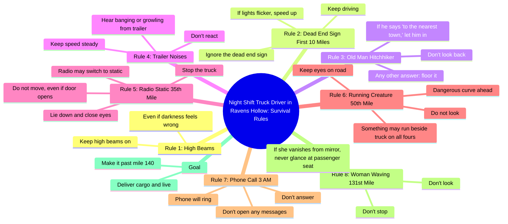

# Night Shift Truck Driver Rules for Surviving Ravens Hollow

> 🌐 **Read this in:** **English** · [中文](../../zh-CN/2026-05/tiktok-transcript-could-you-survive-the-road-tiktokhorror-horror-horrortok-cre-5b01.md)

> **Creator:** [@final.instructions](https://www.tiktok.com/@final.instructions) · **Views:** 18.8M · **Posted:** 2026-05-25 · **Niche:** entertainment
>
> **TL;DR:** Immediately places the viewer in a specific, eerie scenario with a mundane yet ominous job.

[Watch original video →](https://www.tiktok.com/@final.instructions/video/7555298672037154061)

## Why This Went Viral

## Hook (first 3 seconds)
- **Verbatim opening line:** "Congratulations. You've been hired as a night shift truck driver hauling dried meat to a small town in Ravens Hollow, deep in the Nevada desert."
- **Hook pattern:** Scene-setting + direct address ("you") + ominous world-building
- **Why it stops scrolling:** The immediate second-person framing ("you've been hired") creates instant personal stakes. The specific, eerie details ("dried meat," "Ravens Hollow," "Nevada desert") signal a creepy, rule-based survival story — a proven viral format on TikTok and YouTube Shorts.

## Emotional Rhythm
- **Beats:** Curiosity (job offer) → Unease (darkness feels wrong) → Tension (dead end sign) → Fear (flickering lights, speed up) → Suspense (hitchhiker test) → Dread (banging from trailer) → Terror (static, lie down, don't move) → Horror (something runs on all fours) → Paranoia (phone rings, don't answer) → Final spike (woman vanishes, never glance at passenger seat) → Relief/Closure (make it past mile 140, you'll live)
- **Suspense lands:** Every rule introduces a new threat with a specific, actionable instruction — the viewer mentally simulates "what would I do?"
- **Climax moment:** "If she vanishes from the mirror, never glance at the passenger seat." — The twist that the threat is now *inside the vehicle*.
- **Resonance:** The rules feel like a video game or creepypasta, tapping into the shared cultural language of "rules horror."

## Keyword Density
| Keyword/Phrase | Count | Function |
|---|---|---|
| "Rule No." | 8 | Algorithmic structure (clear, scannable list format) |
| "Don't" | 6 | Emotional pull (commands build tension and fear) |
| "Keep" / "Do not" | 5 | Emotional pull (directive, creates urgency) |
| "Mile" | 4 | Algorithmic + emotional (countdown structure drives retention) |
| "Look" / "look back" | 3 | Emotional (forbidden action = primal fear) |
| "Speed up" / "floor it" | 2 | Emotional (action = adrenaline spike) |
| "Door opens" | 1 | Emotional (single image, maximum dread) |
| "Passenger seat" | 1 | Emotional (climax twist, lingers in memory) |

- **Algorithmic drivers:** "Rule No." and numbers (miles, time) create a clear, repeatable format that platforms reward for watch time and completion rate.
- **Emotional pull:** "Don't," "do not," "look back" — negative commands trigger anxiety and anticipation, keeping viewers hooked.

## Why It Spreads
1. **Rule-based format is inherently shareable.** The numbered list ("Rule No. 1… 2… 3…") is a proven template for short-form virality — it creates a promise of completion, and viewers feel compelled to watch until the end to "survive" the story. *Concrete line: "Rule No. 1, keep your high beams on even if the darkness feels wrong."*
2. **Second-person POV ("you") forces immersion.** The viewer is not a passive observer — they are the truck driver. This triggers the psychological "self-reference effect," making the fear feel personal and immediate. *Concrete line: "You've been hired as a night shift truck driver…"*
3. **Escalating stakes with a clear countdown.** Each rule is tied to a specific mile marker or time (10 miles, 35th mile, 50th mile, 3 AM, 131st mile, 140th mile). This creates a ticking clock that drives retention — viewers must watch to "reach mile 140." *Concrete line: "Make it past mile 140 and you'll live to deliver the cargo."*
4. **Twist ending (threat enters the vehicle) rewards re-watches.** The final rule subverts the expectation that the danger is outside. This makes the video "sticky" — viewers re-watch to catch earlier clues, and commenters debate interpretations. *Concrete line: "If she vanishes from the mirror, never glance at the passenger seat."*
5. **Open-ended lore invites user-generated content.** The world (Ravens Hollow, dried meat, the trailer's contents) is never fully explained. This sparks comments like "What's in the trailer?" and "Part 2?" — fueling algorithmic engagement and spawning copycat videos. *Concrete line: "You may hear banging or growling from the trailer."*

## What You Can Steal
1. **Use a numbered rule list as your video's backbone.** It gives viewers a clear reason to stay until the end (completion of the list) and is easy to replicate. Apply it to any high-stakes scenario: "Rules for surviving a haunted house," "Rules for dating my sister," etc.
2. **Write in second-person ("you") from the very first sentence.** It instantly transforms a passive viewer into an active participant. Start with "You've been hired…" or "You wake up in a room…" — never "A man was hired…"
3. **Build a countdown with specific numbers.** Tie each rule to a concrete unit (miles, minutes, floors, days). This creates a psychological "progress bar" that viewers subconsciously track, increasing watch time and completion rate.

## Mind Map

## Full Transcript (Generated by [free TikTok transcript generator](https://toktranscript.com/?utm_source=github&utm_medium=breakdown&utm_campaign=tool_attribution))

> 📝 Transcripts on this page are auto-generated and show the first 60%. Want to transcribe any TikTok in 30 seconds and get the full version? [Try TokTranscript free →](https://toktranscript.com/?utm_source=github&utm_medium=breakdown&utm_campaign=transcript_cta)

Congratulations. You've been hired as a night shift truck driver hauling dried meat to a small town in Ravens Hollow, deep in the Nevada desert. Your pay is good, but to survive the road, you must follow the rules. Rule No. 1, keep your high beams on even if the darkness feels wrong. Rule No. 2, within the first 10 miles, you may see a dead end sign. Ignore it and keep driving. If your lights start to flicker, speed up. Rule No. 3, you may see an old man hitchhiking. If he says to the nearest town, let him in. Any other answer, floor it. Don't look back. Rule No. 4, if you hear banging or growling from the trailer, don't react. Just keep your speed steady. Rule No. 5, by the 35th mile, your radio may suddenly switch to static.

*[Read the full transcript on TokTranscript →](https://toktranscript.com/plaza/tiktok-transcript-could-you-survive-the-road-tiktokhorror-horror-horrortok-cre-5b01?utm_source=github&utm_medium=breakdown&utm_campaign=transcript_full)*

## Browse More

- All [entertainment](../../by-niche/en/entertainment.md) breakdowns
- All [Second-person immersive setup](../../by-pattern/en/hook-second-person-immersive-setup.md) examples

## Video Info

| | |
|---|---|
| Creator | [@final.instructions](https://www.tiktok.com/@final.instructions) |
| Original video | [https://www.tiktok.com/@final.instructions/video/7555298672037154061](https://www.tiktok.com/@final.instructions/video/7555298672037154061) |
| Original title | Could you survive the road? #tiktokhorror #horror #horrortok #creepyp... |
| Views | 18.8M (18800000) |
| Posted | 2026-05-25 |
| Duration | 0s |
| Niche | `entertainment` |
| Hook pattern | `Second-person immersive setup` |
| Original language | `en` |
| Available languages | en, zh-CN |
| Generated | 2026-05-26 by [TokTranscript](https://toktranscript.com/) |

---

*This breakdown is for educational analysis under fair use. Original video © [@final.instructions](https://www.tiktok.com/@final.instructions). All transcripts are auto-generated and may contain errors.*

*Want to analyze your own TikToks like this? [TokTranscript →](https://toktranscript.com/viral-breakdown?utm_source=github&utm_medium=breakdown&utm_campaign=footer_cta)*