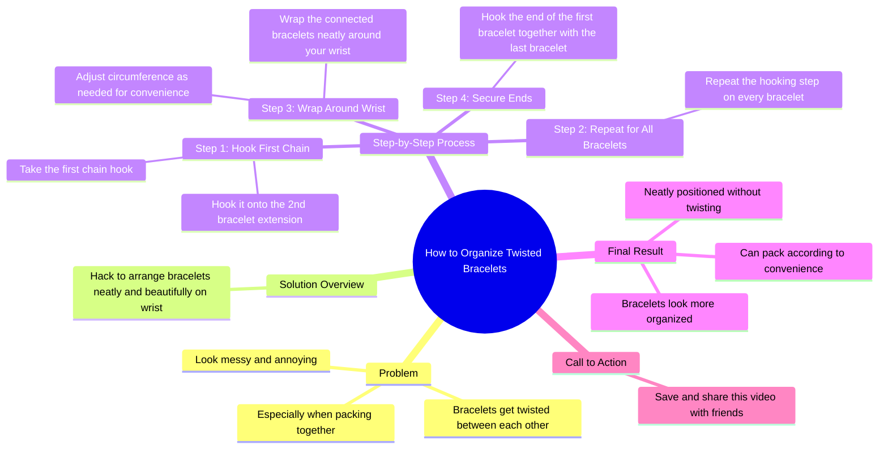

# Bracelet Hack to Prevent Twisting When Packing

> 🌐 **Read this in:** **English** · [中文](../../zh-CN/2026-05/tiktok-transcript-dan-kongsikan-ini-dengan-rakan-rakan-anda-yang-pasti-akan-m-0475.md)

> **Creator:** [@habibjewelsofficial](https://www.tiktok.com/@habibjewelsofficial) · **Views:** 960.8K · **Posted:** 2026-05-22 · **Niche:** beauty
>
> **TL;DR:** Starts with a relatable problem to hook viewers who face bracelet tangling.

[Watch original video →](https://vt.tiktok.com/ZSxyNrMTG/)

## Why This Went Viral

## Hook (first 3 seconds)
- **Verbatim opening line:** "Have your bracelets ever been twisted? between each other Especially when packing together."
- **Hook pattern type:** Question + Pain point (empathy-driven)
- **Why it stops scrolling:** It instantly triggers a relatable frustration — anyone who wears multiple bracelets has experienced the tangling mess. The question creates a "yes, that's me" moment, forcing the viewer to pause and seek the solution.

## Emotional Rhythm
1. **Curiosity / Empathy** (0–3s) — "Have your bracelets ever been twisted?" Viewer feels understood.
2. **Frustration / Resonance** (3–6s) — "sometimes bracelets You look messy and annoying, don't you?" Reinforces shared pain.
3. **Anticipation** (6–10s) — "this is a hack how to start your bracelets..." Promise of a fix.
4. **Satisfaction / Relief** (10–20s) — Step-by-step demonstration creates a "aha, that's clever" feeling.
5. **Climax** (20–22s) — "Your hands look more organized now. neatly and neatly located without twisting each other" — visual payoff + emotional closure.
6. **Call to Action / Urgency** (22–24s) — "Save and share this video with your friends." Turns satisfaction into social sharing.

## Keyword Density
- **bracelets** (7x) — Core product; drives search and hashtag reach.
- **twisted / twisting** (3x) — Emotional pain point; triggers relatability.
- **neatly / neat** (3x) — Desired outcome; aspirational keyword.
- **hook / hooked** (3x) — Specific action; instructional clarity.
- **pack / packing** (2x) — Context (travel/storage); expands use-case reach.
- **save / share** (2x) — Algorithmic engagement signals; drives distribution.

*Algorithmic reach drivers:* "bracelets," "packing," "hack" — high-volume search terms.
*Emotional pull drivers:* "twisted," "annoying," "neatly" — trigger pain and relief.

## Why It Spreads
1. **Universal pain point → instant relatability.** The opening question ("Have your bracelets ever been twisted?") is a yes/no trap that 99% of bracelet-wearers answer "yes" to. This forces them to watch for the fix.
2. **Simple, visual solution with no extra tools.** The hack uses only the bracelets themselves — no scissors, no tape, no purchase needed. This lowers the barrier to trying it, increasing saves and shares.
3. **Clear before/after emotional payoff.** The transcript explicitly contrasts "messy and annoying" with "neatly and neatly located." Viewers feel the relief vicariously, which drives them to save for later use.
4. **Direct call to action at peak satisfaction.** "Save and share this video with your friends" comes right after the "ready" moment — when viewers feel most grateful and likely to comply.
5. **Repeatable, shareable format.** The "hack" is a sequence of 4 simple steps that anyone can memorize and demonstrate to a friend — making it perfect for word-of-mouth and reposts.

## What You Can Steal
1. **Open with a pain-point question** that forces a "yes" from your target audience. Example: "Ever had your earphones tangle in your pocket?" — instantly hooks anyone who carries earbuds.
2. **Promise a zero-cost, zero-tool solution.** The most viral hacks use what people already own. In your script, explicitly state "no extra supplies needed" early to increase watch time.
3. **End with a direct "save and share" command** at the moment of highest emotional satisfaction (right after the "ready" reveal). Don't assume viewers will act — tell them exactly what to do.

## Mind Map

## Full Transcript (Generated by [free TikTok transcript generator](https://toktranscript.com/?utm_source=github&utm_medium=breakdown&utm_campaign=tool_attribution))

> 📝 Transcripts on this page are auto-generated and show the first 60%. Want to transcribe any TikTok in 30 seconds and get the full version? [Try TokTranscript free →](https://toktranscript.com/?utm_source=github&utm_medium=breakdown&utm_campaign=transcript_cta)

Have your bracelets ever been twisted? between each other Especially when packing together. sometimes bracelets You look messy and annoying, don't you? this is a hack how to start your bracelets to make them visible Neat and beautiful on your wrist. first you take the first chain hook and hook it on The 2nd bracelet extension. Repeat this step on all your bracelets.

*[Read the full transcript on TokTranscript →](https://toktranscript.com/plaza/tiktok-transcript-dan-kongsikan-ini-dengan-rakan-rakan-anda-yang-pasti-akan-m-0475?utm_source=github&utm_medium=breakdown&utm_campaign=transcript_full)*

## Browse More

- All [beauty](../../by-niche/en/beauty.md) breakdowns
- All [Problem-Agitation](../../by-pattern/en/hook-problem-agitation.md) examples

## Video Info

| | |
|---|---|
| Creator | [@habibjewelsofficial](https://www.tiktok.com/@habibjewelsofficial) |
| Original video | [https://vt.tiktok.com/ZSxyNrMTG/](https://vt.tiktok.com/ZSxyNrMTG/) |
| Original title | 𝘚𝘢𝘷𝘦 dan kongsikan 𝘩𝘢𝘤𝘬 ini dengan rakan-rakan anda yang pasti akan m... |
| Views | 960.8K (960800) |
| Posted | 2026-05-22 |
| Duration | 0s |
| Niche | `beauty` |
| Hook pattern | `Problem-Agitation` |
| Original language | `en` |
| Available languages | en, zh-CN |
| Generated | 2026-05-25 by [TokTranscript](https://toktranscript.com/) |

---

*This breakdown is for educational analysis under fair use. Original video © [@habibjewelsofficial](https://www.tiktok.com/@habibjewelsofficial). All transcripts are auto-generated and may contain errors.*

*Want to analyze your own TikToks like this? [TokTranscript →](https://toktranscript.com/viral-breakdown?utm_source=github&utm_medium=breakdown&utm_campaign=footer_cta)*