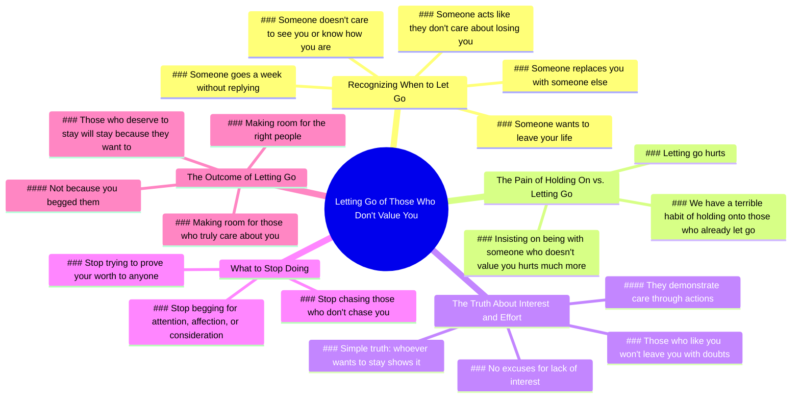

# Let Go When Someone Replaces You

> 🌐 **Read this in:** **English** · [中文](../../zh-CN/2026-05/tiktok-transcript-deixa-ir-coringa-motiva-o-reflexaododia-videostatus-capcut-8a03.md)

> **Creator:** [@_coringasemfiltro](https://www.tiktok.com/@_coringasemfiltro) · **Views:** 8.3M · **Posted:** 2026-05-26 · **Niche:** other
>
> **TL;DR:** A series of relatable 'if' scenarios builds urgency and personal relevance.

[Watch original video →](https://www.tiktok.com/@_coringasemfiltro/video/7618763017961999624?is_from_webapp=1&sender_device=pc)

## Why This Went Viral

## Hook (first 3 seconds)
- **Verbatim:** "If someone replaces you with someone else let go if someone goes a week without replying to you if someone doesn't care to see you and to know how you are if someone acts like they don't care about losing you if someone wants to leave your life and go away Open the door and you already know."
- **Hook pattern:** **Scene + Contrast** — A rapid-fire list of painful relational scenarios (replacement, ghosting, indifference) immediately contrasted with the command "Open the door."
- **Why it stops scroll:** It mirrors the viewer's own unresolved pain with brutal specificity. The repetition of "if someone" creates a hypnotic rhythm that feels like a personal diagnosis. The viewer thinks, *"They're describing my exact situation."* It bypasses logic and hits the emotional wound directly.

## Emotional Rhythm
- **Beat 1 – Recognition (0–5 sec):** The list of scenarios triggers instant identification. Viewer feels seen.
- **Beat 2 – Validation (5–10 sec):** "It hurts, it hurts" — the repetition normalizes the pain. Relief that someone acknowledges the depth of the wound.
- **Beat 3 – Reframe (10–15 sec):** "But insisting on being with someone who doesn't value you... it hurts much more." — A twist that flips the narrative from victimhood to self-inflicted suffering.
- **Beat 4 – Awakening (15–25 sec):** "We have the terrible habit of trying to hold onto those who have already let go." — Collective accountability. Suspense builds as the viewer feels called out.
- **Beat 5 – Climax (25–35 sec):** "whoever wants to stay... demonstrates. Those who like you won't leave you with doubts." — The core truth lands with clarity. Emotional peak.
- **Beat 6 – Release (35–45 sec):** "Stop chasing. Stop begging." — Cathartic permission to stop. Relief.
- **Beat 7 – Hope (45–60 sec):** "when you stop insisting... make room for the right people to arrive." — Resolution. Future-oriented reward.

## Keyword Density
| Keyword/Phrase | Count (approx.) | Driver |
|----------------|-----------------|--------|
| "if someone" | 6 | **Algorithmic reach** — High recall, triggers search and watch time because it hooks with conditional "if" patterns. |
| "let go" / "leave" / "go away" | 5 | **Emotional pull** — Core loss-anchors. Drives shareability because people attach their own stories. |
| "hurt" | 4 | **Emotional pull** — Lowers psychological resistance. Creates resonance. |
| "don't care" / "doesn't value" | 4 | **Emotional pull** — Names the unspoken fear. Drives comments. |
| "stop" / "stop chasing" / "stop begging" | 4 | **Algorithmic reach** — Imperative verbs increase retention and click-through. |
| "you" | 10+ | **Algorithmic reach** — Second-person pronoun maximizes personalization, which boosts watch time and completion rate. |
| "who deserves" / "right people" | 3 | **Emotional pull** — Hope-anchor. Drives saves and shares for future reference. |

## Why It Spreads
1. **Pain mirroring → Viral empathy loop**  
   The opening list is so specific ("replaces you," "goes a week without replying") that viewers feel it was written about *their* ex, friend, or family member. This triggers an immediate share impulse: *"This is exactly what I'm going through."* The viewer becomes a messenger.

2. **Imperative structure forces action**  
   "Open the door," "Stop chasing," "Stop begging" — these are not suggestions. They are commands. This creates a psychological urgency that drives high completion rates (algorithm loves that) and makes viewers comment "I needed to hear this."

3. **Twist from pain to self-accountability**  
   The line "We have the terrible habit of trying to hold onto those who have already let go" reframes the viewer from victim to participant. This is a cognitive dissonance moment — uncomfortable but liberating. Viewers share it to signal growth or to *make someone else* realize their own pattern.

4. **Hope as the closing reward**  
   The final line — "make room for the right people to arrive" — offers a payoff. This is why it gets saved and re-watched. It doesn't just diagnose pain; it prescribes a future. Saves = algorithmic boost.

5. **High commentability**  
   The video invites two types of comments:  
   - *Personal testimony:* "This happened to me last month."  
   - *Tagging:* "This is for you @friendname."  
   Both increase engagement signals (comments, shares) which feed the algorithm.

## What You Can Steal

1. **The "If someone..." cascade**  
   Open with a rapid-fire list of 3–5 painful scenarios that your audience *immediately* recognizes. Use the same syntactic pattern (e.g., "If you've ever felt... if you've ever wondered... if you've ever stayed too long..."). This builds hypnotic rhythm and forces self-identification within seconds.

2. **The "But here's the truth" pivot**  
   After naming the pain, insert a single sentence that flips the blame from external to internal (e.g., "But the real problem isn't them — it's that you're still holding on"). This creates the cognitive dissonance that drives shares and saves.

3. **End with a permission slip**  
   Close with a directive that releases the viewer from their pattern and offers a future reward (e.g., "Stop chasing. Stop begging. When you do, the right people will show up."). This gives the video utility — viewers save it to remind themselves later, which boosts algorithmic signals.

## Mind Map

## Full Transcript (Generated by [analyze your own TikToks](https://toktranscript.com/?utm_source=github&utm_medium=breakdown&utm_campaign=tool_attribution))

> 📝 Transcripts on this page are auto-generated and show the first 60%. Want to transcribe any TikTok in 30 seconds and get the full version? [Try TokTranscript free →](https://toktranscript.com/?utm_source=github&utm_medium=breakdown&utm_campaign=transcript_cta)

if someone replaces you with someone else let go if someone goes a week without replying to you if someone doesn't care to see you and to know how you are if someone acts like they don't care about losing you if someone wants to leave your life and go away Open the door and you already know. It hurts, it hurts. But insisting on being with someone who doesn't value you. .. It hurts much more. We have the terrible habit of trying To hold onto those who have already let go of our hand. some time ago to create sorry to justify the lack of interest from others But the truth is simple. whoever wants to stay Who cares?

*[Read the full transcript on TokTranscript →](https://toktranscript.com/plaza/tiktok-transcript-deixa-ir-coringa-motiva-o-reflexaododia-videostatus-capcut-8a03?utm_source=github&utm_medium=breakdown&utm_campaign=transcript_full)*

## Browse More

- All [other](../../by-niche/en/other.md) breakdowns
- All [conditional cascade](../../by-pattern/en/hook-conditional-cascade.md) examples

## Video Info

| | |
|---|---|
| Creator | [@_coringasemfiltro](https://www.tiktok.com/@_coringasemfiltro) |
| Original video | [https://www.tiktok.com/@_coringasemfiltro/video/7618763017961999624?is_from_webapp=1&sender_device=pc](https://www.tiktok.com/@_coringasemfiltro/video/7618763017961999624?is_from_webapp=1&sender_device=pc) |
| Original title | Deixa ir.. #coringa #motivação #reflexaododia #videostatus #capcut  |
| Views | 8.3M (8300000) |
| Posted | 2026-05-26 |
| Duration | 0s |
| Niche | `other` |
| Hook pattern | `conditional cascade` |
| Original language | `en` |
| Available languages | en, zh-CN |
| Generated | 2026-05-27 by [TokTranscript](https://toktranscript.com/) |

---

*This breakdown is for educational analysis under fair use. Original video © [@_coringasemfiltro](https://www.tiktok.com/@_coringasemfiltro). All transcripts are auto-generated and may contain errors.*

*Want to analyze your own TikToks like this? [TokTranscript →](https://toktranscript.com/viral-breakdown?utm_source=github&utm_medium=breakdown&utm_campaign=footer_cta)*