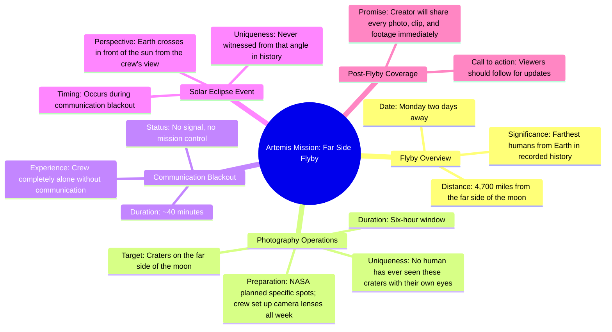

# Artemis Crew Flying Behind the Moon Monday

> 🌐 **Read this in:** **English** · [中文](../../zh-CN/2026-05/tiktok-transcript-don-t-miss-it-8da8.md)

> **Creator:** [@niickjackson](https://www.tiktok.com/@niickjackson) · **Views:** 4.1M · **Posted:** 2026-05-28 · **Niche:** other
>
> **TL;DR:** Creates immediate FOMO by framing the content as unmissable and historically important.

[Watch original video →](https://www.tiktok.com/@niickjackson/video/7625074773273480461?q=vlog%20about%20ARTEMIS%20II&t=1779980995009)

## Why This Went Viral

## Hook (first 3 seconds)
- **Verbatim opening line:** "Make sure that you do not miss this, because this is about to be the biggest part of the entire Artemis mission."
- **Hook pattern:** Urgency + bold claim ("biggest part of the entire Artemis mission")
- **Why it stops scrolling:** The creator issues a direct command ("Make sure you do not miss this") paired with a superlative claim that promises exclusive, high-stakes content. It creates FOMO instantly — viewers feel they'll miss something historic if they scroll past.

## Emotional Rhythm
- **Beat 1 — Urgency/Curiosity:** "Make sure you do not miss this" + "biggest part" → viewer is locked in.
- **Beat 2 — Escalation:** "Footage... is going to be absolutely insane" → raises stakes.
- **Beat 3 — Specificity/Scale:** "Farthest humans from earth in all of recorded history" → awe + tension.
- **Beat 4 — Suspense/Isolation:** "Losing all communication... completely alone... no signal, no mission control" → creates vulnerability and emotional weight.
- **Beat 5 — Twist/Climax:** "They are gonna be seeing a solar eclipse... nobody's ever been able to witness from that angle" → peak awe + exclusivity.
- **Beat 6 — Call to Action (CTA):** "Add me right now... I'm gonna be showing you every single photo" → urgency + reward.

**Climax moment:** The solar eclipse reveal from the far side of the moon — a never-before-seen perspective that combines isolation (blackout) with wonder (eclipse).

## Keyword Density
- **"Moon"** (7x) — core subject, drives algorithmic discovery for space/NASA content.
- **"Artemis"** (3x) — high-search-volume brand term, algorithmic reach.
- **"Never" / "nobody" / "ever"** (4x) — exclusivity and rarity, emotional pull.
- **"Insane"** (2x) — emotional amplifier, triggers curiosity.
- **"Alone" / "no communication"** (2x) — vulnerability, emotional resonance.
- **"Monday"** (3x) — time-specific urgency, drives immediate action.
- **"Footage" / "photos" / "clips"** (4x) — promise of visual reward, algorithmic for "viral footage" queries.

**Algorithmic drivers:** "Artemis," "moon," "NASA," "Monday" — high-search-volume, news-adjacent keywords.
**Emotional pull:** "never," "alone," "insane," "nobody's ever" — exclusivity and awe.

## Why It Spreads
1. **Urgency + FOMO from the first word:** "Make sure you do not miss this" is a direct command that triggers fear of missing out. Viewers who care about space feel compelled to watch and share.
2. **Incremental escalation of awe:** Each sentence adds a new layer of impossibility — "farthest humans ever," "craters no human has seen," "completely alone," "solar eclipse no one has witnessed." The video builds like a countdown, making viewers feel they're witnessing history.
3. **The "blackout" twist creates emotional tension:** The 40-minute communication blackout introduces danger and isolation, which humanizes the crew and makes the eclipse reveal feel earned. This emotional spike is shareable because it's a story, not just facts.
4. **Clear, time-bound CTA:** "Monday is two days away" + "add me right now" creates a specific deadline. Viewers are more likely to follow/subscribe because the reward (exclusive footage) is imminent and scarce.
5. **Promise of exclusive visual content:** "Every single photo, every single clip" — the creator positions themselves as the sole curator of never-before-seen footage. This makes the account a destination, increasing follow-through and shareability.

## What You Can Steal
1. **Open with a command + superlative:** Start your video with "Make sure you don't miss this because this is about to be the [biggest/rarest/most insane] [thing]." It instantly creates FOMO and stakes.
2. **Build a "countdown to awe" structure:** Don't reveal the climax immediately. Layer in escalating details (distance, isolation, rarity) so the final reveal feels earned. Use phrases like "and during that blackout..." to keep viewers hooked.
3. **Anchor your CTA to a specific, imminent event:** "Monday is two days away — add me now so you see every photo the second it comes back." This turns a generic "follow me" into a time-sensitive promise of exclusive access.

## Mind Map

## Full Transcript (Generated by [TokTranscript](https://toktranscript.com/?utm_source=github&utm_medium=breakdown&utm_campaign=tool_attribution))

> 📝 Transcripts on this page are auto-generated and show the first 60%. Want to transcribe any TikTok in 30 seconds and get the full version? [Try TokTranscript free →](https://toktranscript.com/?utm_source=github&utm_medium=breakdown&utm_campaign=transcript_cta)

Make sure that you do not miss this, because this is about to be the biggest part of the entire Artemis mission. And the footage that comes back from Monday is going to be absolutely insane. So, happening on Monday, the Artemis crew is going to be flying behind the moon, and this is everything that is about to happen. They are going to pass 4,700 miles from the far side of the moon, which will officially make them the farthest humans from earth in all of recorded history. During a six our window, they're gonna be photographing craters from the far side of the moon that no human being has actually ever been able to see before with their own eyes. NASA has already been planning which exact spots that they're going to be shooting, and the crew has been setting up camera lenses all week. So they're ready for this moment.

*[Read the full transcript on TokTranscript →](https://toktranscript.com/plaza/tiktok-transcript-don-t-miss-it-8da8?utm_source=github&utm_medium=breakdown&utm_campaign=transcript_full)*

## Browse More

- All [other](../../by-niche/en/other.md) breakdowns
- All [Urgency + Promise of Significance](../../by-pattern/en/hook-urgency-promise-of-significance.md) examples

## Video Info

| | |
|---|---|
| Creator | [@niickjackson](https://www.tiktok.com/@niickjackson) |
| Original video | [https://www.tiktok.com/@niickjackson/video/7625074773273480461?q=vlog%20about%20ARTEMIS%20II&t=1779980995009](https://www.tiktok.com/@niickjackson/video/7625074773273480461?q=vlog%20about%20ARTEMIS%20II&t=1779980995009) |
| Original title | DON’T MISS IT! 🤩 |
| Views | 4.1M (4100000) |
| Posted | 2026-05-28 |
| Duration | 0s |
| Niche | `other` |
| Hook pattern | `Urgency + Promise of Significance` |
| Original language | `en` |
| Available languages | en, zh-CN |
| Generated | 2026-05-29 by [TokTranscript](https://toktranscript.com/) |

---

*This breakdown is for educational analysis under fair use. Original video © [@niickjackson](https://www.tiktok.com/@niickjackson). All transcripts are auto-generated and may contain errors.*

*Want to analyze your own TikToks like this? [TokTranscript.com →](https://toktranscript.com/viral-breakdown?utm_source=github&utm_medium=breakdown&utm_campaign=footer_cta)*