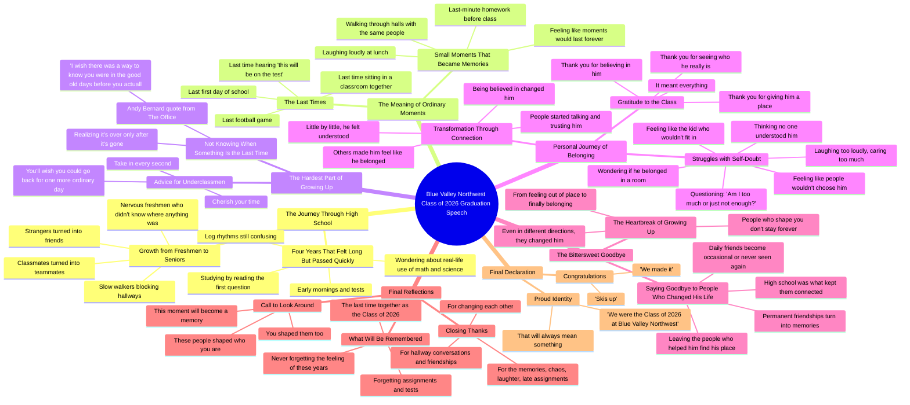

# Sharing My Story at Blue Valley Northwest Graduation

> 🌐 **Read this in:** **English** · [中文](../../zh-CN/2026-05/tiktok-transcript-dream-come-true-getting-to-share-my-story-in-front-of-people-a9cc.md)

> **Creator:** [@dylanbarness](https://www.tiktok.com/@dylanbarness) · **Views:** 1.9M · **Posted:** 2026-05-27 · **Niche:** entertainment
>
> **TL;DR:** The hook immediately creates a sense of collective nostalgia and anticipation, drawing the audience into a shared emotional experience.

[Watch original video →](https://www.tiktok.com/t/ZTB2n3hmT/)

## Why This Went Viral

## Hook (first 3 seconds)
- **Verbatim opening line:** "Good evening faculty, families, friends, and most importantly the Blue Valley Northwest Class of 2026."
- **Hook pattern:** **Scene-setting + direct address** — the speaker immediately names the audience with escalating specificity ("faculty, families, friends, and most importantly..."), creating a ceremonial, intimate tone.
- **Why it stops scroll:** The phrase "most importantly" signals this speech is *for* the students, not *at* them. It feels personal and inclusive — viewers who resonate with graduation or belonging feel instantly seen. The pause and deliberate pacing also create a "this matters" weight that interrupts doomscrolling.

## Emotional Rhythm
- **Beats in order:**
  1. **Nostalgia & shared memory** — "we talked about graduation like it was some far away finish line" → evokes collective experience.
  2. **Humor & self-deprecation** — "opened the study guide, read the first question, and just hope the rest would be multiple choice" → lightens the mood, builds relatability.
  3. **Tension & reflection** — "you never know something is the last time until it's already over" → introduces bittersweet weight.
  4. **Vulnerability spike** — "maybe I'm just not the kind of kid people really chose" → raw, personal confession that shifts from generic speech to intimate story.
  5. **Resonance & gratitude** — "you made me feel like I belonged" → emotional payoff, catharsis.
  6. **Climax** — "the people who help shape you don't get to stay with you forever" → the hardest truth, delivered with stillness.
  7. **Call to action + final lift** — "look around this room... really look" → communal moment, then "congratulations class of 2026 we made it" → triumphant release.

- **Climax moment:** "I wish there was a way to know you were in the good old days before you actually left them" — a universally recognized quote that crystallizes the entire speech's thesis. It's the emotional anchor.

## Keyword Density
| Word/Phrase | Count (approx.) | Driver |
|---|---|---|
| "last time" | 7 | **Algorithmic reach** — high emotional search volume, triggers nostalgia content recommendations |
| "belong" / "belonged" | 6 | **Emotional pull** — core human need, drives shares from viewers who felt excluded |
| "changed" / "changed me" | 5 | **Both** — signals transformation (algorithm loves growth arcs) and deep personal impact |
| "moments" | 5 | **Emotional pull** — vague enough to be universal, specific enough to feel real |
| "people" | 8 | **Algorithmic reach** — high-frequency word that signals community content, boosts categorization |
| "thank you" | 6 | **Emotional pull** — gratitude triggers reciprocity, makes viewers want to share as a "thank you" to their own people |
| "growing up" | 3 | **Both** — evergreen topic, high search volume + deeply emotional |
| "class of 2026" | 4 | **Algorithmic reach** — hyper-specific location/class tag drives local and school-alumni discovery |

## Why It Spreads
1. **Universal nostalgia + hyper-specific detail** — "the last time hearing 'hey this will be on the test'" is a line *every* graduate recognizes, but the specificity ("Blue Valley Northwest") makes it feel authentic, not generic. Viewers share because it feels like *their* story, but the video is clearly real.

2. **Vulnerability as a sharing trigger** — "I started asking myself questions like 'am I too much or am I just not enough'" is a confession most people have never said aloud. When the speaker risks real shame, viewers emotionally invest and feel compelled to share it as a proxy for their own unspoken feelings.

3. **The Office quote as a cultural anchor** — Andy Bernard's line is already viral in graduation content. By citing it, the speaker taps into pre-existing emotional resonance. Viewers who love The Office share it for that reason alone — it's a built-in distribution multiplier.

4. **The "look around the room" moment** — directing the audience to physically look at each other creates a *shared ritual*. Viewers at home imagine their own room, their own people. This triggers a "tag your people" impulse — the video becomes a communal experience, not just a monologue.

5. **Emotional whiplash (humor → pain → hope)** — The speech moves from "we opened the study guide and hoped for multiple choice" (laugh) to "maybe I'm just not the kind of kid people really chose" (gut punch) to "congratulations, we made it" (release). This rollercoaster keeps retention high — viewers don't know what's coming next, so they stay.

## What You Can Steal
1. **Start with the audience, not yourself.** The hook names *them* first ("faculty, families, friends, and most importantly..."). This signals the video is about the viewer's experience, not the creator's ego. In any short-form video, open with the viewer's problem, identity, or desire — not your own.

2. **Embed a universally recognized quote as a narrative hinge.** The Office quote isn't just decoration — it's the emotional fulcrum of the entire speech. Use a quote your audience already loves (from a show, movie, book, or meme) to crystallize your message. It gives viewers a ready-made reason to share ("this reminded me of The Office").

3. **Use the "one personal story" rule.** The speech is mostly general nostalgia, but the viral spike comes from the *one specific, vulnerable story* ("I wondered if anyone actually understood me"). Creators should keep 80% of content broad/relatable, but insert one 15–20 second raw personal moment. That's the shareable heart.

## Mind Map

## Full Transcript (Generated by [TokTranscript](https://toktranscript.com/?utm_source=github&utm_medium=breakdown&utm_campaign=tool_attribution))

> 📝 Transcripts on this page are auto-generated and show the first 60%. Want to transcribe any TikTok in 30 seconds and get the full version? [Try TokTranscript free →](https://toktranscript.com/?utm_source=github&utm_medium=breakdown&utm_campaign=transcript_cta)

good evening faculty families friends and most importantly the Blue Valley Northwest Class of 2026 it's strange sitting here right now because for years we've been counting down to this moment we talked about graduation like it was some far away finish line we said things like senior year is gonna fly by or I can't wait to get out of here and now it's actually over and I don't think any of us were really ready for how fast someday could turn into right now four years that felt so long at the beginning somehow turned into just a few short moments moments filled with early mornings we definitely didn't want to wake up for tests we absolutely studied for meaning we opened the study guide read the first question and just hope the rest would be multiple choice and the classic question we all ask ourselves at least once a week in math or science are we ever actually gonna use this in real life and if anyone here ends up using log rhythms after graduation please let the rest of us know because I'm still very confused but in between all of that chaos something important was happening we were growing up these hallways saw us walk in as nervous freshmen who had no idea where anything was and somehow the slowest walkers made the perfect wall across the hallway with not one opening like it was a skill like they were training for it but those awkward first days turned into something so much bigger than we expected strangers turned into friends classmates turned into teammates ordinary moments turned into memories that we didn't realize we'd miss someday because the weird thing about high school is that the moments that seem small while they're happening end up meaning the most later the laughing too loudly at lunch the fantasy punishment the last minute homework before class walking through the halls with the same people every single day those moments felt so normal so permanent like they would just keep happening forever but one day they quietly became the last time the last first day of school the last football game the last time sitting in a classroom together and for most of us the last time hearing hey this will be on the test and suddenly becoming very interested for about five seconds and that's the hardest part about growing up realizing you never know something is the last time until it's already over this reminds me of a quote from a TV show that got me through my hardest days in high school the office Andy Bernard once said I wish there was a way to know you were in the good old days before you actually left them so to any underclassman sitting here tonight take in every second and cherish your time as long as possible because before you know it you'll be sitting in these exact seats wishing you could go back for just one more ordinary day and before you move on there's something I want to share that's a little more personal I wish I was still with you good luck for a while in high school I always thought people would see me as the kid who would never fit in the one who laughed a little too loudly the one who cared a little too much the kind of kid who walks into a room and immediately wonders if he actually belongs there and after a while I started to wonder if I ever would over time I started to question myself I started asking myself questions like am I too much or am I just not enough some days that feeling followed me through these halls sitting in class wondering if anyone actually understood me the way I hoped they would there are moments when I went home turned to my parents and said maybe I'm just not the kind of kid people really chose and that's a hard thought to sit with especially when all you really want is to feel like you matter to anyone and for a while I didn't know if I ever would but something changed over time people started talking to me trusting me with things that matter to them and understanding me and little by little you all helped me realize something that completely changed the way I see myself you made me feel like I belonged and that might sound like a small thing to you but I promise you it isn't because when people believe in

*[Read the full transcript on TokTranscript →](https://toktranscript.com/plaza/tiktok-transcript-dream-come-true-getting-to-share-my-story-in-front-of-people-a9cc?utm_source=github&utm_medium=breakdown&utm_campaign=transcript_full)*

## Browse More

- All [entertainment](../../by-niche/en/entertainment.md) breakdowns
- All [Shared anticipation](../../by-pattern/en/hook-shared-anticipation.md) examples

## Video Info

| | |
|---|---|
| Creator | [@dylanbarness](https://www.tiktok.com/@dylanbarness) |
| Original video | [https://www.tiktok.com/t/ZTB2n3hmT/](https://www.tiktok.com/t/ZTB2n3hmT/) |
| Original title | dream come true 🥹 getting to share my story in front of people that c... |
| Views | 1.9M (1900000) |
| Posted | 2026-05-27 |
| Duration | 0s |
| Niche | `entertainment` |
| Hook pattern | `Shared anticipation` |
| Original language | `en` |
| Available languages | en, zh-CN |
| Generated | 2026-05-29 by [TokTranscript](https://toktranscript.com/) |

---

*This breakdown is for educational analysis under fair use. Original video © [@dylanbarness](https://www.tiktok.com/@dylanbarness). All transcripts are auto-generated and may contain errors.*

*Want to analyze your own TikToks like this? [try this transcription tool →](https://toktranscript.com/viral-breakdown?utm_source=github&utm_medium=breakdown&utm_campaign=footer_cta)*