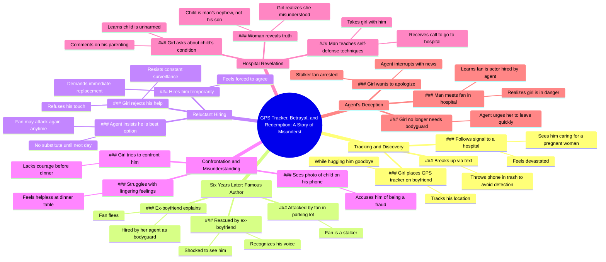

# Girl Plants GPS Tracker on Boyfriend, Finds Him at Hospital

> 🌐 **Read this in:** **English** · [中文](../../zh-CN/2026-05/tiktok-transcript-film-movie-foryou-9be2.md)

> **Creator:** [@xuupoaaty](https://www.tiktok.com/@xuupoaaty) · **Views:** 8.8M · **Posted:** 2026-05-24 · **Niche:** entertainment
>
> **TL;DR:** The hook immediately creates intrigue by revealing a secret tracking device, prompting viewers to question the motive.

[Watch original video →](https://vt.tiktok.com/ZSxukyf4x/)

## Why This Went Viral

## Hook (first 3 seconds)
- **Verbatim opening:** "La chica colocó un rastreador gps en la espalda de su novio mientras lo abrazaba después de que él se marchara."
- **Hook pattern:** Scene-based narrative hook (immediate action + betrayal setup).
- **Why it stops scrolls:** The opening line presents a shocking, specific action (planting a GPS tracker during an embrace) that instantly signals high drama, distrust, and a secret to be uncovered. Viewers are compelled to see the consequence of this betrayal.

## Emotional Rhythm
- **Beat 1 – Curiosity + Suspense:** GPS tracking → following signal to hospital.
- **Beat 2 – Tension + Shock:** Seeing him with a pregnant woman → emotional collapse → text breakup + phone disposal.
- **Beat 3 – Relief + Twist (6-year time jump):** She's now a famous author → attacked by fan → rescued by ex-boyfriend.
- **Beat 4 – Confusion + Resistance:** She rejects his help, resists his presence, but is forced to hire him temporarily.
- **Beat 5 – Misunderstanding + Guilt:** Sees child photo → accuses him of fraud → later learns child is his nephew → realizes she misjudged him.
- **Beat 6 – Climax + Final Twist:** Agent reveals fan was an actor hired by the agent → she is now in danger.
- **Climax moment:** The reveal that the fan was a hired actor, flipping the entire narrative from romance to conspiracy.

## Keyword Density
- **Strongest repeated words/phrases:**
  1. "rastreador gps" (GPS tracker) – drives the initial suspense and surveillance theme.
  2. "hospital" – central location for key revelations (pregnant woman, child, fan arrest).
  3. "agente" (agent) – becomes the villain, driving algorithmic reach via conspiracy.
  4. "fan / admirador" – triggers danger and rescue, emotional pull for protective instinct.
  5. "exnovio" – romantic tension, emotional resonance.
  6. "niño" (child) – emotional manipulation, false assumption.
  7. "contratado" (hired) – reveals the agent's manipulation, algorithmic reach for "betrayal" patterns.
- **Algorithmic reach drivers:** "agente," "contratado," "fan" – create conspiracy and danger tags.
- **Emotional pull drivers:** "exnovio," "niño," "rastreador gps" – fuel jealousy, misunderstanding, and redemption.

## Why It Spreads
- **1. Multiple high-stakes twists in under 2 minutes:** Each beat (GPS tracking, pregnancy reveal, rescue, child photo, actor reveal) is a mini-cliffhanger. Viewers stay to see the next twist, then share to discuss "what happens next."
- **2. Relatable emotional rollercoaster:** The narrative taps into universal fears (betrayal, misjudgment, regret) and desires (second chances, protection). The line "se derrumbó" (she collapsed) and "se quedó atónita" (she was stunned) create visceral empathy.
- **3. "Misunderstanding" trope with a dark twist:** The classic "she thought he cheated but he was being noble" is subverted by the agent's conspiracy. This dual-layer (romantic misunderstanding + villainous agent) triggers both "aww" and "what?!" reactions, fueling comments.
- **4. Cliffhanger ending that demands resolution:** The final line "El hombre se dio cuenta de que la chica ahora estaba en peligro" is an open loop. Viewers are driven to comment "what happens next?" or search for part 2, increasing watch time and sharing.
- **5. High-density emotional language:** Phrases like "repulsivo fraude," "impotente," "incapaz de convencerse a sí misma" amplify the drama. This language is easily quotable and meme-able, encouraging shares.

## What You Can Steal
- **1. Start with a shocking, specific action in the first 3 seconds:** Don't set up context. Open with the most dramatic moment (e.g., "She planted a GPS tracker on him while hugging him"). This forces viewers to ask "why?" and stay.
- **2. Use a "time jump" to reset stakes and add depth:** Jumping 6 years forward (from jealous girlfriend to famous author) instantly elevates the story's stakes and makes the reunion more powerful. Use time jumps to create contrast and new tension.
- **3. End on an unresolved twist that demands a follow-up:** The final reveal (agent hired the fan) is a complete reversal. Never resolve everything. Leave a clear "what now?" question to drive comments, shares, and part 2 views.

## Mind Map

## Full Transcript (Generated by [free TikTok transcript generator](https://toktranscript.com/?utm_source=github&utm_medium=breakdown&utm_campaign=tool_attribution))

> 📝 Transcripts on this page are auto-generated and show the first 60%. Want to transcribe any TikTok in 30 seconds and get the full version? [Try TokTranscript free →](https://toktranscript.com/?utm_source=github&utm_medium=breakdown&utm_campaign=transcript_cta)

La chica colocó un rastreador gps en la espalda de su novio mientras lo abrazaba después de que él se marchara. Ella siguió la señal hasta un hospital. Al verlo cuidando a una mujer embarazada, se derrumbó. Le envió un mensaje de texto para romper con él antes de tirar su teléfono a una papelera para evitar ser descubierta. 6 años más tarde, ahora convertida en una autora famosa, fue atacada por un admirador fanático en un aparcamiento. De repente, apareció un hombre y la rescató. Ella reconoció su voz. Era su exnovio, al que había perdido el rastro hacía tiempo. Se quedó atónita al encontrarlo allí. Él le explicó que su agente lo había contratado como su guardaespaldas. El fan huyó. El hombre intentó ayudarla a levantarse, pero ella rechazó su contacto. La chica se resistía a que él la siguiera constantemente, pero su agente insistió en que era el mejor guardaespaldas disponible. No encontraría un sustituto hasta después del mediodía del día siguiente. Como era probable que el fan la acosara de nuevo en cualquier momento, la chica contrató a regañadientes a su exnovio de forma temporal. Le dijo a su agente que debía encontrar un sustituto inmediatamente. No esperaría ni un segundo más. La chica intentó confrontar al hombre por su engaño pasado, pero le faltó el valor para enfrentarse a él antes de la cena. Al ver una fotografía de un niño pequeño en el teléfono del hombre, lo acusó de ser un repulsivo fraude. Sentada Impotente a la mesa del comedor, se encontró incapaz de convencerse a sí misma de dejar atrás sus sentimientos por él.

*[Read the full transcript on TokTranscript →](https://toktranscript.com/plaza/tiktok-transcript-film-movie-foryou-9be2?utm_source=github&utm_medium=breakdown&utm_campaign=transcript_full)*

## Browse More

- All [entertainment](../../by-niche/en/entertainment.md) breakdowns
- All [Mystery/Deception Hook](../../by-pattern/en/hook-mystery-deception-hook.md) examples

## Video Info

| | |
|---|---|
| Creator | [@xuupoaaty](https://www.tiktok.com/@xuupoaaty) |
| Original video | [https://vt.tiktok.com/ZSxukyf4x/](https://vt.tiktok.com/ZSxukyf4x/) |
| Original title | #film #movie #foryou  |
| Views | 8.8M (8800000) |
| Posted | 2026-05-24 |
| Duration | 0s |
| Niche | `entertainment` |
| Hook pattern | `Mystery/Deception Hook` |
| Original language | `en` |
| Available languages | en, zh-CN |
| Generated | 2026-05-25 by [TokTranscript](https://toktranscript.com/) |

---

*This breakdown is for educational analysis under fair use. Original video © [@xuupoaaty](https://www.tiktok.com/@xuupoaaty). All transcripts are auto-generated and may contain errors.*

*Want to analyze your own TikToks like this? [TokTranscript.com →](https://toktranscript.com/viral-breakdown?utm_source=github&utm_medium=breakdown&utm_campaign=footer_cta)*