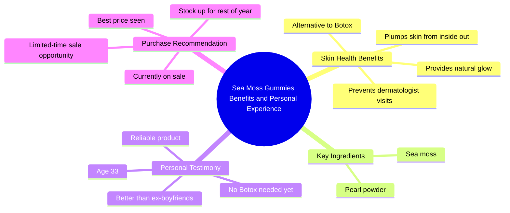

# Sea Moss Gummies for Glowing Clear Skin

> 🌐 **Read this in:** **English** · [中文](../../zh-CN/2026-05/tiktok-transcript-glowier-clearer-skin-from-gummies-that-won-t-let-you-down-li-6742.md)

> **Creator:** [@astaxanthin.queen](https://www.tiktok.com/@astaxanthin.queen) · **Views:** 2.5M · **Posted:** 2026-05-29 · **Niche:** beauty
>
> **TL;DR:** Uses a humorous, relatable regret about exes to pivot to a glowing product endorsement.

[Watch original video →](https://www.tiktok.com/@astaxanthin.queen/video/7467254962620271915?is_from_webapp=1&sender_device=pc)

## Why This Went Viral

## Hook (first 3 seconds)
- **Verbatim opening:** "I may regret some of my exes but I will never regret all the jars of sea Moss gummies I bought"
- **Hook pattern:** Contrast / Relatable confession
- **Why it stops scrolling:** It opens with a universally relatable emotional wound (regretting exes) then flips immediately into a product endorsement. The contrast ("regret exes" vs. "never regret gummies") creates cognitive dissonance that forces the viewer to watch to understand the connection.

## Emotional Rhythm
- **Beat 1: Relatable vulnerability** (regretting exes) → creates instant identification
- **Beat 2: Curious pivot** ("never regret jars") → viewer needs to know why
- **Beat 3: Tension release** ("kept me out of dermatologist office") → payoff for the setup
- **Beat 4: Emotional resonance** ("none of my ex boyfriends could ever do") → humor + empowerment
- **Beat 5: Social proof** ("listen to them when they tell you") → authority transfer
- **Beat 6: Contrast climax** ("thought I'd be getting Botox by now... these gummies have saved me") → highest emotional peak
- **Beat 7: Urgency spike** ("right now while they're on sale") → scarcity trigger
- **Beat 8: Closing twist** ("unlike my exes this is something I know I can count on") → callback + final emotional punch
- **Climax moment:** "these gummies have saved me" — the word "saved" elevates the product from cosmetic to life-changing

## Keyword Density
| Word/Phrase | Frequency | Function |
|---|---|---|
| **glowing / glowy** | 3x | Emotional pull + visual benefit (skin glow is aspirational) |
| **exes / ex boyfriends** | 4x | Relatable pain point + contrast mechanism |
| **gummies** | 4x | Core product keyword (algorithmic reach for beauty/supplement searches) |
| **sale** | 2x | Scarcity + conversion trigger |
| **literally** | 2x | Conversational intensifier (drives authenticity) |
| **young / Botox** | 2x | Anti-aging aspiration (high emotional pull) |
| **stock / stocked** | 2x | Urgency + purchase intent signal |

- **Algorithmic drivers:** "gummies," "sale," "skin," "Botox" — high search volume in beauty/supplement niches
- **Emotional drivers:** "exes," "glowing," "saved," "young" — trigger identity/vanity/relatability

## Why It Spreads
1. **Emotional bait-and-switch hook** — The first sentence weaponizes universal regret (exes) to make a product claim feel authentic, not salesy. Viewers who relate to "regretting exes" stay for the payoff.
2. **Relatable villain framing** — "None of my ex boyfriends could ever do" turns the product into a hero and exes into a punchline. This is highly shareable because it validates the audience's own relationship grievances.
3. **Scarcity + social proof layered on emotional story** — "Right now while they're on sale... best price I've ever seen" creates urgency without feeling pushy because it's embedded in a personal testimonial.
4. **Unexpected age reveal** — "I'm 33... thought I'd be getting Botox" humanizes the creator and makes the glow claim credible. Viewers under 30 see a roadmap; viewers over 30 see validation.
5. **Callback closing** — "Unlike my exes this is something I know I can count on" bookends the video, making it feel complete and quotable. Memorable closings drive shares.

## What You Can Steal
1. **The "regret X but never regret Y" pattern** — Open with a relatable pain point (exes, bad purchases, failed diets) then pivot to your product as the exception. The contrast forces attention.
2. **Embed urgency inside a story** — Don't say "sale ends soon" in isolation. Wrap it in personal stakes: "I'm about to stock up for the rest of year... I don't know when they'll have this sale again."
3. **Use exes as a foil** — Comparing your product to past relationships is low-effort, high-relatability comedy. It makes the product feel like a "keeper" and the audience feels smarter for choosing it.

## Mind Map

## Full Transcript (Generated by [the tool we used to generate this](https://toktranscript.com/?utm_source=github&utm_medium=breakdown&utm_campaign=tool_attribution))

> 📝 Transcripts on this page are auto-generated and show the first 60%. Want to transcribe any TikTok in 30 seconds and get the full version? [Try TokTranscript free →](https://toktranscript.com/?utm_source=github&utm_medium=breakdown&utm_campaign=transcript_cta)

I may regret some of my exes but I will never regret all the jars of sea Moss gummies I bought because this has literally kept me out of the dermatologist office and given me the best glow literally has me glowing which none of my ex boyfriends could ever do like seriously listen to them when they tell you sea moss and pearl powder is so good for your skin and will literally plump it from the inside out really thought I'd be getting some Botox by now I'm 33 like I thought it'd be time but these gummies have saved me and that's why I will always 

*[Read the full transcript on TokTranscript →](https://toktranscript.com/plaza/tiktok-transcript-glowier-clearer-skin-from-gummies-that-won-t-let-you-down-li-6742?utm_source=github&utm_medium=breakdown&utm_campaign=transcript_full)*

## Browse More

- All [beauty](../../by-niche/en/beauty.md) breakdowns
- All [Contrast & Relatable Regret](../../by-pattern/en/hook-contrast-relatable-regret.md) examples

## Video Info

| | |
|---|---|
| Creator | [@astaxanthin.queen](https://www.tiktok.com/@astaxanthin.queen) |
| Original video | [https://www.tiktok.com/@astaxanthin.queen/video/7467254962620271915?is_from_webapp=1&sender_device=pc](https://www.tiktok.com/@astaxanthin.queen/video/7467254962620271915?is_from_webapp=1&sender_device=pc) |
| Original title | Glowier clearer skin from gummies that won't let you down like your e... |
| Views | 2.5M (2500000) |
| Posted | 2026-05-29 |
| Duration | 0s |
| Niche | `beauty` |
| Hook pattern | `Contrast & Relatable Regret` |
| Original language | `en` |
| Available languages | en, zh-CN |
| Generated | 2026-05-31 by [TokTranscript](https://toktranscript.com/) |

---

*This breakdown is for educational analysis under fair use. Original video © [@astaxanthin.queen](https://www.tiktok.com/@astaxanthin.queen). All transcripts are auto-generated and may contain errors.*

*Want to analyze your own TikToks like this? [free TikTok transcript generator →](https://toktranscript.com/viral-breakdown?utm_source=github&utm_medium=breakdown&utm_campaign=footer_cta)*