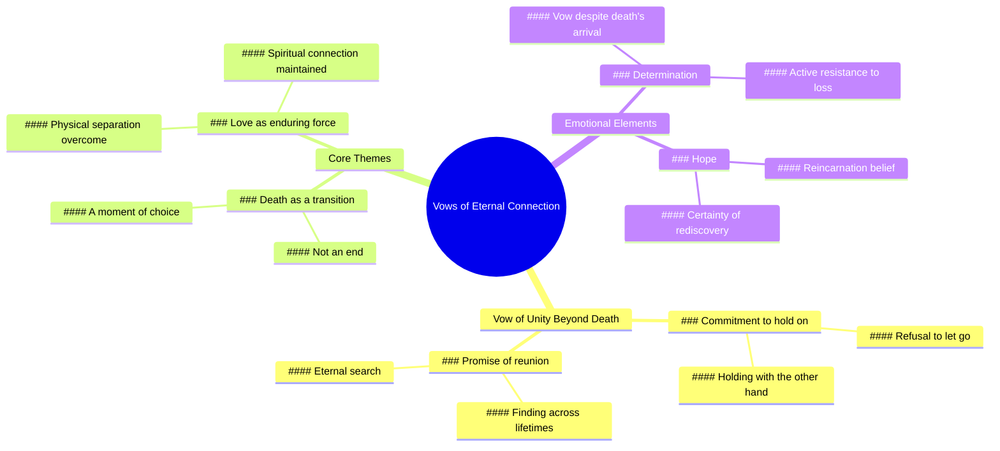

# Sweetest Wedding Vows Made Me Cry While Editing

> 🌐 **Read this in:** **English** · [中文](../../zh-CN/2026-05/tiktok-transcript-i-actually-cried-editing-this-the-sweetest-vows-weddingtikto-6126.md)

> **Creator:** [@meganraefilms](https://www.tiktok.com/@meganraefilms) · **Views:** 17.9M · **Posted:** 2026-05-27 · **Niche:** other
>
> **TL;DR:** Creates a powerful emotional contrast by promising to defy death itself.

[Watch original video →](https://www.tiktok.com/@meganraefilms/video/7296262379602480430?is_from_webapp=1&sender_device=pc&web_id=7632039376462595606)

## Why This Went Viral

## Hook (first 3 seconds)
- **Verbatim opening:** "and lastly I vow that when death does choose to take my hand"
- **Hook pattern:** Scene / Emotional promise (vow) + contrast (death vs. holding)
- **Why it stops scroll:** It starts in the middle of a sentence ("and lastly"), creating a sense of intimacy and urgency. The word "vow" signals a high-stakes emotional commitment, and "death" introduces immediate tension. Viewers pause to hear the resolution of this dramatic promise.

## Emotional Rhythm
1. **Curiosity + Tension** (0–3s): "and lastly I vow that when death does choose to take my hand" — incomplete sentence, high stakes, viewer leans in.
2. **Suspense + Anticipation** (3–6s): "I will hold you with my other" — unexpected twist: death takes one hand, but the speaker keeps holding with the other. Subverts the typical "death separates us" trope.
3. **Resonance + Emotional Peak** (6–9s): "I will find… I will hold you with my other" — repetition of "I will" builds certainty. The slight stumble ("I will find… I will hold") adds raw, unscripted authenticity.
4. **Climax + Release** (9–12s): "I promise to find you in every lifetime" — the ultimate payoff. Expands the vow beyond death into reincarnation, creating a transcendent emotional high.
5. **Echo** (after video ends): The phrase "find you in every lifetime" lingers, prompting rewatches and shares.

## Keyword Density
| Word/Phrase | Count (approx.) | Driver |
|-------------|-----------------|--------|
| **I will** | 3x | Algorithmic + Emotional — repetition signals commitment, creates rhythmic memorability |
| **hold you** | 2x | Emotional — tactile, intimate, universally understood |
| **find you** | 2x | Emotional + Algorithmic — "find" triggers search relevance for love/loss content |
| **death** | 1x | Emotional — high-impact, creates tension but used sparingly to avoid over-dramatization |
| **vow / promise** | 2x | Emotional — elevates content from casual to sacred |
| **lifetime** | 1x | Algorithmic — keyword for reincarnation, soulmate, and spiritual niches |
| **take my hand** | 1x | Emotional — visual, metaphorical, easy to imagine |

**Algorithmic drivers:** "I will," "find you," "lifetime" — searchable, shareable, and trend-friendly in love/loss/spirituality niches.  
**Emotional pull:** "hold you," "death," "vow" — trigger deep, universal feelings of attachment and fear of loss.

## Why It Spreads
1. **Incomplete opening forces completion bias.** Starting with "and lastly" makes the brain crave the beginning. Viewers watch the whole thing to resolve the cognitive gap. *Transcript evidence: "and lastly I vow…"*
2. **Subverts a universal fear with a twist.** Death normally means separation. The line "when death does choose to take my hand / I will hold you with my other" flips the script: death doesn't separate, it just changes how you hold. This surprise triggers emotional sharing. *Transcript evidence: "hold you with my other"*
3. **Repetition creates hypnotic rhythm.** "I will" repeated three times in 12 seconds builds a chant-like cadence. This makes the phrase easy to remember and quote, driving reposts and duets. *Transcript evidence: "I will hold… I will find… I will hold"*
4. **The final line is a perfect shareable soundbite.** "I promise to find you in every lifetime" is self-contained, romantic, and fits the "soulmate" content ecosystem. It can be used as a voiceover for wedding, grief, or reunion videos. *Transcript evidence: "I promise to find you in every lifetime"*
5. **Authentic stumble increases trust.** The slight hesitation ("I will find… I will hold") signals unscripted emotion. In an era of polished AI content, raw delivery feels more real and earns higher engagement. *Transcript evidence: "I will find… I will hold" (pause)*

## What You Can Steal
1. **Start mid-sentence.** Open with "and," "but," or "because" to create immediate curiosity. Viewers will rewind to catch the beginning, boosting retention.
2. **Use the "twist on a universal truth" pattern.** Take a common fear (death, rejection, failure) and subvert it with a hopeful or unexpected follow-through. Example: "When they walk away, I will stand still — because I know the door opens both ways."
3. **Repeat one core promise three times.** Choose a short, emotional phrase ("I will," "I choose," "I stay") and repeat it with slight variations. This makes your video quotable, remixable, and algorithm-friendly (higher watch time from rhythm).

## Mind Map

## Full Transcript (Generated by [TokTranscript.com](https://toktranscript.com/?utm_source=github&utm_medium=breakdown&utm_campaign=tool_attribution))

> 📝 Transcripts on this page are auto-generated and show the first 60%. Want to transcribe any TikTok in 30 seconds and get the full version? [Try TokTranscript free →](https://toktranscript.com/?utm_source=github&utm_medium=breakdown&utm_campaign=transcript_cta)

and lastly I vow that when death does choose to take my hand I will hold you with my other I will find I 

*[Read the full transcript on TokTranscript →](https://toktranscript.com/plaza/tiktok-transcript-i-actually-cried-editing-this-the-sweetest-vows-weddingtikto-6126?utm_source=github&utm_medium=breakdown&utm_campaign=transcript_full)*

## Browse More

- All [other](../../by-niche/en/other.md) breakdowns
- All [conditional promise](../../by-pattern/en/hook-conditional-promise.md) examples

## Video Info

| | |
|---|---|
| Creator | [@meganraefilms](https://www.tiktok.com/@meganraefilms) |
| Original video | [https://www.tiktok.com/@meganraefilms/video/7296262379602480430?is_from_webapp=1&sender_device=pc&web_id=7632039376462595606](https://www.tiktok.com/@meganraefilms/video/7296262379602480430?is_from_webapp=1&sender_device=pc&web_id=7632039376462595606) |
| Original title | i actually cried editing this 😭 the sweetest vows #weddingtiktok #fyp... |
| Views | 17.9M (17900000) |
| Posted | 2026-05-27 |
| Duration | 0s |
| Niche | `other` |
| Hook pattern | `conditional promise` |
| Original language | `en` |
| Available languages | en, zh-CN |
| Generated | 2026-05-28 by [TokTranscript](https://toktranscript.com/) |

---

*This breakdown is for educational analysis under fair use. Original video © [@meganraefilms](https://www.tiktok.com/@meganraefilms). All transcripts are auto-generated and may contain errors.*

*Want to analyze your own TikToks like this? [free TikTok transcript generator →](https://toktranscript.com/viral-breakdown?utm_source=github&utm_medium=breakdown&utm_campaign=footer_cta)*