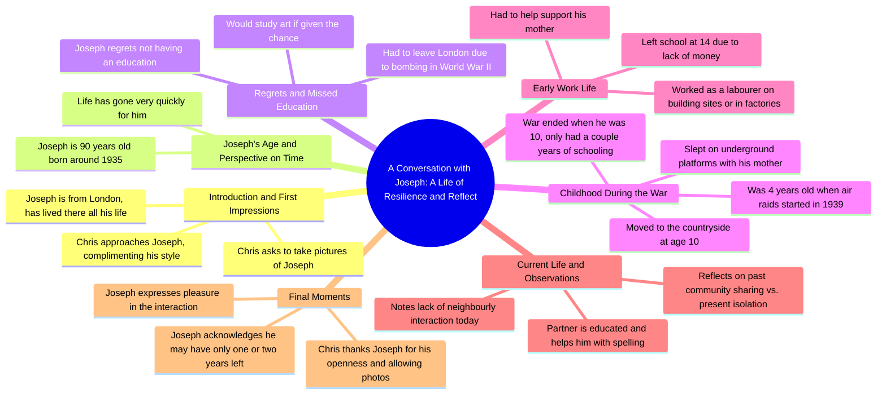

# Model Strangers Street Photography After Three Years

> 🌐 **Read this in:** **English** · [中文](../../zh-CN/2026-05/tiktok-transcript-i-have-been-working-on-model-strangers-for-almost-three-year-df88.md)

> **Creator:** [@modelstrangers](https://www.tiktok.com/@modelstrangers) · **Views:** 3.1M · **Posted:** 2026-05-29 · **Niche:** entertainment
>
> **TL;DR:** Opens with a genuine, emphatic compliment that immediately disarms and intrigues the viewer.

[Watch original video →](https://vm.tiktok.com/ZNRWuVT7Q/)

## Why This Went Viral

## Hook (first 3 seconds)
- **Verbatim opening line:** "excuse me sir my name is Chris I think you look very stylish very very stylish"
- **Hook pattern type:** Scene + compliment (street compliment / unexpected kindness)
- **Why it stops scrolling:** The immediate, genuine compliment ("very very stylish") creates a warm, unexpected moment. Viewers stop because they anticipate a positive human interaction, which is rare and refreshing in short-form content.

## Emotional Rhythm
- **Curiosity → Warmth → Vulnerability → Nostalgia → Melancholy → Gratitude → Catharsis**
- **Suspense:** When Chris asks "what age of a man are you?" and Joseph says "90" — the age gap creates tension about what wisdom or story will follow.
- **Resonance:** Joseph's regret about missing education and his desire to study art lands emotionally because it's universal (lost potential).
- **Twist:** The shift from light compliment to deep life reflection ("I haven't got many more years to come") surprises viewers.
- **Climax:** Joseph saying "I haven't got many more years to come... I might have one year, I might have two years" — the raw mortality statement.
- **Resolution:** Chris's gratitude and Joseph's gracious "it's been a pleasure" leave viewers with a sense of closure and warmth.

## Keyword Density
- **"education"** (5x) — drives emotional pull (regret, lost opportunity) and algorithmic reach (educational content tag)
- **"years"** (4x) — algorithmic (age/life stage content) + emotional (mortality)
- **"mother"** (4x) — emotional pull (family, vulnerability)
- **"war"** (3x) — algorithmic (historical content) + emotional (shared trauma)
- **"regret" / "regrets"** (2x) — high emotional resonance (universal theme)
- **"stylish"** (2x) — hook word, drives curiosity
- **"London"** (2x) — location-based algorithmic reach
- **"money"** (2x) — economic vulnerability, emotional pull
- **"bombing"** (1x) — strong historical/emotional anchor
- **"underground"** (1x) — vivid imagery, nostalgia trigger

## Why It Spreads
1. **Unexpected depth from a compliment hook:** The video starts with a light, positive interaction ("you look very stylish") and then pivots to a profound life story. This contrast keeps viewers engaged because they don't know where it's going. *Concrete line: "are you from London... have you lived here all your life... there's no money at all"*

2. **Mortality creates urgency:** Joseph's acknowledgment of limited time ("I haven't got many more years to come") triggers emotional sharing. People share content that makes them reflect on life. *Concrete line: "I might have one year I might have two years so I don't know"*

3. **Generational bridge:** The interaction between a young man (Chris) and a 90-year-old man (Joseph) creates a cross-generational appeal. Both young and old viewers see themselves or their grandparents. *Concrete line: "my partner's very educated and she teaches me sometimes"*

4. **Vulnerability is rewarded:** Joseph openly admits regret, lack of education, and loneliness. This emotional honesty feels rare and precious, making viewers want to honor his story by sharing. *Concrete line: "if there's anything I regret I would do it again I'd really study art"*

5. **Contrast between past and present:** Joseph contrasts community values ("you helped each other out") with modern isolation ("you gotta lock your bike up... no talking to a next door neighbour"). This nostalgic critique resonates widely. *Concrete line: "years ago you you helped each other out... it doesn't go on today"*

## What You Can Steal
1. **Start with a compliment, not a question:** Instead of asking "how are you?" or "can I ask you something?" — lead with genuine, specific praise. This disarms the subject and hooks the viewer immediately. Apply: In your next video, open with "I love your [specific detail]" before asking anything.

2. **Ask one "regret" question:** The most viral moment came from "do you have any regrets?" This question is universal, safe, yet deeply emotional. Apply: In any interview or conversation video, ask "what's one thing you wish you'd done differently?" — it consistently yields gold.

3. **Let silence and pauses breathe:** Joseph's pauses ("I haven't got many more years to come... I mean... oh I might have one year") are more powerful than words. Apply: Don't rush to fill gaps. Leave 1–2 seconds of silence after emotional statements — it amplifies impact and gives viewers time to feel.

## Mind Map

## Full Transcript (Generated by [analyze your own TikToks](https://toktranscript.com/?utm_source=github&utm_medium=breakdown&utm_campaign=tool_attribution))

> 📝 Transcripts on this page are auto-generated and show the first 60%. Want to transcribe any TikTok in 30 seconds and get the full version? [Try TokTranscript free →](https://toktranscript.com/?utm_source=github&utm_medium=breakdown&utm_campaign=transcript_cta)

excuse me sir my name is Chris I think you look very stylish very very stylish oh thank you are you from London yes have you lived here all your life all my life there's no money at all it's just me taking a pic couple of pictures of you oh hi Joseph Joseph nice to meet you Joseph thank you I'm very selective about who I approach what age of a man are you if you don't mind me asking 90 oh 19 35 has life gone very quickly for you oh god yeah yeah do you have any regrets I never had education I had to leave London and go and live in the country over my mother because of the bombing education is a wonderful thing and unfortunately I missed out on it mm hmm and if there's anything I regret I would do it again I'd really study art you know 1939 I think I was 4 when the air race started we'd go down in the underground and stay there she slept on the platform and in the morning you get up and then it was open so me and my mother and that that that house was still there my mother decided that we should go to the country you have to live with a family that I was 10 when the war finished only done a couple of years I left school at 14 because my mother had no money just had to um find a job and help support my mother do you remember what job then did you get well labouring labouring cause I I never had education you know on a building site or in a factory ye

*[Read the full transcript on TokTranscript →](https://toktranscript.com/plaza/tiktok-transcript-i-have-been-working-on-model-strangers-for-almost-three-year-df88?utm_source=github&utm_medium=breakdown&utm_campaign=transcript_full)*

## Browse More

- All [entertainment](../../by-niche/en/entertainment.md) breakdowns
- All [Compliment Hook](../../by-pattern/en/hook-compliment-hook.md) examples

## Video Info

| | |
|---|---|
| Creator | [@modelstrangers](https://www.tiktok.com/@modelstrangers) |
| Original video | [https://vm.tiktok.com/ZNRWuVT7Q/](https://vm.tiktok.com/ZNRWuVT7Q/) |
| Original title | I have been working on Model Strangers for almost three years now, an... |
| Views | 3.1M (3100000) |
| Posted | 2026-05-29 |
| Duration | 0s |
| Niche | `entertainment` |
| Hook pattern | `Compliment Hook` |
| Original language | `en` |
| Available languages | en, zh-CN |
| Generated | 2026-05-30 by [TokTranscript](https://toktranscript.com/) |

---

*This breakdown is for educational analysis under fair use. Original video © [@modelstrangers](https://www.tiktok.com/@modelstrangers). All transcripts are auto-generated and may contain errors.*

*Want to analyze your own TikToks like this? [TokTranscript →](https://toktranscript.com/viral-breakdown?utm_source=github&utm_medium=breakdown&utm_campaign=footer_cta)*