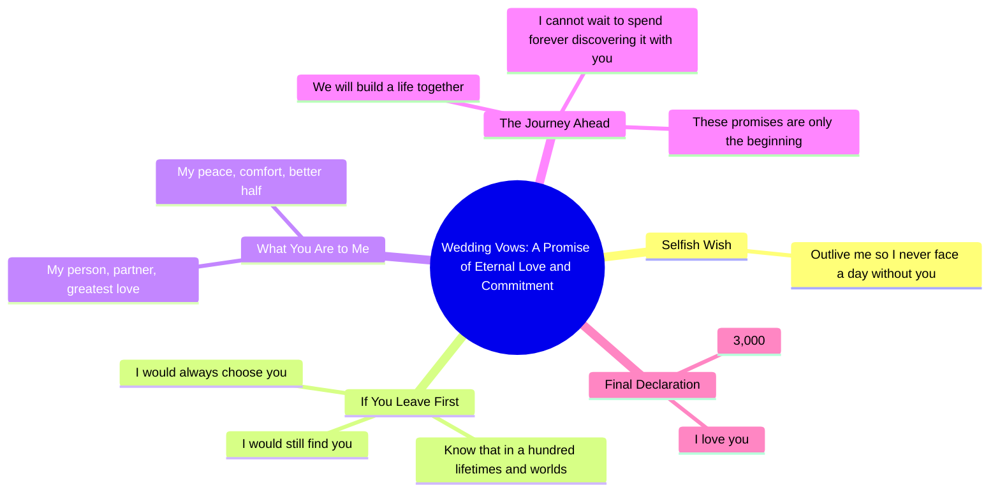

# Sharing My Wedding Vows and Crying Through Them

> 🌐 **Read this in:** **English** · [中文](../../zh-CN/2026-05/tiktok-transcript-i-realized-i-never-shared-my-wedding-vows-and-i-am-the-bigge-5de6.md)

> **Creator:** [@emmarovigalmanza](https://www.tiktok.com/@emmarovigalmanza) · **Views:** 8.9M · **Posted:** 2026-05-27 · **Niche:** other
>
> **TL;DR:** The hook subverts expectations by framing a selfless plea as a selfish wish, instantly grabbing attention.

[Watch original video →](https://www.tiktok.com/@emmarovigalmanza/video/7643848185848401182?is_from_webapp=1&sender_device=pc&web_id=7632039376462595606https://www.tiktok.com/@amandafilms__/video/7327396934660918574?is_from_webapp=1&sender_device=pc&web_id=7632039376462595606)

## Why This Went Viral

## Hook (first 3 seconds)
- **Verbatim opening line:** "Lastly, my one selfish wish in this marriage is simple. Outlive me so I never have to face a minute or a day without you."
- **Hook pattern:** **Contrast** (selfish wish vs. selfless love) + **Emotional vulnerability** (request to outlive)
- **Why it stops scrolling:** The word "selfish" creates immediate intrigue because it contradicts the expected selfless wedding vow tone. The raw, vulnerable plea ("outlive me") feels intimate and rare—viewers pause to hear the rest of this unconventional promise.

## Emotional Rhythm
- **Beat 1 – Curiosity/Intrigue:** "selfish wish" subverts expectations, making viewers lean in.
- **Beat 2 – Tension/Heartache:** "Outlive me so I never have to face a minute or a day without you" — introduces fear of loss.
- **Beat 3 – Suspense/Imagery:** "If the time comes and you leave this world before me" — builds anticipation for a twist.
- **Beat 4 – Climax (Resonance & Relief):** "In a hundred lifetimes... I would still find you" — the twist shifts from grief to eternal devotion, releasing tension.
- **Beat 5 – Warmth/Resolution:** "You are my person... my better half" — grounding, intimate naming creates emotional resonance.
- **Beat 6 – Payoff (Nostalgia):** "I love you. 3,000" — the "3,000" callback (from *Toy Story* / pop culture) lands as a surprise emotional punch.

## Keyword Density
| Word/Phrase | Frequency | Algorithmic Reach vs. Emotional Pull |
|-------------|-----------|--------------------------------------|
| **you** / **your** | 8 | **Emotional pull** — direct second-person creates intimacy, makes viewer feel addressed personally |
| **lifetimes** / **worlds** / **reality** | 3 | **Algorithmic reach** — grand, universal terms trigger "soulmate" and "love" search queries |
| **selfish** | 2 | **Emotional pull** — subversive word sparks curiosity and shares (people love "unexpected wedding vow" content) |
| **outlive** / **leave this world** | 2 | **Algorithmic reach** — taps into trending "grief" and "mortality" content loops, high engagement |
| **forever** | 1 | **Emotional pull** — classic love word, signals commitment |
| **3,000** | 1 | **Viral trigger** — pop culture reference (Toy Story) drives shares and comments ("I cried at 3,000") |

## Why It Spreads
1. **Subverts wedding vow expectations** — The "selfish wish" twist makes it stand out from generic vows. Viewers share it as "the most beautiful vow I've ever heard."
2. **Universal fear + resolution** — The fear of losing a partner (line: "face a minute or a day without you") is a primal human emotion. The resolution ("in a hundred lifetimes... I would still find you") provides catharsis, making it highly shareable in relationship/romance communities.
3. **Pop culture Easter egg** — "3,000" is a direct callback to *Toy Story* (Buzz Lightyear's "To infinity and beyond" — 3,000 is a fan-favorite number from the franchise). This triggers nostalgia, comments like "I heard 3,000 and sobbed," and cross-platform virality (TikTok, Instagram Reels, Pinterest).
4. **Perfect pacing for short-form** — The rhythm builds tension (fear) → twist (eternal love) → payoff (3,000). Each line is short, punchy, and designed for a 30–60 second video, keeping retention high.
5. **Emotional mirroring** — The direct address ("you") makes viewers imagine their own partner. This triggers personal sharing ("tag your person") and drives comments like "I want someone to say this to me."

## What You Can Steal
1. **Lead with a subversive word** — Start with a word that contradicts the expected tone (e.g., "selfish" in a love vow, "hate" in a gratitude post). This creates instant curiosity and stops the scroll.
2. **Use a pop culture callback as a climax** — Drop a specific, nostalgic reference (like "3,000") at the very end. It rewards loyal fans and drives comments/shares from people who catch it.
3. **Build a fear-to-relief arc in under 60 seconds** — Open with a universal fear (loss, rejection, loneliness), then pivot to a resolution (eternal love, hope, certainty). This emotional rollercoaster keeps retention high and makes the video feel "complete" — perfect for shares.

## Mind Map

## Full Transcript (Generated by [analyze your own TikToks](https://toktranscript.com/?utm_source=github&utm_medium=breakdown&utm_campaign=tool_attribution))

> 📝 Transcripts on this page are auto-generated and show the first 60%. Want to transcribe any TikTok in 30 seconds and get the full version? [Try TokTranscript free →](https://toktranscript.com/?utm_source=github&utm_medium=breakdown&utm_campaign=transcript_cta)

Lastly, my one selfish wish in this marriage is simple. Outlive me so I never have to face a minute or a day without you. But if the time comes and you leave this world before me, know this. In a hundred lifetimes, in a hundred worlds and in every version of reality, I would still find you. And I would always choose you.

*[Read the full transcript on TokTranscript →](https://toktranscript.com/plaza/tiktok-transcript-i-realized-i-never-shared-my-wedding-vows-and-i-am-the-bigge-5de6?utm_source=github&utm_medium=breakdown&utm_campaign=transcript_full)*

## Browse More

- All [other](../../by-niche/en/other.md) breakdowns
- All [Selfish wish twist](../../by-pattern/en/hook-selfish-wish-twist.md) examples

## Video Info

| | |
|---|---|
| Creator | [@emmarovigalmanza](https://www.tiktok.com/@emmarovigalmanza) |
| Original video | [https://www.tiktok.com/@emmarovigalmanza/video/7643848185848401182?is_from_webapp=1&sender_device=pc&web_id=7632039376462595606https://www.tiktok.com/@amandafilms__/video/7327396934660918574?is_from_webapp=1&sender_device=pc&web_id=7632039376462595606](https://www.tiktok.com/@emmarovigalmanza/video/7643848185848401182?is_from_webapp=1&sender_device=pc&web_id=7632039376462595606https://www.tiktok.com/@amandafilms__/video/7327396934660918574?is_from_webapp=1&sender_device=pc&web_id=7632039376462595606) |
| Original title | i realized I never shared my wedding vows and I am the biggest cry ba... |
| Views | 8.9M (8900000) |
| Posted | 2026-05-27 |
| Duration | 0s |
| Niche | `other` |
| Hook pattern | `Selfish wish twist` |
| Original language | `en` |
| Available languages | en, zh-CN |
| Generated | 2026-05-28 by [TokTranscript](https://toktranscript.com/) |

---

*This breakdown is for educational analysis under fair use. Original video © [@emmarovigalmanza](https://www.tiktok.com/@emmarovigalmanza). All transcripts are auto-generated and may contain errors.*

*Want to analyze your own TikToks like this? [the tool we used to generate this →](https://toktranscript.com/viral-breakdown?utm_source=github&utm_medium=breakdown&utm_campaign=footer_cta)*