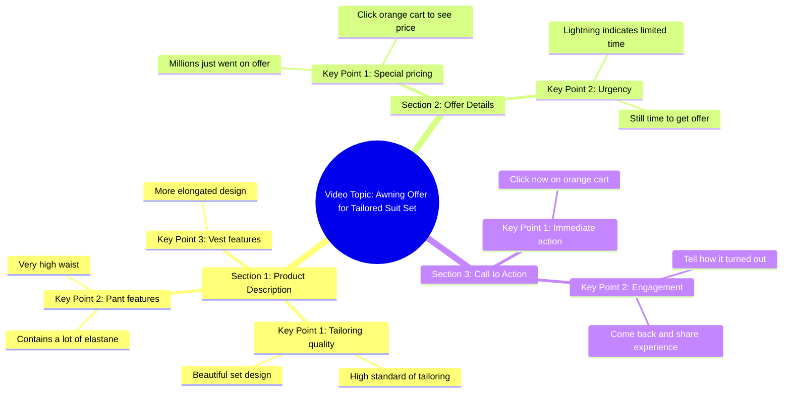

# Tailored Set With High-Waist Pants And Long Vest

> 🌐 **Read this in:** **English** · [中文](../../zh-CN/2026-05/tiktok-transcript-look-de-milh-es-conjuntofeminino-alfaiataria-elegante-177d.md)

> **Creator:** [@fabifigueiro_](https://www.tiktok.com/@fabifigueiro_) · **Views:** 2.4M · **Posted:** 2026-05-22 · **Niche:** other
>
> **TL;DR:** Creates immediate intrigue by promising something unbelievable.

[Watch original video →](https://www.tiktok.com/@fabifigueiro_/video/7593764719668792596?is_from_webapp=1&sender_device=pc&web_id=7569766293202830868)

## Why This Went Viral

## Hook (first 3 seconds)
- **Verbatim opening:** "You will not believe. This look here in the millions just went on awind offer."
- **Hook pattern:** Bold claim + scarce opportunity ("millions just went on awind offer")
- **Why it stops scroll:** The phrase "you will not believe" triggers immediate curiosity, and "millions just went on" creates urgency and exclusivity — viewers feel they might miss a rare deal.

## Emotional Rhythm
- **Beat 1 – Curiosity:** "You will not believe" — viewer wonders what is unbelievable.
- **Beat 2 – Scarcity:** "Millions just went on awind offer" — tension rises; something valuable is disappearing.
- **Beat 3 – Admiration:** "Beautiful set of tailoring… high standard" — positive reinforcement, visual pleasure.
- **Beat 4 – Urgency spike:** "Click now… orange cart" — direct call to action, pressure to act.
- **Beat 5 – Social proof:** "Lightning will tell you if it's not fancy" — implied third-party validation.
- **Beat 6 – Reward/Closure:** "Come back here and tell me how it turned out" — invites engagement and future payoff.
- **Climax:** "Lightning will tell you if it's not fancy" — the moment trust is transferred to an external, fast-acting judge.

## Keyword Density
- **"Offer"** (3x) — drives algorithmic reach (commerce-related keywords) and emotional pull (scarcity)
- **"Millions"** (2x) — algorithmic reach (high-value, viral-friendly number) + emotional pull (exclusivity)
- **"Beautiful"** (2x) — emotional pull (visual desire)
- **"Pants"** (2x) — product-specific, aids searchability
- **"Click" / "Cart"** (2x) — direct action triggers, algorithmic signal for conversion intent
- **"Lightning"** (2x) — brand name, builds trust and curiosity
- **"Run"** (1x) — urgency word, emotional trigger
- **"Not believe"** (1x) — curiosity hook, drives retention

## Why It Spreads
1. **Urgency without friction:** "Click now… run, there's still time" — creates FOMO but keeps CTA simple (one click to cart). Viewers act fast, boosting completion rate.
2. **Social proof via metaphor:** "Lightning will tell you if it's not fancy" — personifies the brand as a fast, honest judge. This reduces skepticism and increases shareability (people quote it).
3. **Engagement loop:** "Come back and tell me how it turned out" — directly invites comments, which signals the algorithm to push the video further.
4. **Visual specificity:** "Pants are very high, vest is more elongated" — paints a clear mental image, making the product feel tangible and worth investigating.
5. **Conversational disbelief:** "I'm not believing either" — creator aligns with viewer skepticism, building authenticity and lowering resistance.

## What You Can Steal
1. **Start with a disbelief + scarcity combo:** Open with "You will not believe" followed by a time-sensitive claim. This instantly hooks both curiosity and FOMO.
2. **Embed a "trust proxy" in your script:** Use a phrase like "[Brand/Person] will tell you if it's not good" — it offloads trust to an external authority and adds a memorable, quotable line.
3. **End with a direct engagement prompt:** Ask viewers to report back ("Come back and tell me how it turned out"). This drives comments, which algorithmically boosts reach — and creates a community feedback loop.

## Mind Map

## Full Transcript (Generated by [TokTranscript.com](https://toktranscript.com/?utm_source=github&utm_medium=breakdown&utm_campaign=tool_attribution))

> 📝 Transcripts on this page are auto-generated and show the first 60%. Want to transcribe any TikTok in 30 seconds and get the full version? [Try TokTranscript free →](https://toktranscript.com/?utm_source=github&utm_medium=breakdown&utm_campaign=transcript_cta)

You will not believe. This look here in the millions just went on awind offer. I'm not believing either, okay? It is a beautiful set of tailoring with a high standard, his pants are very high, with a lot of elatane and the vest is more elongated.

*[Read the full transcript on TokTranscript →](https://toktranscript.com/plaza/tiktok-transcript-look-de-milh-es-conjuntofeminino-alfaiataria-elegante-177d?utm_source=github&utm_medium=breakdown&utm_campaign=transcript_full)*

## Browse More

- All [other](../../by-niche/en/other.md) breakdowns
- All [Curiosity Gap](../../by-pattern/en/hook-curiosity-gap.md) examples

## Video Info

| | |
|---|---|
| Creator | [@fabifigueiro_](https://www.tiktok.com/@fabifigueiro_) |
| Original video | [https://www.tiktok.com/@fabifigueiro_/video/7593764719668792596?is_from_webapp=1&sender_device=pc&web_id=7569766293202830868](https://www.tiktok.com/@fabifigueiro_/video/7593764719668792596?is_from_webapp=1&sender_device=pc&web_id=7569766293202830868) |
| Original title | Look de milhões ✨✨ #conjuntofeminino #alfaiataria #elegante  |
| Views | 2.4M (2400000) |
| Posted | 2026-05-22 |
| Duration | 0s |
| Niche | `other` |
| Hook pattern | `Curiosity Gap` |
| Original language | `en` |
| Available languages | en, zh-CN |
| Generated | 2026-05-24 by [TokTranscript](https://toktranscript.com/) |

---

*This breakdown is for educational analysis under fair use. Original video © [@fabifigueiro_](https://www.tiktok.com/@fabifigueiro_). All transcripts are auto-generated and may contain errors.*

*Want to analyze your own TikToks like this? [the tool we used to generate this →](https://toktranscript.com/viral-breakdown?utm_source=github&utm_medium=breakdown&utm_campaign=footer_cta)*