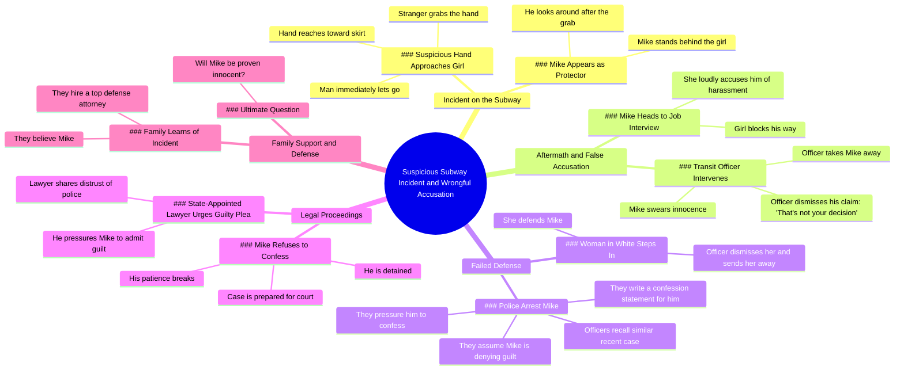

# Subway Hero Stops Harasser Before Job Interview

> 🌐 **Read this in:** **English** · [中文](../../zh-CN/2026-05/tiktok-transcript-movie-foryou-usa-tik-tok-a7d3.md)

> **Creator:** [@tmagnk](https://www.tiktok.com/@tmagnk) · **Views:** 1.4M · **Posted:** 2026-05-22 · **Niche:** entertainment
>
> **TL;DR:** Creates instant suspense with a vivid, alarming visual.

[Watch original video →](https://vt.tiktok.com/ZSxf6JBYR/)

## Why This Went Viral

## Hook (first 3 seconds)
- **Verbatim opening:** "In a crowded subway, a suspicious hand slowly reaches toward a girl's skirt."
- **Hook pattern:** Scene + Suspense (immediate visual threat)
- **Why it stops scroll:** Creates instant moral tension — viewer is forced to watch to see if the assault happens, triggering a protective/justice instinct.

## Emotional Rhythm
1. **Curiosity** — "suspicious hand" sets up a threat
2. **Tension** — hand reaches; grab happens; viewer expects assault
3. **Confusion/Relief** — "He suddenly grabs the stranger" — victim becomes assailant? Twist.
4. **Injustice** — Mike is falsely accused, arrested, dismissed by authority figures
5. **Frustration** — Officer, lawyer, police all pressure Mike to confess
6. **Hope** — Family hires top defense attorney
7. **Cliffhanger** — "Will Mike ultimately be proven innocent?" — unresolved emotional peak

**Climax moment:** "That's not your decision" — the officer shuts down Mike's truth, cementing the injustice.

## Keyword Density
| Word/Phrase | Frequency (approx.) | Driver |
|---|---|---|
| Mike | 8+ | Protagonist anchor — algorithmic identity tracking |
| officer / police / lawyer / case | 7+ | Authority figures — triggers "system failure" search clusters |
| confess / guilt / deny | 5+ | Core legal drama — emotional pull (innocence vs. corruption) |
| harassment / accused | 4+ | High-engagement social topic — algorithmic reach via controversy |
| innocent / proven | 3+ | Resolution hook — drives comment debate |

**Algorithmic reach drivers:** "harassment," "police," "case," "confess" — high-volume search terms.
**Emotional pull drivers:** "Mike," "innocent," "deny" — create identification and righteous anger.

## Why It Spreads
1. **Injustice triggers outrage sharing** — "They even write a confession statement for him" makes viewers want to warn others, share the injustice.
2. **False accusation fear is universal** — "Mike swears he never touched her, but the officer shuts him down" taps into a deep male/female anxiety that drives comments and shares.
3. **Authority betrayal fuels engagement** — "The officer dismisses her and sends her away" shows system failure, which generates debate (cops vs. victims vs. accused).
4. **Cliffhanger forces completion** — "Will Mike ultimately be proven innocent?" leaves the story unresolved, driving viewers to comment theories and tag friends for follow-up.
5. **Moral ambiguity creates split reaction** — The opening "suspicious hand" makes viewers initially side with the girl, then flip — this cognitive dissonance is highly shareable.

## What You Can Steal
1. **Start with a false assumption** — Open with a morally charged scene that tricks the viewer's initial judgment, then flip it. This creates a "wait, what?" moment that forces rewatch.
2. **Stack authority figures who fail** — Show 3+ different authority types (transit officer, police, lawyer) all making the same mistake. Each repetition amplifies emotional frustration and shareability.
3. **End with an unanswered question** — Don't resolve the story. Use a direct question ("Will Mike ultimately be proven innocent?") to force comments, saves, and follow-up requests.

## Mind Map

## Full Transcript (Generated by [try this transcription tool](https://toktranscript.com/?utm_source=github&utm_medium=breakdown&utm_campaign=tool_attribution))

> 📝 Transcripts on this page are auto-generated and show the first 60%. Want to transcribe any TikTok in 30 seconds and get the full version? [Try TokTranscript free →](https://toktranscript.com/?utm_source=github&utm_medium=breakdown&utm_campaign=transcript_cta)

In a crowded subway, a suspicious hand slowly reaches toward a girl's skirt. He suddenly grabs the stranger, but the man immediately lets go. When he looks around, he only sees Mike standing behind her. After getting off the train, Mike heads to a job interview, but the girl blocks his way. She loudly accuses him of harassment, and a transit officer takes Mike away. Mike swears he never touched her, but the officer shuts him down. That's not your decision. Suddenly, a woman in white steps in to defend Mike, but the officer dismisses her and sends her away. Soon after, police arrive and arrest Mike. Having recently handled a similar case, the officers are convinced Mike, just like the previous suspect, is simply denying guilt.

*[Read the full transcript on TokTranscript →](https://toktranscript.com/plaza/tiktok-transcript-movie-foryou-usa-tik-tok-a7d3?utm_source=github&utm_medium=breakdown&utm_campaign=transcript_full)*

## Browse More

- All [entertainment](../../by-niche/en/entertainment.md) breakdowns
- All [Immediate tension](../../by-pattern/en/hook-immediate-tension.md) examples

## Video Info

| | |
|---|---|
| Creator | [@tmagnk](https://www.tiktok.com/@tmagnk) |
| Original video | [https://vt.tiktok.com/ZSxf6JBYR/](https://vt.tiktok.com/ZSxf6JBYR/) |
| Original title | #movie#foryou#usa🇺🇸 #tik_tok |
| Views | 1.4M (1400000) |
| Posted | 2026-05-22 |
| Duration | 0s |
| Niche | `entertainment` |
| Hook pattern | `Immediate tension` |
| Original language | `en` |
| Available languages | en, zh-CN |
| Generated | 2026-05-25 by [TokTranscript](https://toktranscript.com/) |

---

*This breakdown is for educational analysis under fair use. Original video © [@tmagnk](https://www.tiktok.com/@tmagnk). All transcripts are auto-generated and may contain errors.*

*Want to analyze your own TikToks like this? [TokTranscript →](https://toktranscript.com/viral-breakdown?utm_source=github&utm_medium=breakdown&utm_campaign=footer_cta)*