# Modern Consciousness Catastrophe Explained

> 🌐 **Read this in:** **English** · [中文](../../zh-CN/2026-05/tiktok-transcript-note-this-video-will-lag-if-you-catch-it-early-you-can-downl-5a47.md)

> **Creator:** [@cypher.j](https://www.tiktok.com/@cypher.j) · **Views:** 2.7M · **Posted:** 2026-05-31 · **Niche:** other
>
> **TL;DR:** Opens with a high-stakes claim about a hidden catastrophe inside the mind, demanding immediate attention.

[Watch original video →](https://vm.tiktok.com/ZNRWEojhp/)

## Why This Went Viral

## Hook (first 3 seconds)
- **Verbatim opening:** "This is a deeper take, so I'm gonna need you to lock in for a second."
- **Hook pattern:** Bold claim + direct command ("lock in")
- **Why it stops scrolling:** The speaker pre-frames the content as requiring effort ("deeper take"), which signals intellectual exclusivity. The command "lock in" creates a pact—viewers feel chosen, elite. It also triggers curiosity: *What catastrophe? Why do I need to "lock in"?*

## Emotional Rhythm
1. **Curiosity** (0:00–0:10) – "One of the biggest catastrophes… has already happened."
2. **Tension** (0:10–0:30) – "A massive percentage of humanity no longer experiences life directly anymore. They monitor it."
3. **Recognition / Resonance** (0:30–1:00) – Examples of vacation, love, relationships—viewers see themselves.
4. **Escalation** (1:00–2:00) – Historical framing: tribes → kingdoms → television → smartphone → "catastrophe became total."
5. **Interactive Twist** (2:00–2:30) – "I want you to look around the room…" – direct engagement breaks the passive viewing spell.
6. **Despair / Weight** (2:30–3:30) – "Perceptually exhausted." Observer invades prayer, rest, love.
7. **Climax** (3:30–4:00) – "When is the last time you experienced something without converting it into a reflection of yourself?"
8. **Resolution / Call** (4:00–end) – "The real fight now is learning how to exist again without immediately converting existence into perception."

**Climax moment:** The direct question: *"When is the last time you experienced something without converting it into a reflection of yourself?"* — forces self-confrontation.

## Keyword Density
| Keyword / Phrase | Count (approx) | Driver |
|------------------|----------------|--------|
| Observer / false observer | 15+ | **Algorithmic reach** (unique, searchable concept) + **emotional pull** (creates a villain) |
| Render / rendering | 10+ | **Emotional pull** (fresh, visceral verb) |
| Monitor / monitoring | 8 | **Emotional pull** (clinical, cold — contrasts with "experience") |
| Perform / performing | 8 | **Algorithmic reach** (trending topic: performance culture) |
| Direct experience / directly | 7 | **Emotional pull** (yearning, loss) |
| Audience | 6 | **Algorithmic reach** (creator economy buzzword) |
| Catastrophe | 3 | **Emotional pull** (high-stakes framing) |
| Perception | 5 | **Emotional pull** (abstract, philosophical) |

**Why these work:** "Observer" is a coined term — unique, brandable, searchable. "Render" is unexpected, visual, sticky. "Monitor" and "perform" are high-engagement psychological triggers.

## Why It Spreads
1. **Universal recognition disguised as revelation** — "People go on vacation and never fully arrived…" — almost every viewer has felt this. The video names a nameless anxiety. People share it to say: *"This is exactly what I’ve been feeling."*
2. **Interactive moment breaks passivity** — "I want you to look around the room…" — viewers stop scrolling, follow the instruction, and experience the concept *live*. This creates a memorable, shareable "aha" moment.
3. **Escalating historical framing builds authority** — "This did not begin with social media…" — by tracing the observer back to tribes, law, writing, television, the speaker avoids sounding like a surface-level hot take. This earns trust and makes the video feel "deep" — a status signal to share.
4. **Climax question is a viral hook itself** — "When is the last time you experienced something without converting it into a reflection of yourself?" — this is quotable, tweetable, and prompts self-reflection. It becomes a caption, a comment, a thought experiment.
5. **Emotional exhaustion is a massive, underserved niche** — "Perceptually exhausted" names a feeling millions have but can't articulate. The video gives language to a modern malaise. People share it to explain *themselves* to others.

## What You Can Steal
1. **The "coined term" tactic** — Invent a single, sticky phrase that summarizes your thesis (here: "the false observer"). Repeat it relentlessly. It becomes a mental handle viewers can grab and share.
2. **The interactive break** — Mid-video, directly instruct the viewer to do something physical/mental (look around, feel your face, notice a thought). This resets attention, deepens engagement, and creates a personal experience they'll remember.
3. **The escalation structure** — Start with a relatable modern example (vacation, love), then zoom out historically (tribes → kingdoms → television → phone), then zoom in personally (your prayer, your face, your last direct experience). This gives the video weight, scope, and intimacy — a rare combination that feels profound.

## Mind Map

```mermaid
mindmap
  root((The Catastrophe of the False Observer in Human Consciousness))
    The Core Problem: Loss of Direct Experience
      ## Massive percentage of humanity no longer experiences life directly
      ## People have become monitors of their own existence
      ## The mechanism is so normalized it's called 'personality'
      Examples of Monitoring Behavior
        #### Vacations: Documenting experience instead of arriving
        #### Relationships: Tracking response times, tone shifts, eye contact
        #### Love: Interpreting feelings instead of feeling them
        #### General: Rendering oneself for perception
      The Replacement of Reality
        #### Representation slowly replaces reality
        #### The false observer is born
        #### Self becomes symbolic rather than direct
    Historical Development of the Observer
      ## Did not begin with social media
      ## Social media industrialized it
      ## Built over thousands of years
      Pre-Modern Stages
        #### Small tribes: Observer activated temporarily
        #### Civilization scaling: Reputation, status, role stability matter
        #### Kingdoms: Law, writing, religion, empire
        #### Identity becomes symbolic and legible
      Modern Acceleration
        #### Mass society: Cities full of strangers evaluating constantly
        #### Television: Comparing to engineered appearances
        #### Internet and smartphone: Externalized observer in pocket
        #### Approval numerical, identity searchable, performance continuous
    The Mechanism: The False Observer
      ## A second layer monitoring the self
      ## Evaluates understanding, appearance, resonance, agreement
      ## Appears before moments finish happening
      Effects on Human Experience
        #### Perceptual exhaustion beyond work exhaustion
        #### Constant rendering and managing of appearance
        #### Nervous system not designed for permanent audience conditions
        #### Observer follows into bed, relationships, grief, art, sex, solitude, rest, 
      The Observer in Sacred Spaces
        #### Prayer becomes performance sincerity, holiness
        #### Stillness feels like disappearance
        #### Phone reached for when reality slows down
        #### Silence threatens the rendered self
    Social and Political Consequences
      ## Observer-dependent populations destabilize truth
      ## Appearances matter more than direct assessment
      Political Distortions
        #### Politics becomes perception management
        #### Institutions become render systems
        #### Public figures become symbolic products
        #### Visibility confused with virtue
        #### Images feel true regardless of reality
        #### Populations trapped in mutual render fields
      Relationship Damage
        #### Love requires presence, not performance
        #### Intimacy turns into surveillance
        #### Partner becomes psychological audience
        #### Spontaneous presence collapses
        #### Play, stillness, naturalness collapse
        #### Both people perform relational coherence
    The Ultimate Catastrophe
      ## False observer imitates genuine experiences
      ## Simulated people replace real people
      ## Direct experience is killed
      The Observer's Intolerance
        #### Cannot tolerate immediacy
        #### Needs archive, narrative, render stability
        #### Replaces participation with management
      Psychological Death Before Physical Death
        #### Spontaneous self collapses from disuse
        #### Wonder, play, silence, presence weaken
        #### Lukewarm consciousness results
        #### People achieve dreams but feel absent
        #### Love but fall emotionally far away
        #### Document moments but rarely live inside them
    The Scaling Threat
      ## Observer is still scaling
      ## Phone is prototype, not end point
      Infrastructural Observer
        #### Algorithms learn what captures attention
        #### Platforms learn what stabilizes identity
        #### Systems learn what keeps people rendering
        #### Observer becoming planetary
      The End Point
        #### Populations stop asking 'what is true?'
        #### They ask 'what survives perception?'
        #### Civilization watches itself living forever
        #### Increasingly visible but increasingly absent
    The Call to Action
      ## Find the last time you experienced without converting to reflection
      ## No audience, no archive, no narration, no self-management
      ## Pure encounter before interpretation
      The Real Fight
        #### Learn to exist without converting to perception
        #### Love without monetizing
        #### Create without optimizing
        #### Sit alone with no audience, no rendering, no performance, no monitoring
        #### Silence feels terrifying because existence without being watched is unknown
```

## Full Transcript (Generated by [TokTranscript](https://toktranscript.com/?utm_source=github&utm_medium=breakdown&utm_campaign=tool_attribution))

> 📝 Transcripts on this page are auto-generated and show the first 60%. Want to transcribe any TikTok in 30 seconds and get the full version? [Try TokTranscript free →](https://toktranscript.com/?utm_source=github&utm_medium=breakdown&utm_campaign=transcript_cta)

This is a deeper take, so I'm gonna need you to lock in for a second. But one of the biggest catastrophes in modern human history has already happened, and it happened inside human consciousness itself. I want you to understand what I'm saying. A massive percentage of humanity no longer experiences life directly anymore. They monitor it. Human beings are slowly losing their ability to simply exist without converting themselves into an object being watched. And the terrifying part is that the mechanism has become so normal, people started calling it a personality. You can see it everywhere now. People go on vacation and never fully arrived because half the experience is spent documenting the fact that they're having an experience. People fall in love and immediately begin tracking response times, tone shifts, eye contact, symbolic gestures. Who pulled away first, who seem more. Who seem more invested. Because now people don't feel anymore. They interpret themselves feeling. They monitor themselves feeling. They render themselves feeling. And once a human being starts experiencing themselves primarily through perception, the representation slowly replaces reality. And this did not begin with social media. I don't want you to think about that. Social media industrialized this. Human civilization has been slowly constructing the false observer for thousands of years. The. The moment that civilization scaled beyond small tribes, the observer began forming. Because now reputation mattered Status mattered. Role stability mattered. The village needed to know who you were. Then kingdoms arrived, right? Then law, then writing, then religion, then empire. Now identity could survive beyond direct memory. The self became symbolic. And human beings stop merely existing at that point. They became legible. Right? They became legible. The mass society arrived. Cities full of strangers, millions of people who don't know you, don't love you, don't remember you, and still evaluate you constantly. Then television happened. And for the first time in history, the average person began comparing themselves to someone who is not in their community, but a professionally engineered appearance. And then the internet showed up. And then the smartphone. And this is exactly where the catastrophe became total. Because the phone accomplished something that no other invention previously had and externalized the observer itself. now Audience lives in your pocket. Approval became numerical, identity became searchable. Memory became permanent, and performance became continuous. And the observer, it stopped turning off. But actually, I'm gonna show you it right now. I wanna wait for a second because I don't want you to get past this part too far. I want you to catch it directly right now. Not philosophically, not conceptually. Directly. I want you to look around the room you're in. Just look around. Notice how fast something appears. A second layer, a watcher. Not the part of you seeing the room, the part of you monitoring you seeing the room. The thing evaluating whether you understand this correctly, whether you look stupid listening to this, whether This resonates whether you agree, whether this sounds profound, whether you should share later, and whether you're the kind of person who could understand this, or who even would understand this. That voice, that layer, that is it. That is the false observer. And it does something horrifying. It appeared before that moment even finished happening. And this is why modern people are exhausted in a way the older language can never explain. Because you're not just work exhausted, you're perceptually exhausted. Perceptually exhausted. People are rendering themselves constantly. They're managing how they appear, how they're interpreted, how they're. How they're archived, how they compare, how they signal, how they exist symbolically. And the nervous system was never designed to be a permanent. To be in permanent audience conditions. Human beings evolved in environments where the observer was active, was activated temporarily, right in danger and ritual and courtship and status conflict. And then it deactivated. Now it follows people everywhere into bed, into relationships, into grief, into art, and sex and solitude, and rest and sleep, even into prayer. Some of you are no longer fully praying. When you pray, part of you is watching yourself pray while you're doing it, evaluating whether they sound sincere enough or holy enough, removed enough or changed enough. That's how deep the observer goes. Eventually, the audience enters the sacred places that were supposed to free people from audiences entirely. And this is exactly why. This is exactly why people can't rest anymore. Because stillness feels like disappearance. If no one is perceiving you and you're not actively rendering yourself, the observer starts panicking. This is exactly why people reach for the phone the moment reality slows down. Because silence threatens the rendered self. Now, i'mma show you something worse. I'mma show you something far worse from this. Right? I want you to feel your own face for a second. But not physically, right? Even though I just did that. Not physically. Socially. Notice how many people are still attached to your face. Your family, your ex, your friends, your coworkers, your followers and strangers and people you haven't spoken to in years. Notice how much of your behaviour is still being shaped unconsciously by. By unconsciously rendered movement toward invisible audiences that are not even physically present anymore. Some of you were still performing for rooms that left 10 years ago. It. It happens. And it scales upward to politics, too. Because once. Once populations become observer dependent, truth itself destabilizes. Because appearances matter more than direct assessment. And politics becomes. Becomes perception. Management and institutions become render systems, and public figures become symbolic products. Entire size, entire societies begin confusing visibility with virtue. And we see it in the modern day all the time. If enough people repeat back the same image to each other, the image starts to feel true regardless of reality. And modern political discourse feels insane. Because people are no longer primarily encountering conditions. They're Encountering representations of conditions. And then representations of representations. And the narratives competing against other narratives. Entire populations trapped inside mutual render fields. And then. Then relationships suffer the worst. Because love requires presence. Right not performance, just presence. But the false observer turns intimacy into surveillance. People stop loving each other directly. Now they monitor whether they love correctly*, whether they love correctly, whether they appear lovable, whether they're losing value, whether they're enough, whether the relationship looks secure. The partner starts being encountered directly and becomes a psychological audience. And this is why modern relationships feel exhausting, even when both people genuinely care. Because the observer enters the room. And once the observer enters love, spontaneous presence It starts collapsing. Play collapses. Stillness collapses. Naturalness collapses. Both people begin performing relational coherence for each other instead of fully inhabiting each other.

*[Read the full transcript on TokTranscript →](https://toktranscript.com/plaza/tiktok-transcript-note-this-video-will-lag-if-you-catch-it-early-you-can-downl-5a47?utm_source=github&utm_medium=breakdown&utm_campaign=transcript_full)*

## Browse More

- All [other](../../by-niche/en/other.md) breakdowns
- All [Urgent philosophical revelation](../../by-pattern/en/hook-urgent-philosophical-revelation.md) examples

## Video Info

| | |
|---|---|
| Creator | [@cypher.j](https://www.tiktok.com/@cypher.j) |
| Original video | [https://vm.tiktok.com/ZNRWEojhp/](https://vm.tiktok.com/ZNRWEojhp/) |
| Original title | note: This video will lag if you catch it early. You can download it ... |
| Views | 2.7M (2700000) |
| Posted | 2026-05-31 |
| Duration | 0s |
| Niche | `other` |
| Hook pattern | `Urgent philosophical revelation` |
| Original language | `en` |
| Available languages | en, zh-CN |
| Generated | 2026-06-02 by [TokTranscript](https://toktranscript.com/) |

---

*This breakdown is for educational analysis under fair use. Original video © [@cypher.j](https://www.tiktok.com/@cypher.j). All transcripts are auto-generated and may contain errors.*

*Want to analyze your own TikToks like this? [TokTranscript →](https://toktranscript.com/viral-breakdown?utm_source=github&utm_medium=breakdown&utm_campaign=footer_cta)*