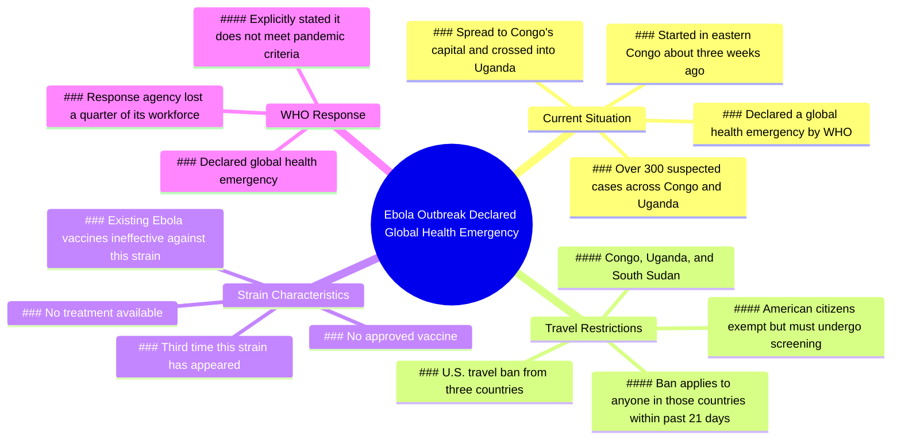

# Ebola Outbreak Declared Global Health Emergency, US Bans...

> 🌐 **Read this in:** **English** · [中文](../../zh-CN/2026-05/tiktok-transcript-one-thing-after-another-504d.md)

> **Creator:** [@niickjackson](https://www.tiktok.com/@niickjackson) · **Views:** 3.0M · **Posted:** 2026-05-25 · **Niche:** other
>
> **TL;DR:** Immediately establishes timeliness and severity, prompting viewers to stay for critical updates.

[Watch original video →](https://www.tiktok.com/t/ZTBFcDp9S/)

## Why This Went Viral

## Hook (first 3 seconds)
- **Verbatim opening:** "The Ebola outbreak that is happening right now just got declared a global health emergency and as of today the United States has now banned travel from three different countries."
- **Hook pattern:** **Urgent news + numbers + contrast** (declared emergency vs. no vaccine/treatment)
- **Why it stops scrolling:** It opens with a present-tense, high-stakes global health crisis ("right now," "just got declared"), immediately followed by a concrete, actionable consequence ("banned travel"). The viewer feels a time-sensitive threat that demands attention.

## Emotional Rhythm
1. **Urgency/Fear (0–3s):** "global health emergency," "banned travel" — immediate threat
2. **Alarm/Anxiety (3–8s):** "over 300 total suspected cases," "no approved vaccine," "no treatment for this strain" — escalating danger
3. **Shock/Disbelief (8–12s):** "only the third time this strain has ever shown up," "existing Ebola vaccines don't even work" — twist that undermines assumed safety
4. **Tension (12–20s):** News clip introduces official declaration, geographic spread, travel ban details — factual reinforcement of threat
5. **Hopelessness/Resignation (20–26s):** "no treatment," "no vaccine," "lost a quarter of their workforce" — climax of despair
6. **Sarcastic release (26s):** "So are we good?" — dark humor twist that relieves tension and invites engagement

**Climax moment:** The line "the existing Ebola vaccines don't even work" — this is the emotional peak where fear transforms into helplessness.

## Keyword Density
| Keyword/Phrase | Frequency | Driver |
|----------------|-----------|--------|
| "Ebola" | 5 | Algorithmic (trending health topic) + emotional (fear) |
| "no vaccine" / "no treatment" | 3 | Emotional (hopelessness) + algorithmic (controversy) |
| "global health emergency" | 3 | Algorithmic (official WHO designation, news value) |
| "banned travel" / "banned" | 3 | Emotional (personal impact) + algorithmic (US policy) |
| "strain" | 3 | Emotional (specificity, novelty) |
| "Congo" / "Uganda" / "South Sudan" | 5 | Algorithmic (geographic news, searchable) |
| "right now" / "as of today" | 3 | Emotional (urgency, timeliness) |

**Algorithmic drivers:** "Ebola," "global health emergency," "banned travel," country names — these are high-search-volume, news-cycle keywords that trigger recommendation systems.

**Emotional pull:** "No vaccine," "no treatment," "doesn't work" — these create fear and helplessness, driving shares and comments.

## Why It Spreads
1. **Fear of the unknown + personal relevance** — The travel ban ("banned from entering the U.S.") makes a distant outbreak feel personally threatening to American viewers. This localizes a global crisis.
2. **Contradiction-driven engagement** — "Declared a global health emergency… said it does not meet the criteria to be a pandemic" — this contradiction invites viewers to comment "Wait, what?" or argue, boosting algorithmic signals.
3. **Dark humor as a share trigger** — The final line "So are we good?" is sarcastic and relatable. Viewers share it as a "this is fine" meme reaction, spreading the video beyond its original audience.
4. **Information gap creates search intent** — "No approved vaccine and no treatment for this strain" leaves viewers unsatisfied. They search for updates, comment asking for more, or share to warn others — all amplifying reach.
5. **News clip integration builds credibility** — The cut to a real news broadcast (with official WHO declaration) makes the video feel authoritative, reducing skepticism and increasing trust-driven shares.

## What You Can Steal
1. **Open with a "right now" time stamp + a concrete consequence** — Always start with "As of today" or "Just happened" and immediately state what it means for the viewer (e.g., "banned travel," "prices just doubled"). This creates urgency and personal stakes.
2. **Use a "twist" in the middle that contradicts a common assumption** — After establishing the threat, add a line like "but here's the thing nobody is talking about" or "and the vaccines don't even work." This keeps viewers watching and fuels comments.
3. **End with a sarcastic, low-energy punchline** — After building high tension, undercut it with a deadpan question ("So are we good?") or a one-liner. This makes the video shareable as a meme and relieves the emotional pressure, making viewers more likely to engage.

## Mind Map

## Full Transcript (Generated by [TokTranscript](https://toktranscript.com/?utm_source=github&utm_medium=breakdown&utm_campaign=tool_attribution))

> 📝 Transcripts on this page are auto-generated and show the first 60%. Want to transcribe any TikTok in 30 seconds and get the full version? [Try TokTranscript free →](https://toktranscript.com/?utm_source=github&utm_medium=breakdown&utm_campaign=transcript_cta)

The Ebola outbreak that is happening right now just got declared a global health emergency and as of today the United States has now banned travel from three different countries. There are over 300 total suspected cases across Congo and Uganda right now and there is no approved vaccine and no treatment for this strain at all. They're saying that this is actually only the third time that this strain has ever even shown up and the existing Ebola vaccines don't even work. Tonight, outbreaks of the deadly Ebola virus in two African countries have prompted the World Health Organization to declare a global health emergency. It started in eastern Congo about three weeks ago, and since then, it has spread to Congo's capital and crossed the border to Uganda.

*[Read the full transcript on TokTranscript →](https://toktranscript.com/plaza/tiktok-transcript-one-thing-after-another-504d?utm_source=github&utm_medium=breakdown&utm_campaign=transcript_full)*

## Browse More

- All [other](../../by-niche/en/other.md) breakdowns
- All [Urgent News Alert](../../by-pattern/en/hook-urgent-news-alert.md) examples

## Video Info

| | |
|---|---|
| Creator | [@niickjackson](https://www.tiktok.com/@niickjackson) |
| Original video | [https://www.tiktok.com/t/ZTBFcDp9S/](https://www.tiktok.com/t/ZTBFcDp9S/) |
| Original title | ONE THING AFTER ANOTHER |
| Views | 3.0M (3000000) |
| Posted | 2026-05-25 |
| Duration | 0s |
| Niche | `other` |
| Hook pattern | `Urgent News Alert` |
| Original language | `en` |
| Available languages | en, zh-CN |
| Generated | 2026-05-26 by [TokTranscript](https://toktranscript.com/) |

---

*This breakdown is for educational analysis under fair use. Original video © [@niickjackson](https://www.tiktok.com/@niickjackson). All transcripts are auto-generated and may contain errors.*

*Want to analyze your own TikToks like this? [the tool we used to generate this →](https://toktranscript.com/viral-breakdown?utm_source=github&utm_medium=breakdown&utm_campaign=footer_cta)*