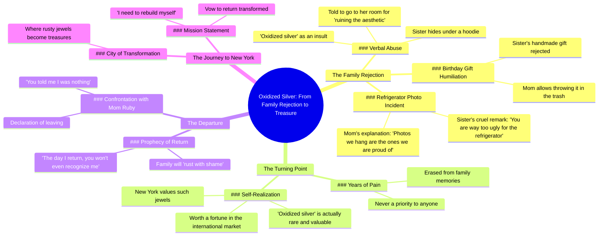

# Part 2: Oxidized Silver and Ruby Story

> 🌐 **Read this in:** **English** · [中文](../../zh-CN/2026-05/tiktok-transcript-part-2-the-oxidized-sliver-and-the-ruby-story-part-1-fruitst-375f.md)

> **Creator:** [@night.clock3](https://www.tiktok.com/@night.clock3) · **Views:** 3.6M · **Posted:** 2026-05-22 · **Niche:** other
>
> **TL;DR:** The hook immediately establishes a painful family dynamic through a simple question and a cruel answer.

[Watch original video →](https://vt.tiktok.com/ZSxf8nd9h/)

## Why This Went Viral

## Hook (first 3 seconds)
- **Verbatim opening line:** "Mom, why don't you have any photos of me on the refrigerator?"
- **Hook pattern:** Question + emotional scene (family rejection)
- **Why it stops scroll:** The question instantly signals a relatable childhood wound (being overlooked), paired with a tense family dynamic. The contrast between the innocent question and the cold reply creates immediate emotional friction — viewers *have* to see how the mother responds.

## Emotional Rhythm
- **Beat 1 – Curiosity (0:00–0:03):** Innocent question sets up a family scene.
- **Beat 2 – Tension (0:04–0:10):** Mother’s cruel reply ("ugly") → sister joins in → viewer feels secondhand pain.
- **Beat 3 – Twist (0:11–0:20):** The sister reveals she is actually "oxidized silver" — rare and valuable. This flips the narrative from victim to hidden power.
- **Beat 4 – Triumph/Resolution (0:21–0:35):** Protagonist declares she's leaving for New York to become a treasure. Climax: "The day I return, you won't even recognize me."
- **Final resonance:** The last line ("the day I return") leaves the story open-ended, inviting viewers to imagine the revenge arc.

## Keyword Density
| Keyword/Phrase | Count (approx.) | Driver |
|----------------|----------------|--------|
| "oxidized silver" | 3 | **Algorithmic reach** (unique, searchable phrase) + emotional pull (identity) |
| "rusting" / "rusty" | 3 | **Emotional pull** (metaphor for shame → transformation) |
| "New York" | 3 | **Algorithmic reach** (location-based trend) + aspirational symbol |
| "treasure" / "jewel" | 3 | **Emotional pull** (self-worth) + **algorithmic** (luxury/wealth keywords) |
| "regret" | 2 | **Emotional pull** (revenge fantasy) |
| "hide" / "hiding" | 2 | **Emotional pull** (shame, invisibility) |
| "room" | 2 | **Algorithmic** (family drama, relatable) |
| "mom" | 3 | **Algorithmic** (family content is high-engagement) |

## Why It Spreads
1. **Relatable family wound + revenge fantasy** – The mother’s cold line ("photos we hang are the ones we are proud of") triggers anyone who’s felt unseen. The daughter’s eventual triumph ("oxidized silver is worth a fortune") offers a satisfying emotional payoff.
2. **Twist that redefines identity** – The reveal that "ugly" = "rare jewel" is a powerful reframe. Viewers share it because it feels like a secret weapon against their own insecurities.
3. **Open-ended cliffhanger** – "The day I return" leaves the story unfinished. This drives comments and speculation (e.g., "What happens next?") — which boosts algorithmic engagement.
4. **High-contrast emotional arc** – From rejection to empowerment in under 60 seconds. The speed of the emotional shift makes it addictive to watch again.
5. **Dialogue-driven + visual metaphor** – The lines are tight and punchy (no filler). The "oxidized silver" metaphor is both visual and verbal — easy to screenshot or quote in shares.

## What You Can Steal
1. **Start with a universal wound, then flip it.** Open with a question that implies rejection ("Why no photos of me?"), then reveal the "flaw" is actually a superpower. This pattern works for any niche (e.g., "Why do you never feature me?" → "I'm the rarest type of content creator").
2. **Use a specific, unusual metaphor as a hook.** "Oxidized silver" is memorable and searchable. Pick a concrete, slightly odd analogy for your value (e.g., "I'm like a dusty vinyl record — everyone thinks I'm old, but collectors pay thousands").
3. **End on a promise, not a conclusion.** "The day I return, you won't even recognize me" leaves the story open. This invites comments ("Part 2?") and keeps viewers in your ecosystem. Use this for series or to build anticipation for your next video.

## Mind Map

## Full Transcript (Generated by [TokTranscript](https://toktranscript.com/?utm_source=github&utm_medium=breakdown&utm_campaign=tool_attribution))

> 📝 Transcripts on this page are auto-generated and show the first 60%. Want to transcribe any TikTok in 30 seconds and get the full version? [Try TokTranscript free →](https://toktranscript.com/?utm_source=github&utm_medium=breakdown&utm_campaign=transcript_cta)

Mom, why don't you have any photos of me on the refrigerator? Because the photos we hang are the ones we are proud of, dear. Mom is right. You are way too ugly for the refrigerator. Hahaha! Happy birthday, sister! I made your gift myself. Mom, this is horrible. Can I just throw it in the trash? Of course, dear. And you, oxidized silver. Go to your room! You're ruining the aesthetic of the photos. Look at her, my sister. Trying to hide that rusty skin under that filthy hoodie. One day you are going to regret every single word. Years of hiding. They erased me from everything as if I were a mistake. I am never a priority to anyone. Oxidized silver.

*[Read the full transcript on TokTranscript →](https://toktranscript.com/plaza/tiktok-transcript-part-2-the-oxidized-sliver-and-the-ruby-story-part-1-fruitst-375f?utm_source=github&utm_medium=breakdown&utm_campaign=transcript_full)*

## Browse More

- All [other](../../by-niche/en/other.md) breakdowns

## Video Info

| | |
|---|---|
| Creator | [@night.clock3](https://www.tiktok.com/@night.clock3) |
| Original video | [https://vt.tiktok.com/ZSxf8nd9h/](https://vt.tiktok.com/ZSxf8nd9h/) |
| Original title | Part 2 | The Oxidized sliver and the ruby story Part 1   #fruitstory ... |
| Views | 3.6M (3600000) |
| Posted | 2026-05-22 |
| Duration | 0s |
| Niche | `other` |
| Original language | `en` |
| Available languages | en, zh-CN |
| Generated | 2026-05-24 by [TokTranscript](https://toktranscript.com/) |

---

*This breakdown is for educational analysis under fair use. Original video © [@night.clock3](https://www.tiktok.com/@night.clock3). All transcripts are auto-generated and may contain errors.*

*Want to analyze your own TikToks like this? [TokTranscript →](https://toktranscript.com/viral-breakdown?utm_source=github&utm_medium=breakdown&utm_campaign=footer_cta)*