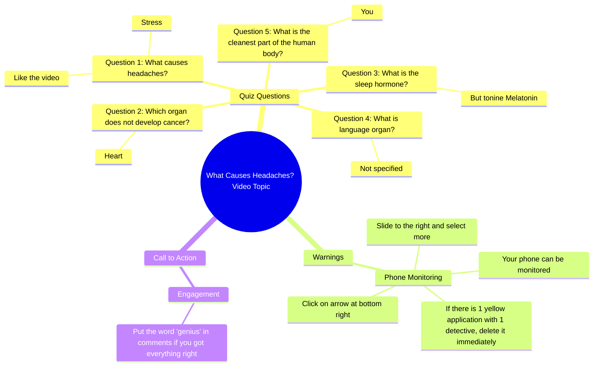

# Human Body Quiz: What Causes Headaches?

> 🌐 **Read this in:** **English** · [中文](../../zh-CN/2026-05/tiktok-transcript-quiz-sur-le-corps-humain-pourtoi-cultureg-quizz-france-corps-64ff.md)

> **Creator:** [@quizdfi0](https://www.tiktok.com/@quizdfi0) · **Views:** 962.7K · **Posted:** 2026-05-25 · **Niche:** entertainment
>
> **TL;DR:** The hook challenges the viewer with a trivia question and implies a high-stakes failure, prompting them to stay for the 'last question'.

[Watch original video →](https://vm.tiktok.com/ZS9YGHCeD53eJ-8RJew/ تتم مشاركة هذا المنشور عبر TikTok Lite. نزّل TikTok Lite للاستمتاع بمزيد من المنشورات: https://www.tiktok.com/tiktoklite)

## Why This Went Viral

## Hook (first 3 seconds)
- **Verbatim opening:** "What causes headaches? Stress"
- **Hook pattern:** **Question → immediate answer** (a subcategory of the "quiz/challenge" pattern)
- **Why it stops scroll:** It baits the viewer into a quick knowledge test. The second line ("Like the video. If you had the right answer, no one passes the last question") creates a **false sense of superiority** and then immediately threatens it — the viewer feels compelled to stay and prove they're smarter than "no one."

## Emotional Rhythm
- **Beat 1 – Curiosity + Challenge:** "What causes headaches?" → viewer answers mentally. Quick dopamine hit.
- **Beat 2 – Tension + Fear of Missing Out:** "No one passes the last question" → stakes are raised. Viewer feels they *must* stay to see if they're the exception.
- **Beat 3 – Suspense + Alarm:** "Your phone can be monitored… delete it immediately" → sudden shift from trivia to **security threat**. This is the twist — the video pivots from brain teaser to survival warning.
- **Beat 4 – Relief + Reward:** "If you got everything right… put genius in comments" → viewer feels validated. They want to claim the label.
- **Climax moment:** The security warning ("delete it immediately") — it's the most emotionally charged line, designed to trigger action (commenting, sharing, checking settings).

## Keyword Density
| Word/Phrase | Count (approx) | Driver |
|-------------|----------------|--------|
| "What" (question pattern) | 3 | **Algorithmic reach** — questions trigger high engagement (comments, replies) |
| "Right answer" / "got everything right" | 2 | **Emotional pull** — validation & ego |
| "Delete it immediately" | 1 (but strong) | **Algorithmic + emotional** — urgency drives shares & saves |
| "Genius" | 1 | **Emotional pull** — identity label, triggers comments |
| "No one passes" | 1 | **Emotional pull** — scarcity & challenge |
| "Phone can be monitored" | 1 | **Algorithmic reach** — high curiosity click-through |

## Why It Spreads
1. **False scarcity + ego bait:** "No one passes the last question" makes viewers feel special if they do. They share to prove they're the exception. *(Concrete line: "no one passes the last question")*
2. **Abrupt genre shift (trivia → security scare):** The twist from harmless quiz to "your phone is being monitored" is **unexpected and alarming**. This triggers a **compulsive save** — viewers save the video to check their phone later. *(Concrete line: "your phone can be monitored… delete it immediately")*
3. **Low-friction engagement loop:** The video explicitly asks for a like ("Like the video"), a comment ("put the word genius"), and a share (the arrow instruction). This creates a **3-action CTA** that feels like a game. *(Concrete lines: "Like the video," "click on the arrow," "put the word genius")*
4. **Identity-reinforcing comment bait:** "Put genius in comments" is a **self-labeling trap** — viewers want to claim the title, and their comment feeds the algorithm's engagement signal. *(Concrete line: "put the word genius in comments")*
5. **Urgency + fear of missing out (FOMO):** The security warning is delivered as a **time-sensitive threat** ("delete it immediately"). This makes viewers share the video to friends who might be at risk. *(Concrete line: "delete it immediately")*

## What You Can Steal
1. **The "quiz → scare" twist:** Start with a harmless trivia question, then pivot to a **personal security or health warning**. The contrast keeps retention high and drives saves.
2. **Triple-action CTA in one video:** Don't just ask for a like — ask for a like, a comment (with a specific word), and a share (with a visual instruction). Make it feel like a **multi-step game**.
3. **Identity label as comment bait:** Ask viewers to comment a single word that labels them as "smart" or "in the know" (e.g., "genius," "expert," "survivor"). People will **claim the identity** publicly.

## Mind Map

## Full Transcript (Generated by [free TikTok transcript generator](https://toktranscript.com/?utm_source=github&utm_medium=breakdown&utm_campaign=tool_attribution))

> 📝 Transcripts on this page are auto-generated and show the first 60%. Want to transcribe any TikTok in 30 seconds and get the full version? [Try TokTranscript free →](https://toktranscript.com/?utm_source=github&utm_medium=breakdown&utm_campaign=transcript_cta)

What causes headaches? Stress Like the video. If you had the right answer, no one passes the last question. Which organ does not develop cancer Heart Before you continue, know that your phone can be monitored to find out. Click on the arrow at the bottom right, slide to the right and select more.

*[Read the full transcript on TokTranscript →](https://toktranscript.com/plaza/tiktok-transcript-quiz-sur-le-corps-humain-pourtoi-cultureg-quizz-france-corps-64ff?utm_source=github&utm_medium=breakdown&utm_campaign=transcript_full)*

## Browse More

- All [entertainment](../../by-niche/en/entertainment.md) breakdowns
- All [Challenge with stakes](../../by-pattern/en/hook-challenge-with-stakes.md) examples

## Video Info

| | |
|---|---|
| Creator | [@quizdfi0](https://www.tiktok.com/@quizdfi0) |
| Original video | [https://vm.tiktok.com/ZS9YGHCeD53eJ-8RJew/ تتم مشاركة هذا المنشور عبر TikTok Lite. نزّل TikTok Lite للاستمتاع بمزيد من المنشورات: https://www.tiktok.com/tiktoklite](https://vm.tiktok.com/ZS9YGHCeD53eJ-8RJew/ تتم مشاركة هذا المنشور عبر TikTok Lite. نزّل TikTok Lite للاستمتاع بمزيد من المنشورات: https://www.tiktok.com/tiktoklite) |
| Original title | Quiz sur le corps humain😎. #pourtoi #cultureg #quizz #france #corps  |
| Views | 962.7K (962700) |
| Posted | 2026-05-25 |
| Duration | 0s |
| Niche | `entertainment` |
| Hook pattern | `Challenge with stakes` |
| Original language | `en` |
| Available languages | en, zh-CN |
| Generated | 2026-05-27 by [TokTranscript](https://toktranscript.com/) |

---

*This breakdown is for educational analysis under fair use. Original video © [@quizdfi0](https://www.tiktok.com/@quizdfi0). All transcripts are auto-generated and may contain errors.*

*Want to analyze your own TikToks like this? [try this transcription tool →](https://toktranscript.com/viral-breakdown?utm_source=github&utm_medium=breakdown&utm_campaign=footer_cta)*