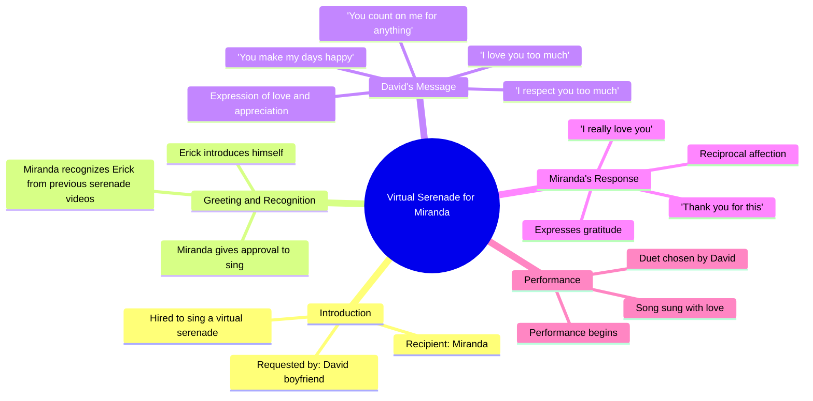

# Virtual Serenade Surprise: What Happened Next

> 🌐 **Read this in:** **English** · [中文](../../zh-CN/2026-05/tiktok-transcript-serenata-virtual-mira-lo-que-pas-amor-duosfreefire-garenafre-ff5e.md)

> **Creator:** [@soyerickcanto](https://www.tiktok.com/@soyerickcanto) · **Views:** 1.1M · **Posted:** 2026-05-26 · **Niche:** entertainment
>
> **TL;DR:** The hook creates immediate curiosity by revealing a hired virtual serenade, making viewers want to see the surprise unfold.

[Watch original video →](https://www.tiktok.com/@soyerickcanto/video/7592389638652759303?is_from_webapp=1&sender_device=pc&web_id=7603080485002610184)

## Why This Went Viral

## Hook (first 3 seconds)
- **What happens verbatim:** "I was hired to sing and give a virtual serenade to his girlfriend and that's what happened" (spoken over a split-screen of the singer and the girlfriend reacting).
- **Hook pattern:** Scene + Contrast (the singer sets up a "job" scenario, then immediately cuts to the girlfriend's live reaction, creating a "this is real" contrast).
- **Why it stops scrolling:** The opening line promises a voyeuristic, emotional, and unscripted moment. The viewer is instantly curious: *Who is this guy? What’s the girlfriend’s reaction?* The split-screen (singer on one side, girlfriend on the other) visually signals that something is about to happen—a classic "reaction video" trigger.

## Emotional Rhythm
- **Beat 1 – Curiosity (0–3s):** The singer explains the setup. Viewer asks: *Will she be surprised? Will she cry?*
- **Beat 2 – Anticipation + Tension (3–10s):** The girlfriend is invited in ("invite her invite her"). She answers, and the singer reveals the boyfriend hired him. This is the "reveal" beat—viewer waits for her emotional response.
- **Beat 3 – Emotional Resonance (10–30s):** The boyfriend speaks. His words are sincere ("I love you too much, I respect you too much"). This is the **climax**—the raw, unscripted love confession. The girlfriend’s reaction (tears, "ay love thank you so much") is the reward.
- **Beat 4 – Relief + Warmth (30s–end):** The song begins. The tension of "will she like it?" is resolved. The video ends on a safe, feel-good note.

## Keyword Density
| Keyword / Phrase | Count (approx.) | Why It Works |
|------------------|-----------------|--------------|
| "love" / "I love you" | 8+ | **Emotional pull** – taps into universal desire for affection; triggers algorithm's "relationship" topic clusters. |
| "serenade" / "virtual serenade" | 4 | **Algorithmic reach** – niche, searchable term (people search for "virtual serenade ideas"). |
| "hired" / "hired me" | 2 | **Algorithmic reach** – signals "service" content, which is shareable for its novelty. |
| "girlfriend" / "boyfriend" | 5 | **Emotional pull + reach** – high-engagement relationship keywords. |
| "thank you" | 4 | **Emotional pull** – gratitude signals genuine emotion; encourages viewer to feel good. |
| "baby" / "precious" / "my life" | 5 | **Emotional pull** – intimacy markers; make the moment feel private, increasing voyeuristic shareability. |

## Why It Spreads
1. **Voyeuristic emotional payoff** – The viewer gets to watch a private, unscripted moment of love and surprise. The boyfriend’s raw words ("you know I love you too much") feel real, not staged. This triggers the "cringe-to-cute" viral mechanism—viewers share because it feels like they’re peeking into a real relationship.
2. **Service-based novelty** – "I was hired to sing" is a clear, unique hook. People share because the concept of a "virtual serenade" is novel and relatable (everyone wants to surprise their partner). The video becomes a template for "how to do this" or "look what I found."
3. **Emotional mirroring** – The girlfriend’s reaction (tears, laughter, "ay love thank you so much") is the reward. Viewers mirror her emotion, which increases the likelihood of sharing (people share content that makes them feel good or cry).
4. **Split-screen structure** – The visual format (singer on one side, girlfriend on the other) creates a clear narrative arc. It’s easy to follow, and the viewer feels like they’re in the room. This is inherently shareable because it’s a "reaction video" format, which has proven viral mechanics.
5. **Low barrier to engagement** – The video ends on a song, which is a natural "pause" point. Viewers are more likely to comment ("this is so sweet," "I wish my boyfriend did this") because the emotional peak has passed, leaving them in a warm, reflective state.

## What You Can Steal
1. **The "invite" technique** – Instead of jumping straight into the content, create a small moment of suspense. In this video, the singer says "invite her, invite her" before the girlfriend joins. This builds anticipation and makes the viewer feel like they’re part of the process. *Apply this:* Before revealing a surprise or result, add a single line of "setup" dialogue that delays the payoff by 2–3 seconds.
2. **The "raw confession" sandwich** – The boyfriend’s words are unscripted, emotional, and specific ("you make my days happy"). This is the viral core. *Apply this:* In any surprise/reaction video, ask the person giving the surprise to say 2–3 genuine, unprompted lines before the main event. Don’t script it—let them speak from the heart. That raw moment is what gets shared.
3. **Split-screen reaction format** – The video uses a simple split-screen: the performer on one side, the receiver on the other. This allows the viewer to see both the setup and the reaction simultaneously. *Apply this:* For any "surprise" or "reveal" content (gift, prank, announcement), record both parties in the same frame or use a split-screen. It doubles the emotional impact and makes the video feel more complete.

## Mind Map

## Full Transcript (Generated by [TokTranscript](https://toktranscript.com/?utm_source=github&utm_medium=breakdown&utm_campaign=tool_attribution))

> 📝 Transcripts on this page are auto-generated and show the first 60%. Want to transcribe any TikTok in 30 seconds and get the full version? [Try TokTranscript free →](https://toktranscript.com/?utm_source=github&utm_medium=breakdown&utm_campaign=transcript_cta)

I was hired to sing and give a virtual serenade to his girlfriend and that's what happened I'm already dale bro invite her invite her invite her dale bro I'm already inviting her hello love hello love hello Miranda how are you well maybe you don't call me my name is Erick I sing and I do virtual serenades eh yes I know you I have seen your serenade videos. Ah seriously well today it was your turn to your boyfriend David eh has hired me to sing you a song and I don't know if I can sing it to you if you give me the approval to sing it to you yes of course dale va great well eh I don't know if David wants to tell you something brother something you want to say to your girlfriend before you start singing.

*[Read the full transcript on TokTranscript →](https://toktranscript.com/plaza/tiktok-transcript-serenata-virtual-mira-lo-que-pas-amor-duosfreefire-garenafre-ff5e?utm_source=github&utm_medium=breakdown&utm_campaign=transcript_full)*

## Browse More

- All [entertainment](../../by-niche/en/entertainment.md) breakdowns
- All [Mystery Setup](../../by-pattern/en/hook-mystery-setup.md) examples

## Video Info

| | |
|---|---|
| Creator | [@soyerickcanto](https://www.tiktok.com/@soyerickcanto) |
| Original video | [https://www.tiktok.com/@soyerickcanto/video/7592389638652759303?is_from_webapp=1&sender_device=pc&web_id=7603080485002610184](https://www.tiktok.com/@soyerickcanto/video/7592389638652759303?is_from_webapp=1&sender_device=pc&web_id=7603080485002610184) |
| Original title | Serenata virtual, mira lo que pasó…  #amor #duosfreefire #garenafreef... |
| Views | 1.1M (1100000) |
| Posted | 2026-05-26 |
| Duration | 0s |
| Niche | `entertainment` |
| Hook pattern | `Mystery Setup` |
| Original language | `en` |
| Available languages | en, zh-CN |
| Generated | 2026-05-27 by [TokTranscript](https://toktranscript.com/) |

---

*This breakdown is for educational analysis under fair use. Original video © [@soyerickcanto](https://www.tiktok.com/@soyerickcanto). All transcripts are auto-generated and may contain errors.*

*Want to analyze your own TikToks like this? [try this transcription tool →](https://toktranscript.com/viral-breakdown?utm_source=github&utm_medium=breakdown&utm_campaign=footer_cta)*