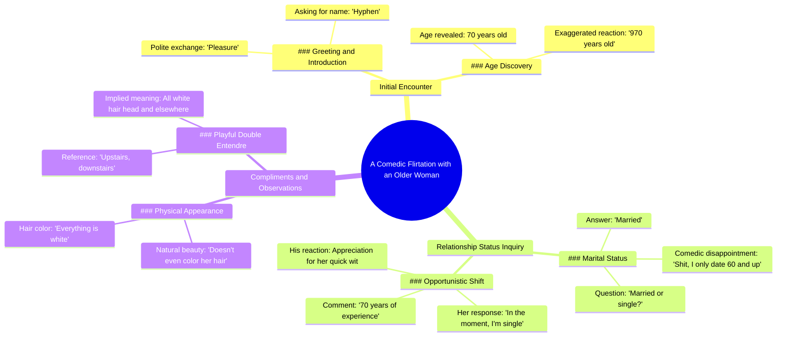

# 70-Year-Old Indian Grandma's Dating Game Is Strong

> 🌐 **Read this in:** **English** · [中文](../../zh-CN/2026-05/tiktok-transcript-she-may-be-70-but-her-dating-game-is-timeless-indian-grandma-6bdc.md)

> **Creator:** [@maxcomedian](https://www.tiktok.com/@maxcomedian) · **Views:** 2.1M · **Posted:** 2026-05-27 · **Niche:** entertainment
>
> **TL;DR:** The hook uses a playful exaggeration to immediately grab attention and set a humorous tone.

[Watch original video →](https://vt.tiktok.com/ZSxXbyUpA/)

## Why This Went Viral

## Hook (first 3 seconds)
- **Verbatim opening:** "These ladies, so nice. Hi. What's your name? Hyphen. Hyphen, pleasure. How old are you? I'm 70. She's 970 years old."
- **Hook pattern:** Scene + Numbers (dialogue drops a specific age, then a hyperbolic contrast)
- **Why it stops scrolling:** The age gap joke ("70" vs "970") is absurd and instantly disorienting — viewers need to rewatch or keep watching to understand if this is real or a bit. The fast, confident delivery signals something unexpected is coming.

## Emotional Rhythm
- **Beat 1 — Curiosity:** "These ladies, so nice." — warm, open, invites trust.
- **Beat 2 — Playful Tension:** "I only date 60 and up… I thought you might be single as my lucky day, but no." — flirty joke lands, creates a mini cliffhanger.
- **Beat 3 — Twist / Suspense:** "In the moment, I'm single." — she flips the script; viewer doesn't know if she's serious or joking.
- **Beat 4 — Relief + Resonance:** "That's 70 years of experience right there. She knows not to miss an opportunity." — punchline resolves the tension with admiration, not cringe.
- **Beat 5 — Resonance + Visual Payoff:** "Everything is white. Upstairs, downstairs." — self-deprecating humor from the creator, ends on a shared laugh.
- **Climax moment:** "In the moment, I'm single." — the exact line where the video could go awkward or charming; it lands charming.

## Keyword Density
1. **"In the moment"** (3×) — algorithmic: repeated phrase triggers pattern recognition; emotional: frames her as spontaneous, confident.
2. **"Single"** (3×) — algorithmic: high-interest relationship keyword; emotional: creates the romantic tension.
3. **"70" / "970"** (2×) — algorithmic: numbers in video titles/descriptions boost click-through; emotional: absurd contrast drives shareability.
4. **"Experience"** (1×, but implied throughout) — emotional: reframes age as asset, not liability.
5. **"Upstairs, downstairs"** (1×) — emotional: visual metaphor is memorable and quotable.
6. **"Beautiful"** (1×) — emotional: positive reinforcement, makes the moment feel genuine.
7. **"Indian women"** (1×) — algorithmic: niche demographic tag; emotional: signals cultural specificity and pride.

**Algorithmic drivers:** "single," "70," "Indian women" — these are searchable, trendable, and hook into relationship/age-gap content verticals.

**Emotional pull drivers:** "in the moment," "experience," "upstairs, downstairs" — these are quotable, relatable, and create the "I want to be like her" effect.

## Why It Spreads
1. **Unexpected confidence from an older woman.** "In the moment, I'm single" is a masterclass in seizing an opportunity without desperation. Viewers share it as an example of "how to be charming at any age."
2. **The age joke is a viral math puzzle.** "970 years old" is so absurd it forces rewatching and commenting ("Did she really say 970?"). This drives watch time and engagement signals.
3. **The creator sets up a romantic premise, then subverts it with admiration.** He starts flirting, but ends by praising her natural beauty ("doesn't even color her hair"). This avoids the cringe of a failed pickup and instead becomes wholesome — a high-share emotional category.
4. **"Upstairs, downstairs" is an instant meme template.** It's a visual, self-deprecating punchline that viewers can quote and reuse in their own content about aging or gray hair.
5. **The interaction feels real, not scripted.** The camera shake, the natural pause, the genuine laugh — it passes the "authenticity test" that platforms reward.

## What You Can Steal
1. **Use the "absurd number" hook.** Open with a realistic fact, then immediately exaggerate it into a joke (e.g., "I'm 30. I'm 930."). This creates a pattern interrupt that forces rewatch.
2. **Flip the script from pursuit to praise.** Start with a flirtatious premise, then pivot to genuine admiration. This turns a potentially awkward moment into a viral "wholesome" clip.
3. **End with a visual, self-deprecating punchline.** "Upstairs, downstairs" is a metaphor you can see. In your next video, close with a line that paints a picture of your own flaw — it makes the creator likable and the moment shareable.

## Mind Map

## Full Transcript (Generated by [TokTranscript](https://toktranscript.com/?utm_source=github&utm_medium=breakdown&utm_campaign=tool_attribution))

> 📝 Transcripts on this page are auto-generated and show the first 60%. Want to transcribe any TikTok in 30 seconds and get the full version? [Try TokTranscript free →](https://toktranscript.com/?utm_source=github&utm_medium=breakdown&utm_campaign=transcript_cta)

These ladies, so nice. Hi. What's your name? Hyphen. Hyphen, pleasure. How old are you? I'm 70. She's 970 years old. You guys are married or single? Married. Oh, married. Shit, I. I only date 60 and up, so I thought you might be single as my lucky day, but no. In the moment, I'm single. In the moment, you're single? I love Indian women.

*[Read the full transcript on TokTranscript →](https://toktranscript.com/plaza/tiktok-transcript-she-may-be-70-but-her-dating-game-is-timeless-indian-grandma-6bdc?utm_source=github&utm_medium=breakdown&utm_campaign=transcript_full)*

## Browse More

- All [entertainment](../../by-niche/en/entertainment.md) breakdowns
- All [Exaggerated compliment](../../by-pattern/en/hook-exaggerated-compliment.md) examples

## Video Info

| | |
|---|---|
| Creator | [@maxcomedian](https://www.tiktok.com/@maxcomedian) |
| Original video | [https://vt.tiktok.com/ZSxXbyUpA/](https://vt.tiktok.com/ZSxXbyUpA/) |
| Original title | She may be 70 but her dating game is timeless! Indian grandma bringin... |
| Views | 2.1M (2100000) |
| Posted | 2026-05-27 |
| Duration | 0s |
| Niche | `entertainment` |
| Hook pattern | `Exaggerated compliment` |
| Original language | `en` |
| Available languages | en, zh-CN |
| Generated | 2026-05-28 by [TokTranscript](https://toktranscript.com/) |

---

*This breakdown is for educational analysis under fair use. Original video © [@maxcomedian](https://www.tiktok.com/@maxcomedian). All transcripts are auto-generated and may contain errors.*

*Want to analyze your own TikToks like this? [TokTranscript.com →](https://toktranscript.com/viral-breakdown?utm_source=github&utm_medium=breakdown&utm_campaign=footer_cta)*