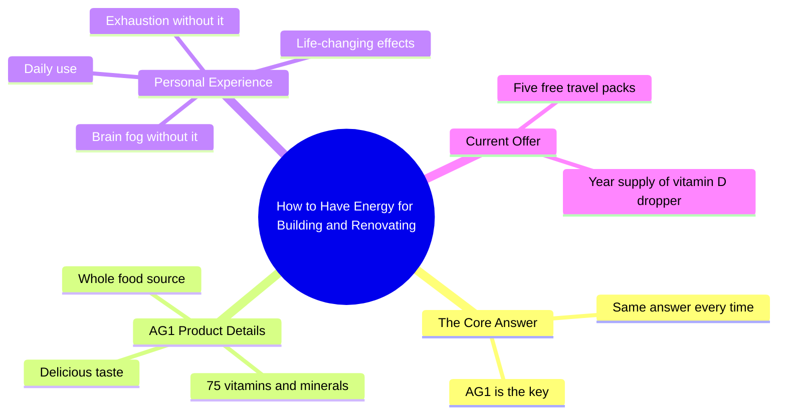

# The Number One Question I Get Has the Same Answer: AG1

> 🌐 **Read this in:** **English** · [中文](../../zh-CN/2026-05/tiktok-transcript-the-number-one-question-i-get-always-has-the-same-answer-i-d-d0f4.md)

> **Creator:** [@thehonesthome_](https://www.tiktok.com/@thehonesthome_) · **Views:** 24.3M · **Posted:** 2026-05-29 · **Niche:** other
>
> **TL;DR:** Poses a relatable question about energy and productivity, immediately engaging viewers who seek similar results.

[Watch original video →](https://www.tiktok.com/@thehonesthome_/video/7021306251829071110?is_from_webapp=1&sender_device=pc&web_id=7637572452097754637)

## Why This Went Viral

## Hook (first 3 seconds)
- **Verbatim opening line:** "My most asked question is how do you have all the energy you do to build and renovate all the spaces that you do?"
- **Hook pattern type:** Scene + Contrast (high-energy creator vs. the viewer's assumption of exhaustion)
- **Why it stops scrolling:** It directly addresses a frequently asked question, creating instant curiosity. The contrast between "all the energy" and "build and renovate" signals an answer to a relatable pain point (low energy), making viewers feel seen and eager for the solution.

## Emotional Rhythm
- **Beat 1 – Curiosity:** "My most asked question is…" — viewer leans in, expecting a secret.
- **Beat 2 – Tension/Relatability:** "…how do you have all the energy…" — viewer recognizes their own fatigue.
- **Beat 3 – Trust/Intimacy:** "You already know I only share stuff with you that I love" — establishes credibility and personal endorsement.
- **Beat 4 – Relief/Validation:** "When I don't take it, I have brain fog and I'm exhausted all day" — validates the viewer's struggle and makes the product feel like a solution.
- **Beat 5 – Climax (Emotional Peak):** "I love the stuff. It has changed my life." — high emotional resonance, feels like a genuine transformation story.
- **Beat 6 – Action/Urgency:** "When you check out AG1 right now… they're giving you five travel packs for free" — closes with a limited-time incentive, driving conversion.

## Keyword Density
- **"Energy"** (3x) – Drives algorithmic reach (high-volume search term) and emotional pull (viewer pain point).
- **"Brain fog"** (1x) – Specific symptom that resonates deeply with tired, high-performers; strong emotional trigger.
- **"Changed my life"** (1x) – High emotional weight; signals transformation, not just utility.
- **"Love"** (2x) – Emotional pull; builds trust and likability.
- **"Free"** (2x) – Algorithmic reach (promotional signal) and conversion driver.
- **"AG1"** (2x) – Brand keyword; essential for searchability and brand recall.
- **"Travel packs"** (1x) – Specific, tangible benefit that feels valuable and low-risk.

## Why It Spreads
1. **Directly answers a high-volume, relatable question.** "How do you have all the energy?" is a universal pain point for creators, builders, and busy people. The video feels like a personal secret, not a sales pitch.
2. **Uses a "before/after" emotional arc without showing it.** The contrast between "brain fog/exhaustion" and "changed my life" creates a mini-story that feels authentic and aspirational.
3. **Trust-first framing.** "You already know I only share stuff with you that I love" positions the creator as a curator, not a paid shill. This lowers resistance and increases shareability.
4. **Urgency without pressure.** The free travel packs and vitamin D dropper offer a tangible, low-friction reward for immediate action, driving shares and clicks.
5. **Short, punchy, and emotionally dense.** Every line serves a purpose: curiosity, validation, solution, transformation, call-to-action. No wasted words — ideal for short-form retention.

## What You Can Steal
1. **Lead with a frequently asked question.** Start your video with a question your audience actually asks you. It instantly hooks and feels like a personal response, not generic content.
2. **Use a "before/after" emotional contrast without showing footage.** Describe the negative state (brain fog, exhaustion) and the positive outcome (changed my life) to create a mini-story that feels real and relatable.
3. **Frame your endorsement as curation, not promotion.** Say "I only share stuff I love" or "I can't live without it" to build trust and make viewers feel like they're getting an insider tip, not an ad.

## Mind Map

## Full Transcript (Generated by [TokTranscript.com](https://toktranscript.com/?utm_source=github&utm_medium=breakdown&utm_campaign=tool_attribution))

> 📝 Transcripts on this page are auto-generated and show the first 60%. Want to transcribe any TikTok in 30 seconds and get the full version? [Try TokTranscript free →](https://toktranscript.com/?utm_source=github&utm_medium=breakdown&utm_campaign=transcript_cta)

My most asked question is how do you have all the energy you do to build and renovate all the spaces that you do? And it's the same answer every time. You already know I only share stuff with you that I love and I can't live without. AG1 is 75 vitamins and minerals from a whole food source. It tastes delicious.

*[Read the full transcript on TokTranscript →](https://toktranscript.com/plaza/tiktok-transcript-the-number-one-question-i-get-always-has-the-same-answer-i-d-d0f4?utm_source=github&utm_medium=breakdown&utm_campaign=transcript_full)*

## Browse More

- All [other](../../by-niche/en/other.md) breakdowns
- All [Curiosity Gap](../../by-pattern/en/hook-curiosity-gap.md) examples

## Video Info

| | |
|---|---|
| Creator | [@thehonesthome_](https://www.tiktok.com/@thehonesthome_) |
| Original video | [https://www.tiktok.com/@thehonesthome_/video/7021306251829071110?is_from_webapp=1&sender_device=pc&web_id=7637572452097754637](https://www.tiktok.com/@thehonesthome_/video/7021306251829071110?is_from_webapp=1&sender_device=pc&web_id=7637572452097754637) |
| Original title | The number one question I get always has the same answer. I drink AG1... |
| Views | 24.3M (24300000) |
| Posted | 2026-05-29 |
| Duration | 0s |
| Niche | `other` |
| Hook pattern | `Curiosity Gap` |
| Original language | `en` |
| Available languages | en, zh-CN |
| Generated | 2026-05-30 by [TokTranscript](https://toktranscript.com/) |

---

*This breakdown is for educational analysis under fair use. Original video © [@thehonesthome_](https://www.tiktok.com/@thehonesthome_). All transcripts are auto-generated and may contain errors.*

*Want to analyze your own TikToks like this? [TokTranscript →](https://toktranscript.com/viral-breakdown?utm_source=github&utm_medium=breakdown&utm_campaign=footer_cta)*