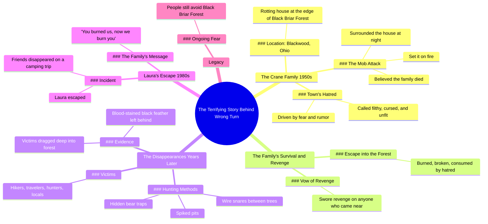

# the real story behind wrong turn  #creepy #1900s #storytime #wrongturn 

> 🌐 **Read this in:** **English** · [中文](../../zh-CN/2026-05/tiktok-transcript-the-real-story-behind-wrong-turn-creepy-1900s-storytime-wron-337b.md)

> **Creator:** [@darkhistorytales1](https://www.tiktok.com/@darkhistorytales1) · **Views:** 5.8M · **Posted:** 2026-05-24 · **Niche:** entertainment
>
> **TL;DR:** Opens with a promise of a scary secret origin, hooking viewers who know the movie.

[Watch original video →](https://vm.tiktok.com/ZNRn9bLj9/)

## Why This Went Viral

## Hook (first 3 seconds)
- **Verbatim opening:** "this is the terrifying story behind Wrong Turn"
- **Hook pattern:** **Bold claim** (linking a popular horror movie to a "true" story) + **Scene setting** (1950s, quiet town, Blackwood Ohio)
- **Why it stops scroll:** It promises an exclusive, hidden backstory to a known IP ("Wrong Turn"), instantly tapping into curiosity and the "true story" myth. The phrase "terrifying story" creates immediate emotional tension.

## Emotional Rhythm
1. **Curiosity** (0–3s): "terrifying story behind Wrong Turn" — viewer wants the secret.
2. **Tension** (3–10s): "mob surrounded the house and set it on fire" — injustice and danger.
3. **Resonance** (10–15s): "burned broken and consumed by hatred" — sympathy for the villains.
4. **Suspense** (15–25s): "people started vanishing... traps throughout the woods" — escalation of threat.
5. **Climax** (25–30s): "whispering you burned us now we burn you" — direct revenge quote, visceral payoff.
6. **Relief + lingering dread** (30–35s): "to this day people still avoid those woods" — closure but open-ended fear.

## Keyword Density
- **"Burned" / "fire"** (4 mentions) — drives emotional pull (injustice, revenge).
- **"Forest" / "woods"** (5 mentions) — algorithmic reach (location-based horror, hiking/outdoor niche).
- **"Family" / "Crane"** (5 mentions) — emotional pull (tragic villain origin).
- **"Vanished" / "disappeared"** (3 mentions) — algorithmic reach (mystery, true crime).
- **"Traps" / "hunted"** (3 mentions) — emotional pull (survival horror).
- **"Revenge"** (2 mentions) — emotional pull (moral complexity).
- **"Blackwood" / "Black Briar"** (3 mentions) — algorithmic reach (local legend, SEO for creepypasta).

## Why It Spreads
1. **IP hijacking:** "Wrong Turn" is a recognizable horror franchise. The video piggybacks on its cultural cache without needing rights. Viewers who love the movie click out of curiosity.
2. **Mob justice origin story:** The family is burned alive by a mob — this flips the villain into a sympathetic victim. The line "burned broken and consumed by hatred" triggers moral outrage and shareability.
3. **Found footage / urban legend framing:** "people started vanishing... the few who escaped claimed..." mimics real survivor testimony. The specific detail "blood stained black feather" feels authentic and visual, making it easy to re-tell.
4. **Direct revenge quote:** "you burned us now we burn you" is a perfect soundbite. It's short, rhythmic, and emotionally charged — ideal for TikTok remixes, reaction videos, or text overlays.
5. **Open-ended dread:** "to this day people still avoid those woods" invites viewers to comment "I'm never going there" or "this is near me" — driving engagement loops.

## What You Can Steal
1. **Start with a known IP + "true story" frame:** Open with "this is the terrifying story behind [popular movie/game]" to hook fans of that IP instantly. Example: "This is the true story behind The Blair Witch."
2. **Use a villain origin arc:** Make the antagonist sympathetic first (burned alive, rejected) before they become the monster. This creates emotional complexity that viewers share to debate "who's really evil?"
3. **End with a direct, repeatable quote:** Craft a single line that can be pulled as a soundbite (e.g., "you burned us now we burn you"). This fuels remixes, stitches, and word-of-mouth. Keep it under 10 words and rhythmically punchy.

## Mind Map

## Full Transcript (Generated by [TokTranscript](https://toktranscript.com/?utm_source=github&utm_medium=breakdown&utm_campaign=tool_attribution))

> 📝 Transcripts on this page are auto-generated and show the first 60%. Want to transcribe any TikTok in 30 seconds and get the full version? [Try TokTranscript free →](https://toktranscript.com/?utm_source=github&utm_medium=breakdown&utm_campaign=transcript_cta)

this is the terrifying story behind Wrong Turn in the 1950s near the quiet town of Blackwood Ohio there lived a family called the Crane Family they stayed in a rotting house at the edge of Black Briar Forest the town's people hated them calling them filthy cursed and unfit to live among others one night driven by fear and rumour a mob surrounded the house and set it on fire believing the family would die with it the cranes survived they disappeared into the forest burned broken and consumed by hatred from then on they swore revenge on anyone who came near years later people started vanishing around black Briar forest hikers travelers hunters even locals the few who escaped claimed the family hunted like a

*[Read the full transcript on TokTranscript →](https://toktranscript.com/plaza/tiktok-transcript-the-real-story-behind-wrong-turn-creepy-1900s-storytime-wron-337b?utm_source=github&utm_medium=breakdown&utm_campaign=transcript_full)*

## Browse More

- All [entertainment](../../by-niche/en/entertainment.md) breakdowns
- All [Mystery/Curiosity Gap](../../by-pattern/en/hook-mystery-curiosity-gap.md) examples

## Video Info

| | |
|---|---|
| Creator | [@darkhistorytales1](https://www.tiktok.com/@darkhistorytales1) |
| Original video | [https://vm.tiktok.com/ZNRn9bLj9/](https://vm.tiktok.com/ZNRn9bLj9/) |
| Views | 5.8M (5800000) |
| Posted | 2026-05-24 |
| Duration | 0s |
| Niche | `entertainment` |
| Hook pattern | `Mystery/Curiosity Gap` |
| Original language | `en` |
| Available languages | en, zh-CN |
| Generated | 2026-05-24 by [TokTranscript](https://toktranscript.com/) |

---

*This breakdown is for educational analysis under fair use. Original video © [@darkhistorytales1](https://www.tiktok.com/@darkhistorytales1). All transcripts are auto-generated and may contain errors.*

*Want to analyze your own TikToks like this? [free TikTok transcript generator →](https://toktranscript.com/viral-breakdown?utm_source=github&utm_medium=breakdown&utm_campaign=footer_cta)*