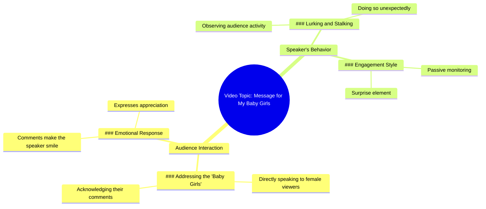

# This Is for All My Baby Girls

> 🌐 **Read this in:** **English** · [中文](../../zh-CN/2026-05/tiktok-transcript-this-is-for-all-my-babygorls-2021tiktok-fyp-targetaudience-9e0a.md)

> **Creator:** [@lolpomz](https://www.tiktok.com/@lolpomz) · **Views:** 1.3M · **Posted:** 2026-05-22 · **Niche:** entertainment
>
> **TL;DR:** Creates immediate intimacy and belonging by singling out a group.

[Watch original video →](https://www.tiktok.com/t/ZTB8qqYbq/)

## Why This Went Viral

## Hook (first 3 seconds)
- **Verbatim opening line:** "This is for all my baby girls."
- **Hook pattern:** **Audience-targeted address / direct engagement** — immediately names a specific group ("baby girls") and signals a personal connection.
- **Why it stops scrolling:** It creates instant belonging and curiosity. Viewers who identify as "baby girls" feel seen and personally called out. The phrase "I see your comments" implies a parasocial relationship, making the viewer feel like the creator is speaking directly to them, not a crowd.

## Emotional Rhythm
- **Beat 1 — Warmth & Belonging (0–3 sec):** "This is for all my baby girls." — Creates a safe, intimate space.
- **Beat 2 — Validation & Gratitude (3–6 sec):** "I see your comments, ladies, and they make me smile." — Reinforces the parasocial bond; viewer feels appreciated.
- **Beat 3 — Playful Tension (6–9 sec):** "I'm lurking and I'm stalking when you least expect." — Shifts from sweet to mischievous, introducing an element of surprise and intrigue.
- **Climax moment:** The word "stalking" — it subverts the warm tone, creating a spike of playful fear/excitement that keeps viewers watching to see where this twist leads.

## Keyword Density
| Keyword/Phrase | Reach vs. Pull | Why it works |
|----------------|----------------|--------------|
| **baby girls** | Emotional pull | Creates a tribe identity; highly shareable among women who feel a sisterhood |
| **I see you / your comments** | Algorithmic reach + pull | Drives engagement (comments, shares) because viewers feel recognized |
| **lurking** | Pull | Adds mystery and intimacy; implies constant attention |
| **stalking** | Pull | High-impact word that creates tension and shock value |
| **when you least expect** | Pull | Builds suspense and FOMO (fear of missing out) |

## Why It Spreads
1. **Parasocial intimacy at scale** — "I see your comments, ladies" makes every viewer feel personally acknowledged, even though it's a one-to-many message. This triggers a dopamine hit of validation, driving shares and comments.
2. **Tension through tone shift** — The switch from sweet ("make me smile") to predatory ("lurking and stalking") creates a cognitive jolt. Viewers re-watch to catch the exact moment the mood changes, boosting retention and loopability.
3. **Low barrier to participation** — The phrase "baby girls" is a broad, inclusive identifier. Any woman who feels like a "baby girl" (soft, protected, cherished) can instantly claim the content, making it easy to tag friends or comment "me."
4. **Mystery + FOMO** — "When you least expect" implies ongoing, unpredictable attention. This makes viewers feel like they're part of a secret game, encouraging them to stay tuned for future content or to comment "👀" to signal they're watching.
5. **Short, high-density script** — Every word serves a purpose: identity, validation, tension, cliffhanger. No filler means high rewatchability and easy memorization for reposting.

## What You Can Steal
1. **Open with a direct address to a specific tribe** — Use a nickname or identifier that your audience already uses for themselves (e.g., "sad girls," "late-night overthinkers," "chaos gremlins"). This instantly filters and bonds.
2. **Create a tonal twist in under 10 seconds** — Start warm/soft, then pivot to something unexpected (playful threat, dark humor, vulnerability). The contrast keeps viewers from swiping away.
3. **End on a cliffhanger of implication** — Don't finish the thought. Use phrases like "when you least expect" or "and that's when it gets interesting" to force viewers to watch again or wait for the next video. This boosts session time and series engagement.

## Mind Map

## Full Transcript (Generated by [TokTranscript.com](https://toktranscript.com/?utm_source=github&utm_medium=breakdown&utm_campaign=tool_attribution))

> 📝 Transcripts on this page are auto-generated and show the first 60%. Want to transcribe any TikTok in 30 seconds and get the full version? [Try TokTranscript free →](https://toktranscript.com/?utm_source=github&utm_medium=breakdown&utm_campaign=transcript_cta)

This is for all my baby girls. I see your comments, ladies, and they make me smi

*[Read the full transcript on TokTranscript →](https://toktranscript.com/plaza/tiktok-transcript-this-is-for-all-my-babygorls-2021tiktok-fyp-targetaudience-9e0a?utm_source=github&utm_medium=breakdown&utm_campaign=transcript_full)*

## Browse More

- All [entertainment](../../by-niche/en/entertainment.md) breakdowns
- All [Direct address to a specific audience](../../by-pattern/en/hook-direct-address-to-a-specific-audience.md) examples

## Video Info

| | |
|---|---|
| Creator | [@lolpomz](https://www.tiktok.com/@lolpomz) |
| Original video | [https://www.tiktok.com/t/ZTB8qqYbq/](https://www.tiktok.com/t/ZTB8qqYbq/) |
| Original title | this is for all my babygorls #2021tiktok #fyp #targetaudience |
| Views | 1.3M (1300000) |
| Posted | 2026-05-22 |
| Duration | 0s |
| Niche | `entertainment` |
| Hook pattern | `Direct address to a specific audience` |
| Original language | `en` |
| Available languages | en, zh-CN |
| Generated | 2026-05-25 by [TokTranscript](https://toktranscript.com/) |

---

*This breakdown is for educational analysis under fair use. Original video © [@lolpomz](https://www.tiktok.com/@lolpomz). All transcripts are auto-generated and may contain errors.*

*Want to analyze your own TikToks like this? [free TikTok transcript generator →](https://toktranscript.com/viral-breakdown?utm_source=github&utm_medium=breakdown&utm_campaign=footer_cta)*