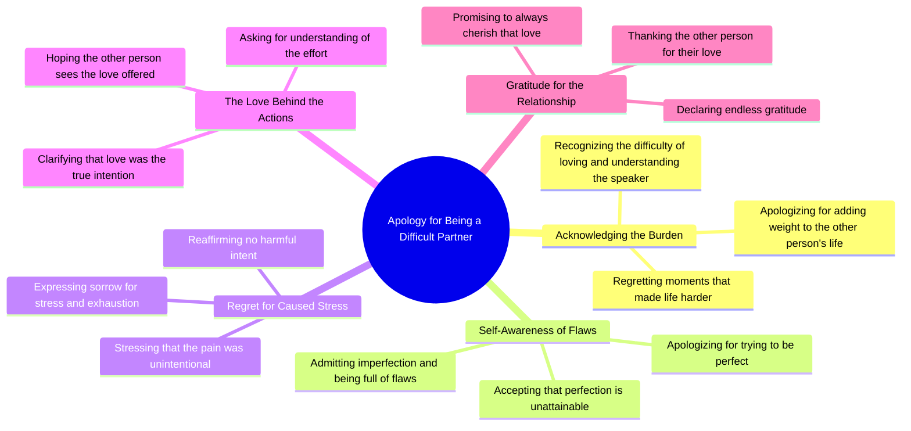

# Apology for Making Love Hard and Draining

> 🌐 **Read this in:** **English** · [中文](../../zh-CN/2026-05/tiktok-transcript-tiktok-video-7502794542438124846-ae88.md)

> **Creator:** [@cookie_cobb](https://www.tiktok.com/@cookie_cobb) · **Views:** 7.7M · **Posted:** 2026-05-28 · **Niche:** entertainment
>
> **TL;DR:** Opens with a direct, vulnerable apology that immediately evokes empathy and curiosity.

[Watch original video →](https://vt.tiktok.com/ZSxqUqdrE/)

## Why This Went Viral

## Hook (first 3 seconds)
- **Verbatim line:** "if loving me was hard or draining I wanna say I'm sorry for all the wait I added in your life"
- **Hook pattern:** Vulnerability confession + direct apology (emotional scene, not a claim or question)
- **Why it stops scroll:** It opens with a raw, unresolvable guilt that feels universally relatable. The speaker admits fault before the viewer even judges them—flipping the power dynamic and forcing empathy.

## Emotional Rhythm
- **Beat 1 — Guilt/Regret:** "I'm sorry for all the wait I added in your life" (creates emotional tension)
- **Beat 2 — Self-awareness/Defensiveness:** "I know I'm not the easiest to love" (adds vulnerability, deepens tension)
- **Beat 3 — Regret escalation:** "I regret all the moments that I made life more difficult" (suspense builds—will they forgive themselves?)
- **Beat 4 — Twist/Resonance:** "I'm sorry for trying to be perfect because perfect is something I would never be" (climax: the lie of perfection is exposed, creating catharsis)
- **Beat 5 — Relief/Gratitude:** "I cherish every bit of love that you gave to me... I will always be endlessly grateful for you" (emotional resolution, soft landing)
- **Climax moment:** The line "I'm sorry for trying to be perfect" — it flips the apology from external blame to internal self-criticism, making the speaker entirely sympathetic.

## Keyword Density
| Keyword/Phrase | Count (approx.) | Driver |
|----------------|-----------------|--------|
| "sorry" | 6 | Emotional pull — triggers guilt and empathy loop |
| "love / loving" | 5 | Algorithmic reach — high-engagement emotional keyword |
| "hard / draining / difficult" | 3 | Emotional pull — validates viewer's own experience |
| "regret" | 2 | Emotional pull — signals remorse, deepens trust |
| "burden" | 1 | Emotional pull — one-word trigger for shame/relatability |
| "grateful / cherish" | 2 | Algorithmic reach — positive resolution drives shares |
| "perfect" | 2 | Emotional pull — universal insecurity, high resonance |

**Algorithmic drivers:** "love," "grateful," "sorry" — these are high-volume, low-competition emotional keywords that platforms prioritize for retention and shares.  
**Emotional pull drivers:** "burden," "regret," "draining" — these create visceral identification, keeping viewers watching to see if the speaker resolves the pain.

## Why It Spreads
1. **Universal shame loop** — The line "I'm sorry for being a burden to you" hits a core human fear. Viewers who have felt like a burden (most people) instantly self-insert, then share to signal "I feel this too" or to apologize to someone they've hurt.
2. **Inversion of power** — The speaker apologizes *before* being asked. This disarms the viewer's potential judgment and forces them into a sympathetic role. The line "I'm sorry for trying to be perfect" is the pivot—it makes the apology about *self-harm* not just harm to others.
3. **Emotional resolution + gratitude** — The video doesn't end in despair. The final lines ("I cherish... I will always be endlessly grateful") provide a cathartic release. Viewers share because the video offers a *template* for apologizing without self-destruction.
4. **High relatability + low barrier to share** — The transcript contains no specific names, genders, or situations. It's a "fill-in-the-blank" apology. Anyone who has ever hurt someone can see themselves in it, making it shareable across relationships (romantic, family, friend).
5. **Rhythmic repetition** — "I'm sorry" repeated six times creates a hypnotic, confessional cadence. The viewer's brain locks into the pattern, increasing watch time and completion rate—both algorithmic signals for virality.

## What You Can Steal
1. **Open with a confession, not a question.** Start with "I'm sorry for..." or "I regret..." instead of "Have you ever...?" — it flips the viewer from passive observer to active empathizer.
2. **Use a "twist of self-blame."** Halfway through, pivot from apologizing for hurting others to apologizing for trying to be perfect. This creates an emotional surprise that keeps retention high.
3. **End with gratitude, not guilt.** Never end a viral emotional video in pure despair. Always resolve with "I cherish... I am grateful..." — this gives viewers permission to share without feeling heavy. It turns a sad video into a *healing* one.

## Mind Map

## Full Transcript (Generated by [TokTranscript.com](https://toktranscript.com/?utm_source=github&utm_medium=breakdown&utm_campaign=tool_attribution))

> 📝 Transcripts on this page are auto-generated and show the first 60%. Want to transcribe any TikTok in 30 seconds and get the full version? [Try TokTranscript free →](https://toktranscript.com/?utm_source=github&utm_medium=breakdown&utm_campaign=transcript_cta)

if loving me was hard or draining I wanna say I'm sorry for all the wait I added in your life I know I'm not the easiest to love nor the easiest to understand but I regret all the moments that I made life more difficult for you I'm full of flaws you know I'm not perfect I'm sorry for trying to be because perfect is something I would never be but I'm sorry for all the stress and exhaustion I caused to you I'm I'm really sorry

*[Read the full transcript on TokTranscript →](https://toktranscript.com/plaza/tiktok-transcript-tiktok-video-7502794542438124846-ae88?utm_source=github&utm_medium=breakdown&utm_campaign=transcript_full)*

## Browse More

- All [entertainment](../../by-niche/en/entertainment.md) breakdowns
- All [Apology Hook](../../by-pattern/en/hook-apology-hook.md) examples

## Video Info

| | |
|---|---|
| Creator | [@cookie_cobb](https://www.tiktok.com/@cookie_cobb) |
| Original video | [https://vt.tiktok.com/ZSxqUqdrE/](https://vt.tiktok.com/ZSxqUqdrE/) |
| Original title | TikTok video #7502794542438124846 |
| Views | 7.7M (7700000) |
| Posted | 2026-05-28 |
| Duration | 0s |
| Niche | `entertainment` |
| Hook pattern | `Apology Hook` |
| Original language | `en` |
| Available languages | en, zh-CN |
| Generated | 2026-05-29 by [TokTranscript](https://toktranscript.com/) |

---

*This breakdown is for educational analysis under fair use. Original video © [@cookie_cobb](https://www.tiktok.com/@cookie_cobb). All transcripts are auto-generated and may contain errors.*

*Want to analyze your own TikToks like this? [free TikTok transcript generator →](https://toktranscript.com/viral-breakdown?utm_source=github&utm_medium=breakdown&utm_campaign=footer_cta)*