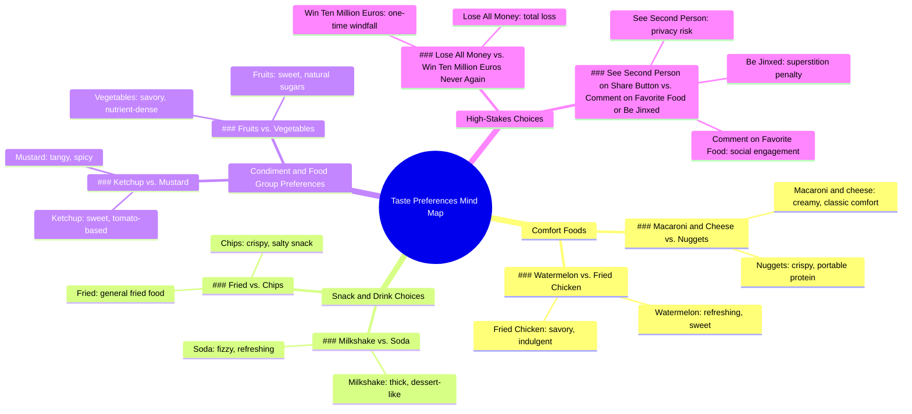

# tu préfères... 🔴 🔵? macaroni au fromage  nuggets de poulet  snickers ...

> 🌐 **Read this in:** **English** · [中文](../../zh-CN/2026-05/tiktok-transcript-tu-pr-f-res-macaroni-au-fromage-nuggets-de-poulet-snickers-8840.md)

> **Creator:** [@noro.tupreferes](https://www.tiktok.com/@noro.tupreferes) · **Views:** 1.0M · **Posted:** 2026-05-23 · **Niche:** other
>
> **TL;DR:** Challenges the viewer's taste, prompting immediate engagement.

[Watch original video →](https://vm.tiktok.com/ZS9YCYe7wbGpK-EDO4i/ تتم مشاركة هذا المنشور عبر TikTok Lite. نزّل TikTok Lite للاستمتاع بمزيد من المنشورات: https://www.tiktok.com/tiktoklite)

## Why This Went Viral

## Hook (first 3 seconds)
- **Verbatim opening line:** "Let's see if you have good taste, do you prefer good macaroni and cheese or nuggets."
- **Hook pattern:** Question / Challenge (dare-like "let's see if you have good taste")
- **Why it stops scrolling:** The opening frames the video as a test of personal identity ("good taste") and immediately forces a binary choice, creating a low-stakes but irresistible urge to answer. The rapid-fire delivery signals a fast, engaging challenge.

## Emotional Rhythm
- **Beat 1 (Curiosity):** "Let's see if you have good taste" — viewer wants to prove themselves.
- **Beat 2 (Tension):** Each binary choice (mac & cheese vs. nuggets, sneakers vs. Twix) creates micro-decisions, building mild stress.
- **Beat 3 (Escalation):** "Lose all your money or win ten million euros, but never again" — stakes suddenly spike, triggering deeper engagement.
- **Beat 4 (Twist / Intrigue):** "See the second person who appears when you click on share and more" — introduces a mysterious, shareable mechanic.
- **Beat 5 (Relief / Resolution):** Final choices (fruits vs. vegetables, ketchup vs. mustard) are playful and low-stakes, ending on a light note.
- **Climax moment:** The "win ten million euros, but never again" choice — highest emotional tension.

## Keyword Density
1. **"or"** — drives the binary choice structure; algorithmic reach (clear pattern recognition)
2. **"prefer"** — emotional pull (personal identity, taste)
3. **"good taste"** — emotional pull (ego, self-validation)
4. **"choose"** — algorithmic reach (action verb, engagement trigger)
5. **"never again"** — emotional pull (loss aversion, regret)
6. **"share"** — algorithmic reach (direct call to action)
7. **"jinxed"** — emotional pull (superstition, fear of missing out)
8. **"comment"** — algorithmic reach (engagement prompt)
9. **"win ten million euros"** — emotional pull (fantasy, high stakes)
10. **"food"** — algorithmic reach (broad, high-traffic topic)

## Why It Spreads
1. **Binary choice format forces mental participation.** Every viewer automatically picks an option in their head — even without commenting. This passive engagement boosts watch time. *Transcript evidence: "do you prefer good macaroni and cheese or nuggets" — no neutral option.*
2. **Escalating stakes create addictive tension.** The jump from silly food picks to "lose all your money or win ten million euros" hooks viewers who want to see how far the game goes. *Transcript evidence: "Lose all your money or win ten million euros, but never again."*
3. **Mysterious share mechanic drives distribution.** "See the second person who appears when you click on share" is a direct, curiosity-driven call to action that exploits the platform's share feature. *Transcript evidence: "See the second person who appears when you click on share and more."*
4. **Superstition/jinx threat increases comment rate.** "Comment on your favorite food or be jinxed forever" uses mild fear to convert passive viewers into active commenters, boosting algorithmic signals. *Transcript evidence: "Comment on your favorite food or be jinxed forever."*
5. **Universal topic (food) + low cognitive load.** Everyone has opinions on mac & cheese vs. nuggets — no expertise needed, so anyone can engage instantly. *Transcript evidence: "Fried or chips. Eat a milkshake or drink a soda."*

## What You Can Steal
1. **Start with an identity challenge.** Open with "Let's see if you have [trait]" — it triggers ego and curiosity. Frame your video as a test, not just content.
2. **Use a "staircase" stakes structure.** Begin with low-stakes binary choices, then escalate to high-stakes (money, loss, jinx) to keep viewers watching to the end.
3. **Embed a mysterious share mechanic.** Add a line like "See what happens when you share this" — it exploits curiosity and directly drives viral distribution without asking for a like.

## Mind Map

## Full Transcript (Generated by [TokTranscript](https://toktranscript.com/?utm_source=github&utm_medium=breakdown&utm_campaign=tool_attribution))

> 📝 Transcripts on this page are auto-generated and show the first 60%. Want to transcribe any TikTok in 30 seconds and get the full version? [Try TokTranscript free →](https://toktranscript.com/?utm_source=github&utm_medium=breakdown&utm_campaign=transcript_cta)

Let's see if you have good taste, do you prefer good macaroni and cheese or nuggets. Sneakers or twix watermelon or fried chicken? Lose all your money or win ten million euros, but never again.

*[Read the full transcript on TokTranscript →](https://toktranscript.com/plaza/tiktok-transcript-tu-pr-f-res-macaroni-au-fromage-nuggets-de-poulet-snickers-8840?utm_source=github&utm_medium=breakdown&utm_campaign=transcript_full)*

## Browse More

- All [other](../../by-niche/en/other.md) breakdowns
- All [unknown](../../by-pattern/en/hook-unknown.md) examples

## Video Info

| | |
|---|---|
| Creator | [@noro.tupreferes](https://www.tiktok.com/@noro.tupreferes) |
| Original video | [https://vm.tiktok.com/ZS9YCYe7wbGpK-EDO4i/ تتم مشاركة هذا المنشور عبر TikTok Lite. نزّل TikTok Lite للاستمتاع بمزيد من المنشورات: https://www.tiktok.com/tiktoklite](https://vm.tiktok.com/ZS9YCYe7wbGpK-EDO4i/ تتم مشاركة هذا المنشور عبر TikTok Lite. نزّل TikTok Lite للاستمتاع بمزيد من المنشورات: https://www.tiktok.com/tiktoklite) |
| Views | 1.0M (1000000) |
| Posted | 2026-05-23 |
| Duration | 0s |
| Niche | `other` |
| Hook pattern | `unknown` |
| Original language | `en` |
| Available languages | en, zh-CN |
| Generated | 2026-05-24 by [TokTranscript](https://toktranscript.com/) |

---

*This breakdown is for educational analysis under fair use. Original video © [@noro.tupreferes](https://www.tiktok.com/@noro.tupreferes). All transcripts are auto-generated and may contain errors.*

*Want to analyze your own TikToks like this? [try this transcription tool →](https://toktranscript.com/viral-breakdown?utm_source=github&utm_medium=breakdown&utm_campaign=footer_cta)*