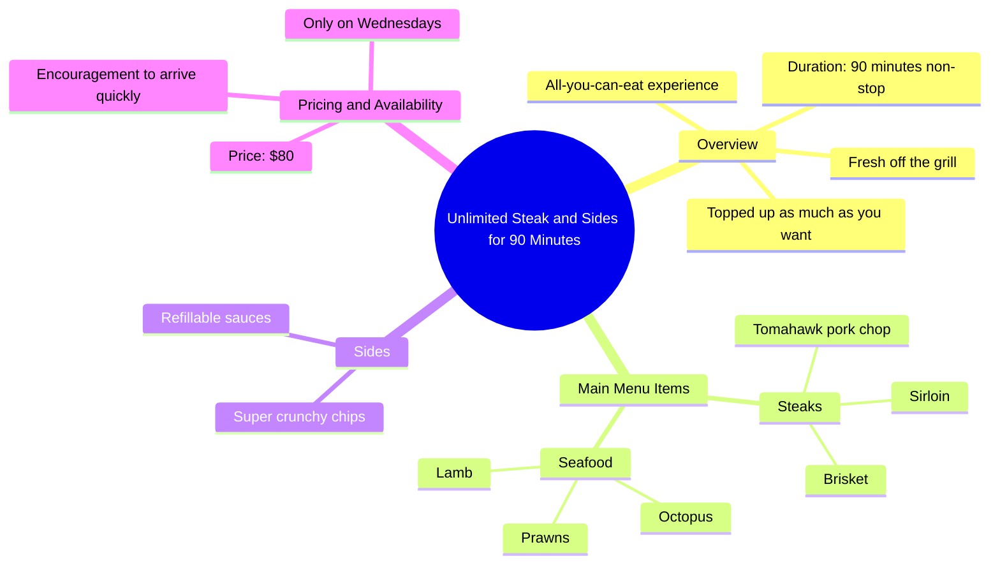

# Unlimited Steak and Sides for 90 Minutes in Sydney

> 🌐 **Read this in:** **English** · [中文](../../zh-CN/2026-05/tiktok-transcript-unlimited-steak-run-follow-for-best-sydney-guide-get-10-off-a4a9.md)

> **Creator:** [@eunicexplores](https://www.tiktok.com/@eunicexplores) · **Views:** 1.5M · **Posted:** 2026-05-22 · **Niche:** food
>
> **TL;DR:** Combines the allure of unlimited food with a time limit, creating urgency and desire.

[Watch original video →](https://vt.tiktok.com/ZSx6qXAAk/)

## Why This Went Viral

## Hook (first 3 seconds)
- **Verbatim opening:** "This is where you can get unlimited steak and sides non stop for 90 minutes."
- **Hook pattern:** Bold claim + scarcity ("unlimited," "non stop," "90 minutes")
- **Why it stops scrolling:** It promises a rare, high-value experience (all-you-can-eat premium meats) with a time limit, triggering immediate FOMO and curiosity about the location and price.

## Emotional Rhythm
1. **Curiosity (0–3s):** "Unlimited steak and sides" — viewer wants to know where and how.
2. **Anticipation (3–10s):** List of premium items (sirloin, brisket, Tomahawk, lamb, prawns, octopus) builds desire and sensory expectation.
3. **Satisfaction (10–15s):** "Super crunchy chips and sauces" — adds relatable, comforting detail, grounding the luxury in everyday pleasure.
4. **Urgency (15–18s):** "Only on Wednesdays for just $80" — creates time pressure and value shock.
5. **Call to action (18–20s):** "So you better be running here" — turns urgency into action, leaving viewer with a clear next step.
- **Climax:** The reveal of the price ($80) and day (Wednesdays) — the moment the viewer decides if it's worth it.

## Keyword Density
| Keyword | Frequency | Function |
|---------|-----------|----------|
| unlimited | 2x | Algorithmic reach (high-value, searchable) |
| steak | 2x | Emotional pull (craving, premium) |
| sides | 2x | Emotional pull (completeness, value) |
| 90 minutes | 1x | Scarcity driver (time limit) |
| Wednesdays | 1x | Algorithmic reach (day-specific search) |
| $80 | 1x | Emotional pull (value anchor, shock) |
| fresh off the grill | 1x | Emotional pull (sensory, trust) |
| topped up | 1x | Emotional pull (abundance, no restriction) |

- **Algorithmic reach:** "unlimited," "steak," "Wednesdays" — high search volume for food deals.
- **Emotional pull:** "fresh off the grill," "topped up," "super crunchy" — triggers taste and comfort.

## Why It Spreads
1. **Extreme value proposition:** "Unlimited steak and sides non stop for 90 minutes" — the offer is so good it becomes shareable (people tag friends who love steak).
2. **Specificity builds trust:** "Sirloin brisket, Tomahawk pork chop, lamb prawns and octopus" — detailed list signals authenticity and quality, not generic buffet.
3. **Scarcity + low price:** "Only on Wednesdays for just $80" — creates a limited-time, affordable luxury that feels like a secret (drives saves and shares).
4. **Actionable CTA:** "So you better be running here" — low-friction, high-urgency command that turns viewers into visitors.
5. **Sensory language:** "Fresh off the grill," "super crunchy chips" — triggers craving, making viewers want to experience it themselves.

## What You Can Steal
1. **Lead with the most outrageous claim first:** "Unlimited steak" beats "great steak deal" — always open with the strongest value statement.
2. **List specific premium items to build desire:** Don't say "various meats" — name-drop "sirloin, brisket, Tomahawk, lamb, prawns, octopus" to trigger imagination and trust.
3. **Anchor with scarcity + price in the last 5 seconds:** Reveal the day and cost at the climax to create urgency — then immediately tell them to act ("run here").

## Mind Map

## Full Transcript (Generated by [TokTranscript](https://toktranscript.com/?utm_source=github&utm_medium=breakdown&utm_campaign=tool_attribution))

> 📝 Transcripts on this page are auto-generated and show the first 60%. Want to transcribe any TikTok in 30 seconds and get the full version? [Try TokTranscript free →](https://toktranscript.com/?utm_source=github&utm_medium=breakdown&utm_campaign=transcript_cta)

This is where you can get unlimited steak and sides non stop for 90 minutes. Everything is fresh off the grill and topped up as much as you want, including sirloin brisket, Tomahawk pork chop, lamb prawns and octopus.

*[Read the full transcript on TokTranscript →](https://toktranscript.com/plaza/tiktok-transcript-unlimited-steak-run-follow-for-best-sydney-guide-get-10-off-a4a9?utm_source=github&utm_medium=breakdown&utm_campaign=transcript_full)*

## Browse More

- All [food](../../by-niche/en/food.md) breakdowns
- All [Scarcity + Abundance](../../by-pattern/en/hook-scarcity-abundance.md) examples

## Video Info

| | |
|---|---|
| Creator | [@eunicexplores](https://www.tiktok.com/@eunicexplores) |
| Original video | [https://vt.tiktok.com/ZSx6qXAAk/](https://vt.tiktok.com/ZSx6qXAAk/) |
| Original title | UNLIMITED STEAK?! RUN. 🤠 follow for best sydney guide ✨ get 10% off T... |
| Views | 1.5M (1500000) |
| Posted | 2026-05-22 |
| Duration | 0s |
| Niche | `food` |
| Hook pattern | `Scarcity + Abundance` |
| Original language | `en` |
| Available languages | en, zh-CN |
| Generated | 2026-05-25 by [TokTranscript](https://toktranscript.com/) |

---

*This breakdown is for educational analysis under fair use. Original video © [@eunicexplores](https://www.tiktok.com/@eunicexplores). All transcripts are auto-generated and may contain errors.*

*Want to analyze your own TikToks like this? [analyze your own TikToks →](https://toktranscript.com/viral-breakdown?utm_source=github&utm_medium=breakdown&utm_campaign=footer_cta)*