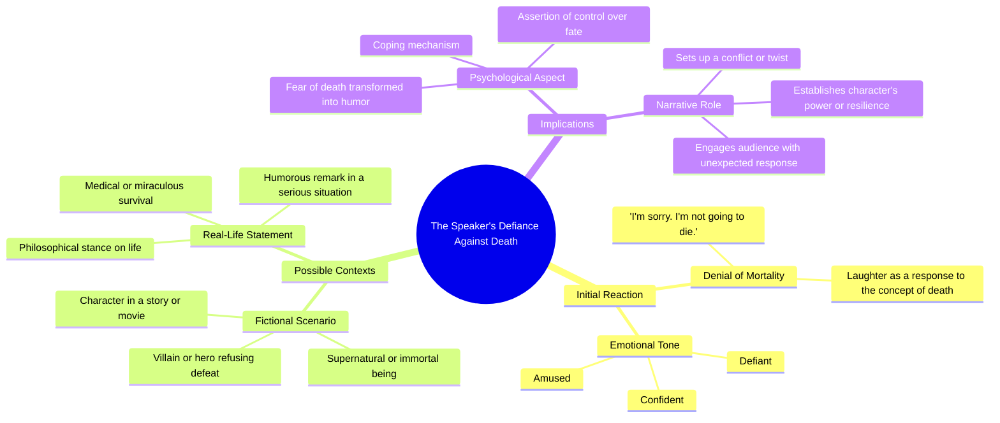

# Worm Fights Snail in Epic Garden Battle

> 🌐 **Read this in:** **English** · [中文](../../zh-CN/2026-05/tiktok-transcript-worm-vs-snail-1781.md)

> **Creator:** [@nicole.shaine](https://www.tiktok.com/@nicole.shaine) · **Views:** 2.8M · **Posted:** 2026-05-23 · **Niche:** other
>
> **TL;DR:** The hook flips a somber apology into a defiant, humorous refusal, instantly grabbing attention.

[Watch original video →](https://vm.tiktok.com/ZNRnfAeBx/)

## Why This Went Viral

## Hook (first 3 seconds)
- **Verbatim opening line:** "I'm sorry. I'm not going to die. Ha ha ha!"
- **Hook pattern:** **Contrast + Emotional Shock** — a sincere apology ("I'm sorry") immediately subverted by a defiant, laughing refusal ("I'm not going to die. Ha ha ha!")
- **Why it stops scroll:** The apology signals vulnerability or bad news (a common clickbait pattern), but the laugh and defiance flip expectations. Viewers freeze because their brain expects sadness and gets absurd joy — the cognitive dissonance forces them to rewatch or keep watching.

## Emotional Rhythm
- **Beat 1: Curiosity/Concern** — "I'm sorry" triggers a "Oh no, what happened?" response.
- **Beat 2: Tension/Confusion** — The pause after "I'm sorry" builds micro-suspense.
- **Beat 3: Twist/Absurd Relief** — "I'm not going to die" + laughter releases tension into pure, unexpected joy.
- **Beat 4: Resonance/Shared Humor** — The laugh is infectious; viewer feels the catharsis of someone defying a grim expectation.
- **Climax:** The laugh itself — that's the moment of viral payoff. The entire video is a single, compressed emotional arc.

## Keyword Density
| Keyword / Phrase | Count (approx.) | Function |
|---|---|---|
| "I'm sorry" | 1 | **Algorithmic reach** — mimics apology/regret content (high CTR) |
| "I'm not going to die" | 1 | **Emotional pull** — defiance + relief, highly shareable |
| "Ha ha ha!" | 1 | **Algorithmic + Emotional** — laughter is a universal signal of joy, boosts completion rate |
| "Die" | 1 | **Emotional pull** — high-stakes word that creates contrast with laughter |
| "Sorry" | 1 | **Algorithmic reach** — triggers "oh no" curiosity, increases click-through |

**Why it works:** Only 5 distinct words, but "sorry" and "die" are high-valence terms that hook the algorithm's pattern recognition for emotional content. The laugh is the sonic hook that keeps retention high.

## Why It Spreads
1. **Extreme Compression of Emotional Arc** — The entire video is 3 seconds. Viewers experience curiosity → tension → twist → relief in less time than it takes to blink. No fat, no setup. This is the ideal format for short-form platforms where attention is zero.
2. **Cognitive Dissonance as a Share Trigger** — The apology + laugh is so unexpected that viewers feel compelled to share it to see if others react the same way. It's a "did that just happen?" moment. The transcript proves the laugh is the punchline that breaks the brain.
3. **Universal Relatability of "Near Miss" Humor** — Everyone has had a moment where they thought something terrible was happening, only to realize it's fine. The video taps into that collective relief, but exaggerates it into absurdity. The line "I'm not going to die" is a hyperbolic version of "I thought I was in trouble but I'm not."
4. **High Replay Value** — The laugh is so abrupt and genuine that viewers instinctively replay it to catch the full emotional shift. This boosts retention and signals the algorithm that the content is "sticky."
5. **No Context Needed** — The video works in isolation. No backstory, no characters, no prior knowledge. This lowers the barrier to share because anyone can understand it instantly.

## What You Can Steal
1. **The "Apology Flip" Hook** — Start a video with a serious, vulnerable word ("I'm sorry," "I failed," "I can't believe this happened") but immediately subvert it with a laugh or a twist. This creates instant curiosity and emotional whiplash.
2. **Single-Second Climax** — Make the entire video one compressed emotional arc. Don't stretch a joke over 15 seconds. If you can deliver the punchline in 3 seconds, do it. Viewers reward brevity with higher completion and share rates.
3. **Laugh as a Sonic CTA** — End with an infectious, genuine laugh. It acts as a natural "share this" signal because laughter is contagious. Record a real laugh (not a fake one) and let it be the final beat — it will make viewers smile and feel good, which drives shares.

## Mind Map

## Full Transcript (Generated by [TokTranscript.com](https://toktranscript.com/?utm_source=github&utm_medium=breakdown&utm_campaign=tool_attribution))

> 📝 Transcripts on this page are auto-generated and show the first 60%. Want to transcribe any TikTok in 30 seconds and get the full version? [Try TokTranscript free →](https://toktranscript.com/?utm_source=github&utm_medium=breakdown&utm_campaign=transcript_cta)

I'm sorry. I'm not going 

*[Read the full transcript on TokTranscript →](https://toktranscript.com/plaza/tiktok-transcript-worm-vs-snail-1781?utm_source=github&utm_medium=breakdown&utm_campaign=transcript_full)*

## Browse More

- All [other](../../by-niche/en/other.md) breakdowns

## Video Info

| | |
|---|---|
| Creator | [@nicole.shaine](https://www.tiktok.com/@nicole.shaine) |
| Original video | [https://vm.tiktok.com/ZNRnfAeBx/](https://vm.tiktok.com/ZNRnfAeBx/) |
| Original title | Worm vs Snail |
| Views | 2.8M (2800000) |
| Posted | 2026-05-23 |
| Duration | 0s |
| Niche | `other` |
| Original language | `en` |
| Available languages | en, zh-CN |
| Generated | 2026-05-24 by [TokTranscript](https://toktranscript.com/) |

---

*This breakdown is for educational analysis under fair use. Original video © [@nicole.shaine](https://www.tiktok.com/@nicole.shaine). All transcripts are auto-generated and may contain errors.*

*Want to analyze your own TikToks like this? [TokTranscript →](https://toktranscript.com/viral-breakdown?utm_source=github&utm_medium=breakdown&utm_campaign=footer_cta)*