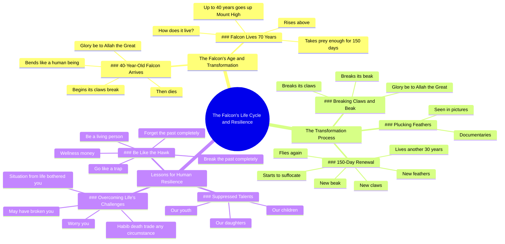

# Falcon Tortures Itself 150 Days to Be Reborn

> 🌐 **Read this in:** **English** · [中文](../../zh-CN/2026-06/tiktok-transcript-19-150-8621.md)

> **Creator:** [@thenoveloffaith0](https://www.tiktok.com/@thenoveloffaith0) · **Views:** 4.2M · **Posted:** 2026-06-12 · **Niche:** other
>
> **TL;DR:** Opens with a precise, surprising age for a falcon, immediately making viewers wonder what happens next.

[Watch original video →](https://vm.tiktok.com/ZNRcaNmcE/)

## Why This Went Viral

## Hook (first 3 seconds)
- **Verbatim:** "When the falcon arrives, it is 40 years old. Glory be to Allah the Great."
- **Hook pattern:** **Scene + Bold Claim** — opens mid-story with a specific age (40 years) and a religious exclamation that signals awe.
- **Why it stops scrolling:** The age is unexpected (falcons don't "arrive" at 40), and the religious phrase adds gravity. Viewers are instantly confused and intrigued — they need to know what happens at 40.

## Emotional Rhythm
1. **Curiosity** — "When the falcon arrives, it is 40 years old…" (what does that mean?)
2. **Awe / Wonder** — "Glory be to Allah the Great… begins its claws break… bends like a human being."
3. **Tension** — "Then he dies." (abrupt, shocking)
4. **Suspense** — "The falcon that lives 70 years… How does he live it?"
5. **Climax** — "Then 150 days. And give him new feathers… new claws… new beak."
6. **Resonance** — "Be like this hawk… Break the past and forget the past completely."
7. **Call to Action (emotional)** — "Be a living person."

**Climax moment:** The 150-day transformation — the moment of rebirth. That's where the emotional payoff lands.

## Keyword Density
| Keyword / Phrase | Count (approx.) | Role |
|-----------------|-----------------|------|
| "Glory be to Allah" | 3 | Emotional pull — religious awe, stops the scroll |
| "40 years" / "150 days" / "30 years" | 3+ | Algorithmic reach — numbers trigger curiosity and retention |
| "Break" / "breaks" | 4 | Emotional pull — pain, transformation, relatability |
| "New" (feathers/claws/beak) | 3 | Emotional pull — hope, rebirth |
| "Be like this hawk" / "be this important" | 2 | Emotional pull — direct call to action, identity |
| "Situation" / "circumstance" / "troubled you" | 3 | Algorithmic reach — high-search terms for life advice |

**Algorithmic drivers:** Numbers (40, 150, 30) + "situation" / "circumstance" — these are searchable, shareable keywords.

**Emotional drivers:** "Glory be to Allah" + "break" + "new" — these create awe, pain, and hope.

## Why It Spreads
1. **Mythic transformation story** — The falcon's rebirth is a universal metaphor. It's not just about a bird; it's about overcoming life's hardest moments. The transcript explicitly ties it to "our children, our youth, our daughters" — making it personal and shareable across demographics.
2. **Religious framing amplifies trust** — "Glory be to Allah" is repeated three times. For Muslim audiences, this signals truth and depth. For non-Muslims, it adds exoticism and curiosity. The religious frame makes the content feel sacred, not just viral.
3. **Numbers + visual imagery = high retention** — "40 years," "150 days," "30 years" are concrete and easy to remember. The visual of a falcon breaking its own beak and claws is shocking enough to make viewers rewatch or share. The transcript mentions "I saw this in pictures / some documentaries" — that visual proof is key.
4. **Direct emotional call to action** — "Be like this hawk… Break the past and forget the past completely." This is a clear, actionable takeaway. Viewers can immediately apply it to their own lives, which drives comments and shares.
5. **Universal pain point** — "A situation from life bothered you… worry you… may have broken you" — this is a near-universal human experience. The video turns personal pain into a shared, hopeful message. That's the core of viral empathy.

## What You Can Steal
1. **Start with a number + a mystery.** "When the falcon arrives, it is 40 years old." Don't explain — just state a weird, specific fact. The viewer's brain will fill in the gap with curiosity.
2. **Use a three-act transformation arc.** Pain (break) → Process (150 days) → Rebirth (new everything). Structure any advice video around a clear before/during/after. The audience remembers the journey, not the facts.
3. **Anchor a universal lesson in a specific animal or object.** The falcon is not random — it's majestic, rare, and visually striking. Pick one concrete thing (a hawk, a tree, a mountain) and make it the hero of your metaphor. Don't just say "overcome hardship" — show the hawk breaking its beak.

## Mind Map

## Full Transcript (Generated by [TokTranscript.com](https://toktranscript.com/?utm_source=github&utm_medium=breakdown&utm_campaign=tool_attribution))

> 📝 Transcripts on this page are auto-generated and show the first 60%. Want to transcribe any TikTok in 30 seconds and get the full version? [Try TokTranscript free →](https://toktranscript.com/?utm_source=github&utm_medium=breakdown&utm_campaign=transcript_cta)

When the falcon arrives, it is 40 years old Glory be to Allah the Great begins its claws break And from his continent He bends like a human being, Glory be to Allah Then he dies. The falcon that lives 70 years How does he live it? They say for up to 40 years he goes up Mount Up High It takes him prey enough for 150 days He takes prey for him and rises above Then Glory be to Allah begins to pluck his feathers I saw this in pictures Some documentaries And then he breaks his claws And breaks its beak, Glory be to Allah the Great Then 150 days. And give him new feathers And new claws And a new beak.

*[Read the full transcript on TokTranscript →](https://toktranscript.com/plaza/tiktok-transcript-19-150-8621?utm_source=github&utm_medium=breakdown&utm_campaign=transcript_full)*

## Browse More

- All [other](../../by-niche/en/other.md) breakdowns
- All [Curiosity gap with specific age](../../by-pattern/en/hook-curiosity-gap-with-specific-age.md) examples

## Video Info

| | |
|---|---|
| Creator | [@thenoveloffaith0](https://www.tiktok.com/@thenoveloffaith0) |
| Original video | [https://vm.tiktok.com/ZNRcaNmcE/](https://vm.tiktok.com/ZNRcaNmcE/) |
| Original title | جزء19|طائر عذّب نفسه 150 يومًا… ليولد من جديد! 😳#قصه_مواثره #حكايات #... |
| Views | 4.2M (4200000) |
| Posted | 2026-06-12 |
| Duration | 0s |
| Niche | `other` |
| Hook pattern | `Curiosity gap with specific age` |
| Original language | `en` |
| Available languages | en, zh-CN |
| Generated | 2026-06-13 by [TokTranscript](https://toktranscript.com/) |

---

*This breakdown is for educational analysis under fair use. Original video © [@thenoveloffaith0](https://www.tiktok.com/@thenoveloffaith0). All transcripts are auto-generated and may contain errors.*

*Want to analyze your own TikToks like this? [TokTranscript →](https://toktranscript.com/viral-breakdown?utm_source=github&utm_medium=breakdown&utm_campaign=footer_cta)*