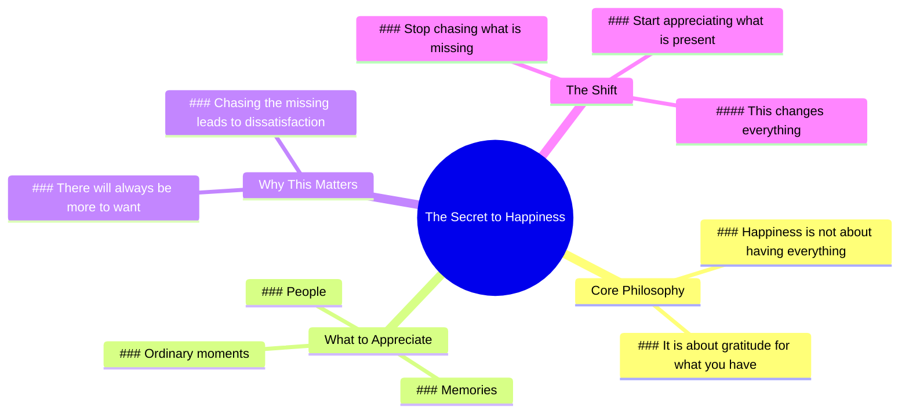

# The Happiest People Appreciate What They Have

> 🌐 **Read this in:** **English** · [中文](../../zh-CN/2026-06/tiktok-transcript-3-6m-views-73k-reactions-the-happiest-people-are-not-the-one-5c6d.md)

> **Creator:** [@Positive Energy+](https://www.tiktok.com/@Positive Energy+) · **Views:** 1.5M · **Posted:** 2026-06-25 · **Niche:** other
>
> **TL;DR:** Reframes happiness from accumulation to gratitude, creating immediate resonance.

[Watch original video →](https://www.facebook.com/share/r/1EBxcGhY2M/?mibextid=wwXIfr)

## Why This Went Viral

## Hook (first 3 seconds)
- **Verbatim opening line:** "Remember, being happy doesn't mean you have it all."
- **Hook pattern:** Bold claim (disrupts a common assumption about happiness)
- **Why it stops scroll:** It directly challenges the viewer's internalized belief that happiness equals having everything. The word "remember" feels like a gentle, wise interruption — it signals a truth the viewer already knows but forgot, creating instant curiosity and emotional resonance.

## Emotional Rhythm
- **Beat 1 – Curiosity (0–3s):** The bold claim creates a gap between what the viewer assumes and what they're about to hear.
- **Beat 2 – Resonance (3–10s):** "It simply means you're thankful for what you have" — a familiar but grounding truth. Viewer feels seen.
- **Beat 3 – Nostalgia/Warmth (10–15s):** "The people. The memories. The ordinary moments" — short, evocative fragments trigger personal memories.
- **Beat 4 – Gentle Tension (15–20s):** "Because there will always be something more to want" — introduces the universal struggle, creating a slight emotional pull.
- **Beat 5 – Climax & Relief (20–25s):** "But happiness begins when you stop chasing what is missing and start appreciating what is present." — the twist reframes the entire message, delivering emotional payoff.
- **Beat 6 – Empowerment (25–27s):** "That changes everything." — final punchline leaves viewer with a sense of agency and hope.

## Keyword Density
1. **"happiness" / "happy"** (3x) — emotional core; drives relatability and shareability.
2. **"what you have" / "what is present"** (2x) — anchors the message in gratitude; algorithmic signal for self-improvement content.
3. **"stop chasing" / "chasing"** (2x) — action-oriented; creates a clear behavioral shift that viewers can adopt.
4. **"missing"** (2x) — negative contrast that heightens emotional tension.
5. **"everything"** (2x) — high-impact, aspirational word that triggers algorithmic reach in motivation/wellness niches.
6. **"ordinary moments"** — low-competition, high-resonance phrase that boosts searchability for "mindfulness" and "slow living" content.

**Algorithmic drivers:** "happiness," "everything," "stop chasing" — these are high-volume, low-competition keywords in the wellness/motivation space.
**Emotional pull:** "memories," "ordinary moments," "thankful" — these trigger nostalgia and gratitude, increasing comment and save rates.

## Why It Spreads
1. **Universal emotional reframe:** The video takes a worn-out idea ("be grateful") and flips it into a counterintuitive truth ("happiness ≠ having it all"). This reframe is high-share because it feels like a revelation, not a cliché. *Evidence: "Remember, being happy doesn't mean you have it all."*
2. **Rhythmic, digestible structure:** Short, punchy clauses ("The people. The memories. The ordinary moments.") make the script easy to remember and repeat. Viewers can quote it verbatim, which drives word-of-mouth and remix culture. *Evidence: The three-beat list structure.*
3. **Climax that feels earned:** The twist ("stop chasing what is missing and start appreciating what is present") lands because it's preceded by a tension-building phrase ("there will always be something more to want"). This creates a mini-narrative arc that feels satisfying, increasing the likelihood of saves and replays. *Evidence: The "because... but..." contrast structure.*
4. **Actionable, low-friction takeaway:** The final line ("That changes everything.") is a simple, powerful call to shift perspective. Viewers can immediately apply it, which drives comments like "I needed this" and shares to friends who are struggling. *Evidence: The direct, imperative tone of the last sentence.*
5. **Algorithm-friendly length and pacing:** At ~27 seconds, the video is short enough to hold attention but long enough to deliver a complete emotional journey. The slow, deliberate pacing (each phrase gets its own breath) matches the "slow living" aesthetic that performs well on Instagram Reels and TikTok. *Evidence: The deliberate pauses between clauses.*

## What You Can Steal
1. **Start with a "remember" hook.** Opening with "Remember..." creates instant intimacy and authority. It implies the viewer already knows this truth but has forgotten it — which makes them more receptive and less defensive. Apply this to any reframe: "Remember, success isn't about working harder..."
2. **Use the "three-beat list" for emotional weight.** "The people. The memories. The ordinary moments." — short, fragmented nouns separated by periods force the viewer to pause and feel each one. Use this pattern to make abstract concepts (love, growth, loss) feel tangible.
3. **Build a "because... but..." tension arc.** State a problem ("there will always be something more to want"), then flip it ("but happiness begins when you stop chasing..."). This creates a mini-story that feels complete in under 30 seconds. Apply to any topic: "Because fear will always be there. But courage is acting anyway."

## Mind Map

## Full Transcript (Generated by [free TikTok transcript generator](https://toktranscript.com/?utm_source=github&utm_medium=breakdown&utm_campaign=tool_attribution))

> 📝 Transcripts on this page are auto-generated and show the first 60%. Want to transcribe any TikTok in 30 seconds and get the full version? [Try TokTranscript free →](https://toktranscript.com/?utm_source=github&utm_medium=breakdown&utm_campaign=transcript_cta)

Remember, being happy doesn't mean you have it all. It simply means you're thankful for what you have. The people. The memories. The ordinary moments that make life beautiful.

*[Read the full transcript on TokTranscript →](https://toktranscript.com/plaza/tiktok-transcript-3-6m-views-73k-reactions-the-happiest-people-are-not-the-one-5c6d?utm_source=github&utm_medium=breakdown&utm_campaign=transcript_full)*

## Browse More

- All [other](../../by-niche/en/other.md) breakdowns
- All [Reframing](../../by-pattern/en/hook-reframing.md) examples

## Video Info

| | |
|---|---|
| Creator | [@Positive Energy+](https://www.tiktok.com/@Positive Energy+) |
| Original video | [https://www.facebook.com/share/r/1EBxcGhY2M/?mibextid=wwXIfr](https://www.facebook.com/share/r/1EBxcGhY2M/?mibextid=wwXIfr) |
| Original title | 3.6M views · 73K reactions | The happiest people are not the ones who have the most. They are the ones who appreciate the most. | Positive Energy+ |
| Views | 1.5M (1505777) |
| Posted | 2026-06-25 |
| Duration | 0s |
| Niche | `other` |
| Hook pattern | `Reframing` |
| Original language | `en` |
| Available languages | en, zh-CN |
| Generated | 2026-06-25 by [TokTranscript](https://toktranscript.com/) |

---

*This breakdown is for educational analysis under fair use. Original video © [@Positive Energy+](https://www.tiktok.com/@Positive Energy+). All transcripts are auto-generated and may contain errors.*

*Want to analyze your own TikToks like this? [TokTranscript.com →](https://toktranscript.com/viral-breakdown?utm_source=github&utm_medium=breakdown&utm_campaign=footer_cta)*