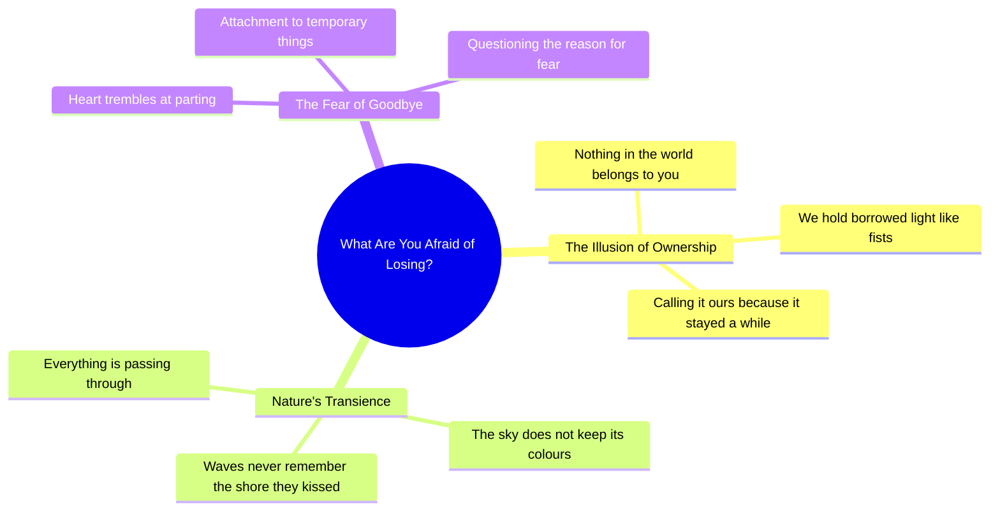

# Poem: What Are You Afraid of Losing When Nothing Belongs...

> 🌐 **Read this in:** **English** · [中文](../../zh-CN/2026-06/tiktok-transcript-4-7m-views-170k-reactions-what-are-you-afraid-of-losing-when-a99b.md)

> **Creator:** [@Whisprs "](https://www.tiktok.com/@Whisprs ") · **Views:** 1.7M · **Posted:** 2026-06-27 · **Niche:** other
>
> **TL;DR:** Opens with a provocative, universal question that challenges attachment and immediately engages the viewer's introspection.

[Watch original video →](https://www.facebook.com/share/r/18fkepJhnf/?mibextid=wwXIfr)

## Why This Went Viral

## Hook (first 3 seconds)
- **Verbatim opening line:** "What are you afraid of losing, when nothing in the world actually belongs to you?"
- **Hook pattern:** Bold, philosophical question that challenges a universal assumption (ownership)
- **Why it stops scroll:** The question is paradoxical and unsettling—it contradicts the viewer's default belief that they *do* own things. The cognitive dissonance forces a pause to resolve the tension.

## Emotional Rhythm
- **Beat 1 – Curiosity/Discomfort (0–3s):** The opening question creates a mild cognitive shock. Viewer feels "Wait, that’s true… but I don’t like that."
- **Beat 2 – Tension/Resistance (4–8s):** "We hold like fists around borrowed light" — the metaphor of clenching vs. releasing creates physical tension. Viewer feels the effort of holding on.
- **Beat 3 – Surrender/Resonance (9–12s):** "Even the sky does not keep its colours" — a beautiful, irrefutable truth that softens resistance. Viewer begins to accept the premise.
- **Beat 4 – Emotional release (13–15s):** "Waves never remember the shore they kissed" — a poignant, romantic image that triggers a sense of bittersweet beauty.
- **Beat 5 – Climax/Invitation (16–18s):** "Why does your heart tremble at goodbye…?" — the final question reframes grief as unnecessary, landing with a mix of sadness and liberation.
- **Climax moment:** The word "goodbye" paired with "passing through" — the emotional peak is the realization that loss is inevitable, but also natural.

## Keyword Density
| Word/Phrase | Count (approx.) | Function |
|-------------|----------------|----------|
| losing / lose | 2 | **Algorithmic reach** — high-search-volume emotional trigger (grief, fear) |
| nothing / no | 3 | **Algorithmic reach** — negative framing drives curiosity clicks |
| belongs / yours | 2 | **Emotional pull** — ownership anxiety, identity attachment |
| borrowed / passing through | 2 | **Emotional pull** — metaphor for impermanence, philosophical depth |
| heart / tremble | 1 each | **Emotional pull** — somatic language (body-based resonance) |
| sky / colours / waves / shore / kissed | 5 total | **Algorithmic reach** — visual, poetic keywords that boost shareability on aesthetic platforms (Instagram, TikTok) |

## Why It Spreads
1. **Universal anxiety hook** — "What are you afraid of losing?" taps into the single most relatable fear (loss of people, youth, identity, possessions). Every viewer has a personal answer.
2. **Poetic reframe of grief** — The metaphor "waves never remember the shore they kissed" reframes heartbreak as beautiful rather than painful. This is highly shareable because it offers a new lens for old pain.
3. **No call-to-action, all resonance** — The video never asks for a like or share, which makes the viewer *want* to share it as a gift. The last line ("everything you love was only passing through") is a quotable mic-drop that people screenshot and repost.
4. **Short, dense, and loopable** — At ~18 seconds, it’s exactly the length for a full emotional arc. The poetic structure makes it feel like a mantra, encouraging rewatching and saving.
5. **Algorithmic density of emotional keywords** — "Losing," "nothing," "belongs," "heart," "goodbye" are high-engagement signals that push the video into "sad/reflective" content clusters, which have low competition but high retention.

## What You Can Steal
1. **Lead with a paradox, not a statement** — Instead of "Loss is hard," open with a question that contradicts a belief ("What are you afraid of losing when nothing belongs to you?"). Paradoxes force the brain to stop and process.
2. **Use somatic metaphors** — Replace abstract words (grief, attachment) with physical images (fists, borrowed light, waves kissing shore). The body understands metaphors before the mind does.
3. **End with a question that has no answer** — Don't resolve the tension. Leave the viewer holding the question. The video ends on "passing through" — a word that floats, not lands. This makes the loop feel incomplete, driving rewatches and saves.

## Mind Map

## Full Transcript (Generated by [free TikTok transcript generator](https://toktranscript.com/?utm_source=github&utm_medium=breakdown&utm_campaign=tool_attribution))

> 📝 Transcripts on this page are auto-generated and show the first 60%. Want to transcribe any TikTok in 30 seconds and get the full version? [Try TokTranscript free →](https://toktranscript.com/?utm_source=github&utm_medium=breakdown&utm_campaign=transcript_cta)

What are you afraid of losing, when nothing in the world actually belongs to you? We hold like fists around borrowed light, calling it ours because it stayed a while.

*[Read the full transcript on TokTranscript →](https://toktranscript.com/plaza/tiktok-transcript-4-7m-views-170k-reactions-what-are-you-afraid-of-losing-when-a99b?utm_source=github&utm_medium=breakdown&utm_campaign=transcript_full)*

## Browse More

- All [other](../../by-niche/en/other.md) breakdowns
- All [Rhetorical Question](../../by-pattern/en/hook-rhetorical-question.md) examples

## Video Info

| | |
|---|---|
| Creator | [@Whisprs "](https://www.tiktok.com/@Whisprs ") |
| Original video | [https://www.facebook.com/share/r/18fkepJhnf/?mibextid=wwXIfr](https://www.facebook.com/share/r/18fkepJhnf/?mibextid=wwXIfr) |
| Original title | 4.7M views · 170K reactions | What are you afraid of losing, when nothing in the world actually belongs to you. | Original Poem by Whisprs #deepthoughts #selfworth #USA #canada #UK | Whisprs " |
| Views | 1.7M (1711076) |
| Posted | 2026-06-27 |
| Duration | 0s |
| Niche | `other` |
| Hook pattern | `Rhetorical Question` |
| Original language | `en` |
| Available languages | en, zh-CN |
| Generated | 2026-06-29 by [TokTranscript](https://toktranscript.com/) |

---

*This breakdown is for educational analysis under fair use. Original video © [@Whisprs "](https://www.tiktok.com/@Whisprs "). All transcripts are auto-generated and may contain errors.*

*Want to analyze your own TikToks like this? [the tool we used to generate this →](https://toktranscript.com/viral-breakdown?utm_source=github&utm_medium=breakdown&utm_campaign=footer_cta)*