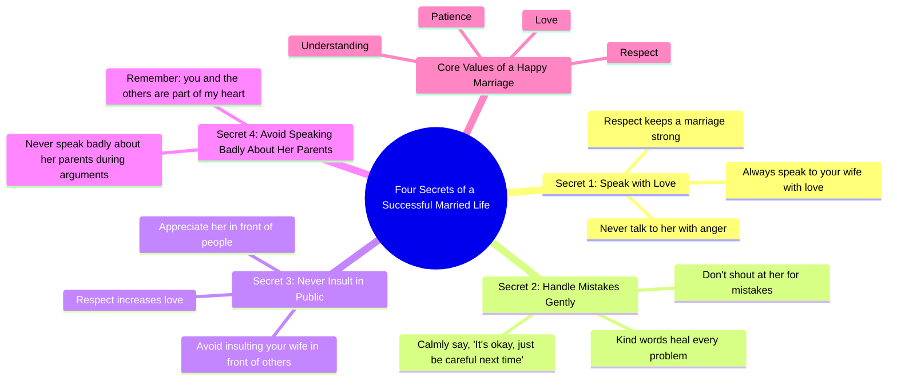

# 4 Secrets of a Happy Married Life – A Mother’s Advice

> 🌐 **Read this in:** **English** · [中文](../../zh-CN/2026-06/tiktok-transcript-802k-views-22k-reactions-4-secrets-of-a-happy-married-life-a-e640.md)

> **Creator:** [@Speak English Fluently](https://www.tiktok.com/@Speak English Fluently) · **Views:** 365.9K · **Posted:** 2026-06-05 · **Niche:** other
>
> **TL;DR:** Promises a numbered list of valuable secrets, creating immediate curiosity and anticipation.

[Watch original video →](https://www.facebook.com/reel/912746148235878)

## Why This Went Viral

## Hook (first 3 seconds)
- **Verbatim opening line:** "Son, today I want to tell you four secrets of a successful married life."
- **Hook pattern:** Scene + numbers (a direct address to "son" with a numbered list promise — "four secrets")
- **Why it stops scrolling:** The immediate framing as a fatherly lecture creates authority and intimacy. The promise of "secrets" triggers curiosity — viewers want to know what those four things are, especially if they're in a relationship or value marriage wisdom. The "son" address makes it feel personal and universal at once.

## Emotional Rhythm
- **Beat 1 (Curiosity + Respect):** "Always speak to your wife with love. Never talk to her with anger." — Sets a tone of moral clarity and gentle authority.
- **Beat 2 (Tension → Relief):** "If she makes a mistake, don't shout at her. Calmly say, 'It's okay, just be careful next time.'" — Introduces a potential conflict (mistake) and immediately resolves it with a model response, creating relief.
- **Beat 3 (Resonance + Pride):** "Never insult your wife in front of others. Instead, appreciate her in front of people." — Taps into shared values of respect and public honor, evoking pride in the listener.
- **Beat 4 (Emotional Climax):** "If you ever have an argument, never speak badly about her parents. Remember, you and the others are part of my heart." — The twist: the advice extends beyond the couple to in-laws, deepening emotional stakes. The phrase "part of my heart" lands as the climax — a moment of profound warmth and connection.
- **Closing (Gratitude + Resolution):** "Thank you, mom. I will always remember these four lessons." — The son's response provides a satisfying emotional payoff, reinforcing the lesson's impact.

## Keyword Density
- **love** (appears 3 times) — drives emotional pull; core value word that resonates with viewers' desire for connection.
- **respect** (appears 3 times) — dual function: algorithmic reach (high-engagement social value) + emotional pull (universal relationship need).
- **wife** (appears 3 times) — specific target audience (married men) + triggers relatability for couples.
- **never** (appears 3 times) — creates contrast and urgency ("never talk with anger," "never insult," "never speak badly"); algorithmic keyword for advice content.
- **mistake** (appears 1 time but implied in the "calmly say" line) — triggers empathy and forgiveness; low frequency but high emotional weight.
- **parents** (appears 1 time in the climax) — expands the emotional scope beyond the couple; drives shareability among family-oriented viewers.
- **happy marriage** (appears 1 time in the closing) — aspirational phrase that hooks viewers seeking relationship improvement.

## Why It Spreads
1. **Universal relationship wisdom in a compact list format.** The transcript is structured as four clear, actionable rules. Viewers can easily remember and share "the four secrets" — making it prime for reposting, quoting, and saving as a reference.
2. **Emotional authenticity through a parent-child frame.** The "father teaching son" setup creates an instant trust shortcut. Viewers feel they're receiving time-tested, non-commercial advice from a loving elder — a format that bypasses skepticism and triggers nostalgia.
3. **Climactic twist that expands the emotional scope.** The fourth secret ("never speak badly about her parents") is the most unexpected and emotionally charged. It surprises viewers and makes the advice feel deeper than typical relationship tips, prompting comments like "This one hit different."
4. **Call to action embedded in the closing line.** "Thank you, mom. I will always remember these four lessons" acts as a soft CTA — it implicitly invites viewers to reflect, comment with their own lessons, or share with a partner. The gratitude tone makes engagement feel natural, not forced.
5. **High shareability among couples and family groups.** The advice is gender-neutral enough to apply to any relationship, but the "son" framing specifically targets men — a demographic often underserved by relationship content. This creates a niche viral loop within family and couples' groups.

## What You Can Steal
1. **Use a numbered list with a personal frame.** Instead of generic "5 tips," say "My dad gave me 5 secrets" or "Here's what my mom taught me." The personal origin story adds trust and makes the list feel earned, not manufactured.
2. **Build a "soft climax" — save the most emotional or surprising point for last.** In this transcript, the fourth secret about in-laws is the most resonant. Structure your advice so the final point lands hardest — viewers will remember it and share it.
3. **End with a gratitude response from the learner.** Don't just give advice; show the recipient's reaction ("Thank you, mom. I will always remember."). This creates a complete emotional arc and gives viewers a satisfying conclusion — making them more likely to engage or save the video.

## Mind Map

## Full Transcript (Generated by [analyze your own TikToks](https://toktranscript.com/?utm_source=github&utm_medium=breakdown&utm_campaign=tool_attribution))

> 📝 Transcripts on this page are auto-generated and show the first 60%. Want to transcribe any TikTok in 30 seconds and get the full version? [Try TokTranscript free →](https://toktranscript.com/?utm_source=github&utm_medium=breakdown&utm_campaign=transcript_cta)

Son, today I want to tell you four secrets of a successful married life. First, always speak to your wife with love. Never talk to her with anger. Because respect keeps a marriage strong. Second, if she makes a mistake, don't shout at her. Calmly say, It's okay, just be careful next time. Kind words heal every problem. Third, never insult your wife in front of others.

*[Read the full transcript on TokTranscript →](https://toktranscript.com/plaza/tiktok-transcript-802k-views-22k-reactions-4-secrets-of-a-happy-married-life-a-e640?utm_source=github&utm_medium=breakdown&utm_campaign=transcript_full)*

## Browse More

- All [other](../../by-niche/en/other.md) breakdowns
- All [List-based curiosity gap](../../by-pattern/en/hook-list-based-curiosity-gap.md) examples

## Video Info

| | |
|---|---|
| Creator | [@Speak English Fluently](https://www.tiktok.com/@Speak English Fluently) |
| Original video | [https://www.facebook.com/reel/912746148235878](https://www.facebook.com/reel/912746148235878) |
| Original title | 802K views · 22K reactions | 4 Secrets of a Happy Married Life – A Mother’s Advice | English Speaking Practice This dialogue helps learners practice simple and meaningful English sentences about respect, love, patience, and understanding in married life. It improves daily conversation skills and teaches positive relationship values. #englishspeakingpractice #lifelesson #learnenglish #parentadvice #marriedlife #marriage | Speak English Fluently |
| Views | 365.9K (365906) |
| Posted | 2026-06-05 |
| Duration | 0s |
| Niche | `other` |
| Hook pattern | `List-based curiosity gap` |
| Original language | `en` |
| Available languages | en, zh-CN |
| Generated | 2026-06-06 by [TokTranscript](https://toktranscript.com/) |

---

*This breakdown is for educational analysis under fair use. Original video © [@Speak English Fluently](https://www.tiktok.com/@Speak English Fluently). All transcripts are auto-generated and may contain errors.*

*Want to analyze your own TikToks like this? [analyze your own TikToks →](https://toktranscript.com/viral-breakdown?utm_source=github&utm_medium=breakdown&utm_campaign=footer_cta)*