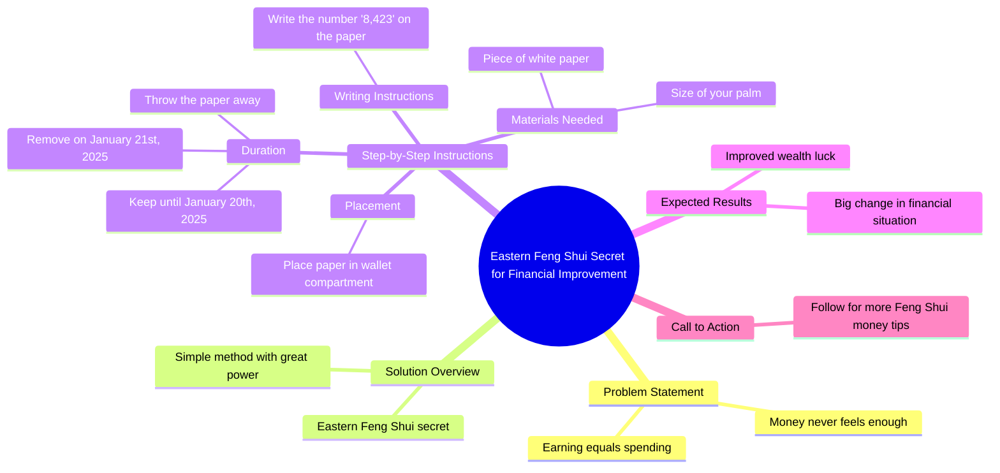

# Feng Shui Tip: Write 8423 on Paper to Improve Finances

> 🌐 **Read this in:** **English** · [中文](../../zh-CN/2026-06/tiktok-transcript-always-feel-like-money-s-tight-let-me-share-a-feng-shui-tip-eb25.md)

> **Creator:** [@emotionaldestiny](https://www.tiktok.com/@emotionaldestiny) · **Views:** 2.7M · **Posted:** 2026-06-30 · **Niche:** finance
>
> **TL;DR:** Identifies a common financial frustration and promises a mystical solution.

[Watch original video →](https://www.tiktok.com/t/ZP8G6regY/)

## Why This Went Viral

## Hook (first 3 seconds)
- **Verbatim opening:** "If you always feel like money is never enough, earning as much as you spend, today I'm going to teach you an eastern feng Shui secret to improve this situation."
- **Hook pattern:** Emotional pain point + promise of secret knowledge (contrast between "never enough" and "secret to improve")
- **Why it stops scroll:** Directly names a universal anxiety (financial inadequacy) and offers a mystical, low-effort solution — viewers feel "this is for me" and "I need to know the secret."

## Emotional Rhythm
- **Beat 1 — Pain resonance:** "If you always feel like money is never enough" — triggers identification and discomfort
- **Beat 2 — Curiosity spike:** "I'm going to teach you an eastern feng Shui secret" — promises hidden, exotic knowledge
- **Beat 3 — Tension:** "The method is simple, but it holds great power" — builds anticipation
- **Beat 4 — Instruction (suspense):** "Write 8,423 on it... place it in your wallet... leave it until January 20th, 2025" — step-by-step ritual creates a mental checklist
- **Beat 5 — Release / reward:** "After doing this, you'll notice a big change in both your financial situation and your wealth. Luck!" — emotional payoff of hope and control
- **Climax:** The specific date "January 20th, 2025" — a deadline that makes the action feel urgent and real

## Keyword Density
| Keyword / Phrase | Frequency (approx.) | Drive Reach (algorithm) | Emotional Pull |
|------------------|---------------------|--------------------------|----------------|
| money / financial | 3 | High (financial niche) | High (pain point) |
| feng shui secret | 2 | Medium (mystical niche) | High (exclusivity) |
| simple / great power | 2 | Low | High (contrast) |
| wallet | 2 | Low | High (actionable) |
| January 20th, 2025 | 1 | Low (unique date) | Very high (urgency) |
| wealth / luck | 2 | Medium (aspirational) | High (reward) |

- **Algorithmic drivers:** "money," "feng shui" — broad search terms; "secret" — clickbait trigger
- **Emotional drivers:** "never enough," "big change," "wealth luck" — fear + hope combo

## Why It Spreads
1. **Universal pain + zero-effort fix:** "If you always feel like money is never enough" hits 80%+ of adults. The "write a number on paper" solution is absurdly simple — shareable because it's low-risk, high-hope.
2. **Mystical authority + deadline:** "Eastern feng shui secret" implies ancient, trustworthy wisdom. The exact date ("January 20th, 2025") creates a countdown — viewers share to hold themselves accountable or to "save" friends.
3. **Action cascade:** The step-by-step instruction ("take a piece of white paper... write 8,423... place in wallet") is easy to screenshot and replicate. This drives comments like "I did it!" which boosts engagement.
4. **Emotional rollercoaster in 30 seconds:** Pain → curiosity → instruction → relief → hope. Short-form videos that compress a full story arc (setup, tension, resolution) get rewatched and shared.
5. **Call-to-action with FOMO:** "If you want to learn more... don't forget to follow me" — turns a one-off ritual into a content series hook, encouraging follows for future "secrets."

## What You Can Steal
1. **Pain-first hook:** Open with a specific, relatable frustration ("If you always feel like money is never enough") — not a generic "hey guys." Naming the exact emotional wound stops the scroll.
2. **The "simple but powerful" contrast:** Frame your solution as absurdly easy yet backed by hidden authority ("eastern secret"). This lowers the barrier to trying and increases shareability.
3. **Create a deadline ritual:** Give viewers a specific action with a concrete future date (e.g., "leave it until January 20th"). Deadlines turn passive watching into active participation — and drive return engagement when the date arrives.

## Mind Map

## Full Transcript (Generated by [TokTranscript.com](https://toktranscript.com/?utm_source=github&utm_medium=breakdown&utm_campaign=tool_attribution))

> 📝 Transcripts on this page are auto-generated and show the first 60%. Want to transcribe any TikTok in 30 seconds and get the full version? [Try TokTranscript free →](https://toktranscript.com/?utm_source=github&utm_medium=breakdown&utm_campaign=transcript_cta)

If you always feel like money is never enough, earning as much as you spend, today I'm going to teach you an eastern feng Shui secret to improve this situation. The method is simple, but it holds great power. You need to take a piece of white paper about the size of your palm and write 8,423 on it. Then place it in the compartment of your wallet.

*[Read the full transcript on TokTranscript →](https://toktranscript.com/plaza/tiktok-transcript-always-feel-like-money-s-tight-let-me-share-a-feng-shui-tip-eb25?utm_source=github&utm_medium=breakdown&utm_campaign=transcript_full)*

## Browse More

- All [finance](../../by-niche/en/finance.md) breakdowns
- All [Problem-Agitate-Solution](../../by-pattern/en/hook-problem-agitate-solution.md) examples

## Video Info

| | |
|---|---|
| Creator | [@emotionaldestiny](https://www.tiktok.com/@emotionaldestiny) |
| Original video | [https://www.tiktok.com/t/ZP8G6regY/](https://www.tiktok.com/t/ZP8G6regY/) |
| Original title | Always feel like money's tight Let me share a Feng Shui tip to improv... |
| Views | 2.7M (2700000) |
| Posted | 2026-06-30 |
| Duration | 0s |
| Niche | `finance` |
| Hook pattern | `Problem-Agitate-Solution` |
| Original language | `en` |
| Available languages | en, zh-CN |
| Generated | 2026-07-01 by [TokTranscript](https://toktranscript.com/) |

---

*This breakdown is for educational analysis under fair use. Original video © [@emotionaldestiny](https://www.tiktok.com/@emotionaldestiny). All transcripts are auto-generated and may contain errors.*

*Want to analyze your own TikToks like this? [TokTranscript.com →](https://toktranscript.com/viral-breakdown?utm_source=github&utm_medium=breakdown&utm_campaign=footer_cta)*