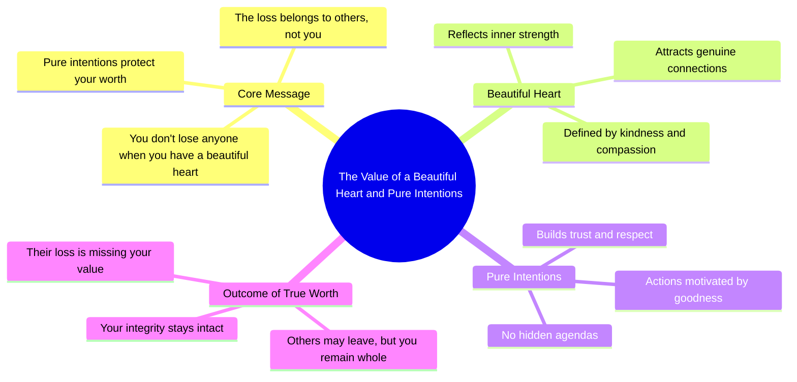

# Always Remember: You Don't Lose Them, They Lose You

> 🌐 **Read this in:** **English** · [中文](../../zh-CN/2026-06/tiktok-transcript-always-remember-when-motivacion-motivacionvideo-motivacionqu-e331.md)

> **Creator:** [@siyal.motivation](https://www.tiktok.com/@siyal.motivation) · **Views:** 1.3M · **Posted:** 2026-06-11 · **Niche:** other
>
> **TL;DR:** The hook flips a common fear of loss into an empowering statement of self-worth.

[Watch original video →](https://vm.tiktok.com/ZNRvv8YGx/)

## Why This Went Viral

## Hook (first 3 seconds)
- **What happens verbatim:** "Always remember, when you have a beautiful heart, pure intentions, then you don't lose anyone, they lose you."
- **Hook pattern:** **Bold claim** + **contrast** (you don't lose → they lose you)
- **Why it stops scrolling:** It flips a painful, universal fear ("I lost someone") into a empowering reframe. The word "always" signals timeless wisdom, making it feel like a secret truth. The contrast is sharp and unexpected, forcing the viewer to pause and process.

## Emotional Rhythm
1. **Curiosity** – "Always remember..." (feels like a lesson about to be revealed)
2. **Tension** – "...when you have a beautiful heart, pure intentions..." (viewer braces for a loss)
3. **Twist / Relief** – "...then you don't lose anyone, they lose you." (the reframe releases the tension with empowerment)
4. **Resonance** – The line lingers, allowing the viewer to apply it to their own past heartbreak or guilt.
- **Climax moment:** The exact word "they lose you" – that’s the emotional payoff. It shifts from victim to victor.

## Keyword Density
- **"lose" / "lost"** (3x) – Algorithmic reach (high-search volume for breakup/heartbreak content) + emotional pull (fear of loss)
- **"you"** (4x) – Emotional pull (personal, direct, feels like it’s spoken to the viewer)
- **"beautiful heart"** – Emotional pull (identity affirmation, aspirational)
- **"pure intentions"** – Emotional pull (moral validation, self-reassurance)
- **"they"** (2x) – Algorithmic reach (triggers "them vs. me" curiosity, drives comments)
- **"remember"** – Emotional pull (memory-anchoring, makes the line stick)

## Why It Spreads
1. **Reframes a universal pain point** – Almost everyone has felt "losing" someone. The video flips that into "they lost you," which is instantly shareable as a self-affirmation. (Line: *"you don't lose anyone, they lose you"*)
2. **High comment bait** – The line invites people to tag friends who "need to hear this" or to share their own story of being the one with a "beautiful heart." (Line: *"when you have a beautiful heart, pure intentions"*)
3. **Repeatable, quotable structure** – The phrase is short, rhythmic, and easy to repost as a text overlay or audio clip. It’s a "mic drop" moment that works across platforms. (Line: *"Always remember..."*)
4. **Low barrier to emotional resonance** – No specific context needed (no name, no gender, no situation). Anyone who has felt wronged in a relationship can project onto it. (Line: *"they lose you"*)
5. **Algorithmic density** – The keywords "lose," "heart," and "intentions" are high-volume in self-help and relationship niches, boosting discoverability. (Line: *"beautiful heart, pure intentions"*)

## What You Can Steal
1. **The "flip the script" hook** – Start with a common belief or fear, then end with a surprising reversal. Example: "You think you’re not good enough? Actually, they’re not ready for you."
2. **Keep it one sentence** – The entire viral payload is a single line. No setup, no story, no filler. Short-form rewards density. Write your core message in under 15 words.
3. **Use "you" and "they" for instant relatability** – The pronoun pair creates a clear "us vs. them" dynamic that makes viewers feel seen and defensive in a good way. It also triggers comments ("This is about my ex").

## Mind Map

## Full Transcript (Generated by [TokTranscript.com](https://toktranscript.com/?utm_source=github&utm_medium=breakdown&utm_campaign=tool_attribution))

> 📝 Transcripts on this page are auto-generated and show the first 60%. Want to transcribe any TikTok in 30 seconds and get the full version? [Try TokTranscript free →](https://toktranscript.com/?utm_source=github&utm_medium=breakdown&utm_campaign=transcript_cta)

Always remember, when you have a beautiful heart, pure intentions

*[Read the full transcript on TokTranscript →](https://toktranscript.com/plaza/tiktok-transcript-always-remember-when-motivacion-motivacionvideo-motivacionqu-e331?utm_source=github&utm_medium=breakdown&utm_campaign=transcript_full)*

## Browse More

- All [other](../../by-niche/en/other.md) breakdowns
- All [Reversal of expectation](../../by-pattern/en/hook-reversal-of-expectation.md) examples

## Video Info

| | |
|---|---|
| Creator | [@siyal.motivation](https://www.tiktok.com/@siyal.motivation) |
| Original video | [https://vm.tiktok.com/ZNRvv8YGx/](https://vm.tiktok.com/ZNRvv8YGx/) |
| Original title | always remember when !!! #motivacion #motivacionvideo #motivacionquot... |
| Views | 1.3M (1300000) |
| Posted | 2026-06-11 |
| Duration | 0s |
| Niche | `other` |
| Hook pattern | `Reversal of expectation` |
| Original language | `en` |
| Available languages | en, zh-CN |
| Generated | 2026-06-12 by [TokTranscript](https://toktranscript.com/) |

---

*This breakdown is for educational analysis under fair use. Original video © [@siyal.motivation](https://www.tiktok.com/@siyal.motivation). All transcripts are auto-generated and may contain errors.*

*Want to analyze your own TikToks like this? [free TikTok transcript generator →](https://toktranscript.com/viral-breakdown?utm_source=github&utm_medium=breakdown&utm_campaign=footer_cta)*