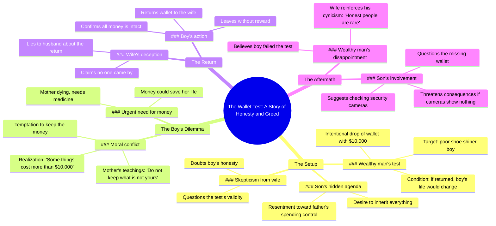

# Shoe Shiner Returns Wallet, Gets Life Changed

> 🌐 **Read this in:** **English** · [中文](../../zh-CN/2026-06/tiktok-transcript-brainrot-ai-fruitdrama-fruits-fruitstory-4d72.md)

> **Creator:** [@gyropatich](https://www.tiktok.com/@gyropatich) · **Views:** 11.6M · **Posted:** 2026-06-24 · **Niche:** entertainment
>
> **TL;DR:** Immediately establishes a life-or-death stakes with a child's plea.

[Watch original video →](https://www.tiktok.com/@gyropatich/video/7653555523538668822)

## Why This Went Viral

## Hook (first 3 seconds)
- **Verbatim opening line:** "Not bad, kid. Here. Thank you. Sir. My mom needs medicine."
- **Hook pattern:** Scene + Contrast (a wealthy man testing a poor boy with a dropped wallet vs. the boy's desperate need for medicine)
- **Why it stops scrolling:** The immediate tension between a casual "Not bad, kid" and the boy's urgent plea "My mom needs medicine" creates a moral dilemma. Viewers are hooked by the high-stakes setup: will the boy keep the money or return it?

## Emotional Rhythm
1. **Curiosity** → "I intentionally dropped my wallet... If he comes to return it tomorrow, I am going to change his entire life."
2. **Tension** → "You honestly believe a struggling kid is going to return thousands of dollars?"
3. **Suspense** → "10,000 inside this wallet. My mother is dying. She needs this medicine."
4. **Moral conflict (climax)** → "But I cannot keep what does not belong to me. That is not how she raised me."
5. **Relief + twist** → "I gave the wallet to your wife last night." → "My wife said no one came by."
6. **Final suspense** → "Check the night security cameras. If those cameras show nothing, you'll regret this."

**Climax moment:** The boy's internal monologue: "Some things cost more than 10 thousand dollars." This is the emotional peak where viewers either admire his integrity or feel the weight of his sacrifice.

## Keyword Density
| Word/Phrase | Frequency | Purpose |
|-------------|-----------|---------|
| 10,000 / $10,000 | 6 | Algorithmic: high-value number triggers curiosity and retention |
| Wallet | 5 | Emotional: tangible object symbolizing the test |
| Mother / Mom | 4 | Emotional: universal trigger for empathy |
| Return / Returning | 4 | Emotional: moral action, creates tension |
| Poor | 3 | Algorithmic: class contrast drives engagement |
| Medicine | 3 | Emotional: life-or-death stakes |
| Kid / Boy | 3 | Emotional: innocence vs. corruption |
| Wife | 2 | Twist: betrayal revealed, drives rewatch |

**Algorithmic drivers:** "10,000" (high-value number), "poor" (class conflict), "return" (action verb).  
**Emotional pull:** "Mother," "medicine," "kid" — these create instant empathy and moral investment.

## Why It Spreads
1. **Moral dilemma + twist ending** — The boy returns the wallet, but the wife lies. This subverts the expected "happy ending" and creates a cliffhanger. Viewers must comment to resolve the tension: *"Check the cameras!"*
2. **Class warfare narrative** — The rich man's test ("Poor people don't get many chances") vs. the boy's integrity. This taps into deep societal resentment and hope, driving shares across political and socioeconomic lines.
3. **High-stakes numbers** — "$10,000" is specific, large, and memorable. It creates a clear benchmark for the sacrifice, making the story easy to retell and compare.
4. **Relatable character archetypes** — The struggling son, the skeptical rich man, the lying wife. Each is a recognizable trope that viewers immediately judge, fueling comment debates.
5. **Rewatch value** — The twist (wife lying) makes viewers want to rewatch to catch clues. The first watch is emotional; the second is detective work.

## What You Can Steal
1. **Open with a moral test** — Start your video with a clear "will they or won't they?" dilemma. The viewer should know the stakes within 3 seconds. Example: "I left my phone in an Uber. If the driver returns it, I'll pay off his car loan."
2. **Use a specific, round number** — "$10,000" is more viral than "a lot of money." Round, large numbers are easy to remember, share, and compare. Always quantify the stakes.
3. **End with a cliffhanger twist** — Don't resolve the story completely. Leave a question unanswered (e.g., "Check the cameras"). This drives comments, shares, and follow-up videos. The twist should subvert the viewer's expectation.

## Mind Map

## Full Transcript (Generated by [analyze your own TikToks](https://toktranscript.com/?utm_source=github&utm_medium=breakdown&utm_campaign=tool_attribution))

> 📝 Transcripts on this page are auto-generated and show the first 60%. Want to transcribe any TikTok in 30 seconds and get the full version? [Try TokTranscript free →](https://toktranscript.com/?utm_source=github&utm_medium=breakdown&utm_campaign=transcript_cta)

Not bad, kid. Here. Thank you. Sir. My mom needs medicine. Don't waste it. Poor people don't get many chances. I intentionally dropped my wallet with $10,000 in front of that poor shoe shiner kid today. If he comes to return it tomorrow, I am going to change his entire life. You honestly believe a struggling kid is going to return thousands of dollars? We are about to find out. He throws 10,000 away testing some poor kids loyalty. But when I wanna spend my own money, he questions every single cent. One day, everything in the safe, this house, all of it will be entirely and only mine. 10,000 inside this wallet. My mother is dying. She needs this medicine. God knows I desperately need this money to save her life. But I cannot keep what does not belong to me. That is not how she raised me. That is not who we are. This money could fix everything. The medicine, the hospital, everything. My mother could live.

*[Read the full transcript on TokTranscript →](https://toktranscript.com/plaza/tiktok-transcript-brainrot-ai-fruitdrama-fruits-fruitstory-4d72?utm_source=github&utm_medium=breakdown&utm_campaign=transcript_full)*

## Browse More

- All [entertainment](../../by-niche/en/entertainment.md) breakdowns
- All [Emotional urgency](../../by-pattern/en/hook-emotional-urgency.md) examples

## Video Info

| | |
|---|---|
| Creator | [@gyropatich](https://www.tiktok.com/@gyropatich) |
| Original video | [https://www.tiktok.com/@gyropatich/video/7653555523538668822](https://www.tiktok.com/@gyropatich/video/7653555523538668822) |
| Original title | #brainrot #ai #fruitdrama #fruits #fruitstory  |
| Views | 11.6M (11600000) |
| Posted | 2026-06-24 |
| Duration | 0s |
| Niche | `entertainment` |
| Hook pattern | `Emotional urgency` |
| Original language | `en` |
| Available languages | en, zh-CN |
| Generated | 2026-06-25 by [TokTranscript](https://toktranscript.com/) |

---

*This breakdown is for educational analysis under fair use. Original video © [@gyropatich](https://www.tiktok.com/@gyropatich). All transcripts are auto-generated and may contain errors.*

*Want to analyze your own TikToks like this? [TokTranscript →](https://toktranscript.com/viral-breakdown?utm_source=github&utm_medium=breakdown&utm_campaign=footer_cta)*