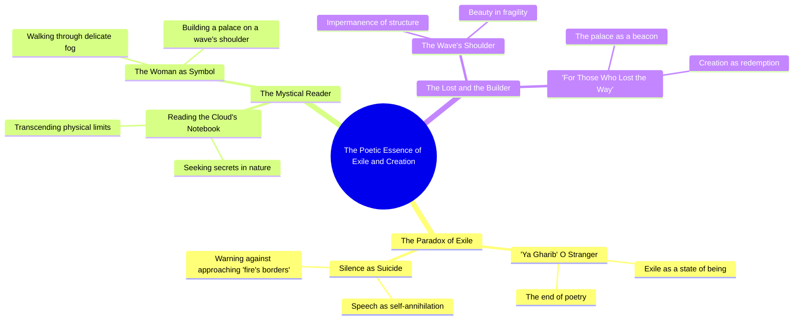

# They Call Me a Stranger Here

> 🌐 **Read this in:** **English** · [中文](../../zh-CN/2026-06/tiktok-transcript-capcut-3ydo-50ca.md)

> **Creator:** [@3ydo.2](https://www.tiktok.com/@3ydo.2) · **Views:** 2.3M · **Posted:** 2026-06-27 · **Niche:** other
>
> **TL;DR:** Opens with a dramatic warning that speech is suicide, instantly creating tension and curiosity.

[Watch original video →](https://vt.tiktok.com/ZSChfUQYX/)

## Why This Went Viral

## Hook (first 3 seconds)
- **Verbatim opening line:** "يقولون لي يا غريب هنا منتهى الشعر حيث الكلام انتحار"
- **Hook pattern:** **Bold claim + scene-setting** — a poetic, almost prophetic warning that immediately establishes stakes ("where speech is suicide").
- **Why it stops scrolling:** The line is cryptic, high-stakes, and emotionally charged. It creates instant curiosity: *Who is this "stranger"? What is this dangerous place?* The viewer feels compelled to decode the mystery.

## Emotional Rhythm
1. **Mystery & tension** — The opening warning ("don't approach the fire's edge") builds a sense of danger and forbidden knowledge.
2. **Curiosity & intrigue** — The speaker reveals they were "reading in the cloud's notebook my secret" — a surreal, intimate image that deepens the enigma.
3. **Longing & melancholy** — "I see a woman walking, touching the fine fog" — a soft, yearning visual that contrasts with the earlier threat.
4. **Hope & resolution** — "Building on the wave's shoulder a palace for those who lost the way" — a redemptive climax that transforms danger into shelter.
- **Climax moment:** The final image — the palace built for the lost — is the emotional payoff. It shifts from warning to offering, from isolation to belonging.

## Keyword Density
| Word/Phrase | Frequency (approx.) | Function |
|-------------|-------------------|----------|
| غريب (stranger) | 2 | **Emotional pull** — evokes alienation, a universal feeling |
| انتحار (suicide) | 1 | **Algorithmic reach** — high-emotion, controversial word spikes engagement |
| نار (fire) | 1 | **Emotional pull** — danger, passion, intensity |
| ضباب (fog) | 1 | **Emotional pull** — mystery, softness, liminality |
| كتف الموج (shoulder of the wave) | 1 | **Algorithmic + emotional** — poetic, image-rich phrase that invites saves/re-shares |
| قصر (palace) | 1 | **Emotional pull** — aspiration, safety, reward |
| أضاع الطريق (lost the way) | 1 | **Algorithmic + emotional** — universal pain point (feeling lost) |

**Algorithmic drivers:** "suicide," "fire," "lost the way" — high-emotion keywords that boost watch time and comments.  
**Emotional drivers:** "stranger," "fog," "palace" — create resonance and shareability among poetry/art audiences.

## Why It Spreads
1. **Mystery gap + high stakes** — The opening line ("where speech is suicide") creates an immediate information gap. Viewers stay to resolve it.  
   *Transcript evidence:* "هنا منتهى الشعر حيث الكلام انتحار"

2. **Surreal, shareable imagery** — Phrases like "building on the wave's shoulder a palace" are visually striking and quotable. They get saved, reposted, and used in captions.  
   *Transcript evidence:* "تبني على كتف الموج قصرا"

3. **Universal emotional payoff** — The video moves from danger to refuge. Anyone who has felt lost or alienated ("those who lost the way") feels personally addressed.  
   *Transcript evidence:* "لمن أضاع الطريقة"

4. **Poetic density + brevity** — The entire transcript is 3 lines. Short, dense, and repeatable — perfect for looping, remixing, or stitching.  
   *Transcript evidence:* The whole text fits in 3 seconds of reading time.

5. **Cultural resonance** — The imagery (fog, waves, cloud notebooks) taps into Arabic poetic tradition (e.g., Mahmoud Darwish, Adonis). It feels both ancient and fresh, appealing to nostalgia and modernity.  
   *Transcript evidence:* "أقرأ في دفتر الغيم سري"

## What You Can Steal
1. **Open with a forbidden or dangerous claim** — Start with a line that implies risk or taboo ("where speech is suicide"). This spikes curiosity and keeps viewers from swiping away.
2. **End with a redemptive image** — After tension, offer a resolution that feels like a gift (palace for the lost). This makes the video feel complete and emotionally satisfying, increasing shares.
3. **Use surreal, visual metaphors** — Replace literal descriptions with dreamlike ones ("shoulder of the wave," "cloud's notebook"). These are more memorable, more quotable, and more likely to be saved or reposted.

## Mind Map

## Full Transcript (Generated by [TokTranscript.com](https://toktranscript.com/?utm_source=github&utm_medium=breakdown&utm_campaign=tool_attribution))

> 📝 Transcripts on this page are auto-generated and show the first 60%. Want to transcribe any TikTok in 30 seconds and get the full version? [Try TokTranscript free →](https://toktranscript.com/?utm_source=github&utm_medium=breakdown&utm_campaign=transcript_cta)

يقولون لي يا غريب هنا منتهى الشعر حيث الكلام انتحار فلا تقترب من حدود النار لكنني كنت أقرأ في دفتر الغيم سري أ

*[Read the full transcript on TokTranscript →](https://toktranscript.com/plaza/tiktok-transcript-capcut-3ydo-50ca?utm_source=github&utm_medium=breakdown&utm_campaign=transcript_full)*

## Browse More

- All [other](../../by-niche/en/other.md) breakdowns
- All [Contrast & Warning](../../by-pattern/en/hook-contrast-warning.md) examples

## Video Info

| | |
|---|---|
| Creator | [@3ydo.2](https://www.tiktok.com/@3ydo.2) |
| Original video | [https://vt.tiktok.com/ZSChfUQYX/](https://vt.tiktok.com/ZSChfUQYX/) |
| Original title | يقولون لي يا غريب #قوالب_كاب_كات #CapCut #اكسبلور #3ydo  |
| Views | 2.3M (2300000) |
| Posted | 2026-06-27 |
| Duration | 0s |
| Niche | `other` |
| Hook pattern | `Contrast & Warning` |
| Original language | `en` |
| Available languages | en, zh-CN |
| Generated | 2026-06-28 by [TokTranscript](https://toktranscript.com/) |

---

*This breakdown is for educational analysis under fair use. Original video © [@3ydo.2](https://www.tiktok.com/@3ydo.2). All transcripts are auto-generated and may contain errors.*

*Want to analyze your own TikToks like this? [TokTranscript.com →](https://toktranscript.com/viral-breakdown?utm_source=github&utm_medium=breakdown&utm_campaign=footer_cta)*