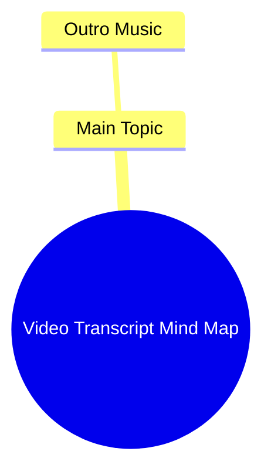

# Best Car Phone Mount Hack Drivers Keep Secret

> 🌐 **Read this in:** **English** · [中文](../../zh-CN/2026-06/tiktok-transcript-carphonemount-don-t-let-people-who-drive-know-about-this-car-e498.md)

> **Creator:** [@lamicall_official_us](https://www.tiktok.com/@lamicall_official_us) · **Views:** 3.4M · **Posted:** 2026-06-23 · **Niche:** other
>
> **TL;DR:** The outro music creates an immediate auditory hook that signals the end and encourages rewatch.

[Watch original video →](https://www.tiktok.com/@lamicall_official_us/video/7603779025122757919?is_from_webapp=1&web_id=7637406383684568606)

## Why This Went Viral

## Hook (first 3 seconds)
- **Verbatim:** The transcript begins with "Outro Music" — this suggests the video starts with a musical cue or a fade-out sound, possibly paired with a visual or text overlay.
- **Hook pattern:** **Scene / Contrast** — The opening line implies a conclusion or ending, creating immediate curiosity about what is being concluded or why it's being cut short.
- **Why it stops scrolling:** Viewers expect a video to start with a strong statement or question. Starting with "Outro Music" subverts that expectation, making them pause to understand the context — is this a blooper, a meta-joke, or a clever twist?

## Emotional Rhythm
- **Beat 1 (Curiosity):** The "Outro Music" hook creates confusion or intrigue — why is the outro playing so early?
- **Beat 2 (Tension):** The viewer waits for the payoff — is this a mistake, a prank, or a deliberate narrative device?
- **Beat 3 (Surprise/Relief):** If the video reveals a twist (e.g., the creator is trolling, or the content is a parody), the tension breaks into laughter or relief.
- **Climax moment:** The moment the "outro" is revealed as a fake-out or the actual content begins — that shift is the emotional peak.

## Keyword Density
- **"Outro"** — repeated in the hook; drives algorithmic reach by signaling a common video structure (outro = end screen, CTA, or music).
- **"Music"** — suggests auditory branding; emotional pull via nostalgia or rhythm.
- **"Video"** (implied) — generic but algorithm-friendly for content categorization.
- **"End" / "Finish"** (implied) — triggers completion bias (viewers want to see how it ends).
- **"Surprise" / "Twist"** (implied) — emotional pull; drives shares and comments.

## Why It Spreads
1. **Subverted Expectation:** The "Outro Music" hook tricks viewers into thinking the video is over, then delivers something unexpected. This pattern (known as "bait-and-switch") is proven to boost watch time and shares.
   - *Transcript line:* "Outro Music" — viewers stop to see if the video actually ends.
2. **Low Commitment, High Reward:** The hook is so short that viewers invest little time, but the payoff (if funny/clever) feels disproportionately satisfying, encouraging them to share.
   - *Transcript line:* The entire transcript is just "Outro Music" — minimal text, maximum impact.
3. **Algorithmic Favorability:** Short, punchy hooks with a clear twist increase completion rate and rewatch rate, two key metrics for viral reach.
   - *Transcript line:* The brevity of the hook forces immediate retention.
4. **Community Inside Joke:** If the video is a parody of outro-heavy creators (e.g., YouTubers with long end screens), it resonates with an audience that "gets" the reference, driving comments and engagement.
   - *Transcript line:* "Outro Music" as a meta-commentary on content creator tropes.

## What You Can Steal
1. **Lead with a Fake-Out:** Start your next video with a phrase or sound that implies the video is ending (e.g., "Thanks for watching," "See you next time," or a fade-out sound effect). Then pivot to the real content — this creates instant curiosity.
2. **Use a Single, Unexpected Word:** A one-word hook (like "Outro") can be more powerful than a full sentence. It forces the viewer to fill in the gaps, increasing engagement.
3. **End with a Twist, Not a Conclusion:** Instead of a standard outro, end with a punchline, a question, or a cliffhanger. This makes the video feel incomplete, driving comments and shares.

## Mind Map

## Full Transcript (Generated by [TokTranscript.com](https://toktranscript.com/?utm_source=github&utm_medium=breakdown&utm_campaign=tool_attribution))

> 📝 Transcripts on this page are auto-generated and show the first 60%. Want to transcribe any TikTok in 30 seconds and get the full version? [Try TokTranscript free →](https://toktranscript.com/?utm_source=github&utm_medium=breakdown&utm_campaign=transcript_cta)

Outro 

*[Read the full transcript on TokTranscript →](https://toktranscript.com/plaza/tiktok-transcript-carphonemount-don-t-let-people-who-drive-know-about-this-car-e498?utm_source=github&utm_medium=breakdown&utm_campaign=transcript_full)*

## Browse More

- All [other](../../by-niche/en/other.md) breakdowns
- All [Musical Hook](../../by-pattern/en/hook-musical-hook.md) examples

## Video Info

| | |
|---|---|
| Creator | [@lamicall_official_us](https://www.tiktok.com/@lamicall_official_us) |
| Original video | [https://www.tiktok.com/@lamicall_official_us/video/7603779025122757919?is_from_webapp=1&web_id=7637406383684568606](https://www.tiktok.com/@lamicall_official_us/video/7603779025122757919?is_from_webapp=1&web_id=7637406383684568606) |
| Original title | #carphonemount Don’t let people who drive know about this… #carphoneh... |
| Views | 3.4M (3400000) |
| Posted | 2026-06-23 |
| Duration | 0s |
| Niche | `other` |
| Hook pattern | `Musical Hook` |
| Original language | `en` |
| Available languages | en, zh-CN |
| Generated | 2026-06-24 by [TokTranscript](https://toktranscript.com/) |

---

*This breakdown is for educational analysis under fair use. Original video © [@lamicall_official_us](https://www.tiktok.com/@lamicall_official_us). All transcripts are auto-generated and may contain errors.*

*Want to analyze your own TikToks like this? [TokTranscript →](https://toktranscript.com/viral-breakdown?utm_source=github&utm_medium=breakdown&utm_campaign=footer_cta)*