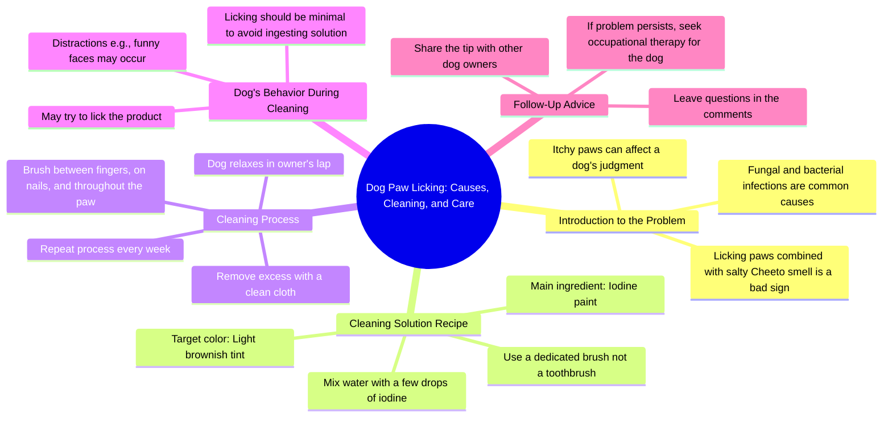

# Excessive Paw Itching Caused by Fungi and Bacteria

> 🌐 **Read this in:** **English** · [中文](../../zh-CN/2026-06/tiktok-transcript-coceiras-em-excesso-nas-patolas-podem-ser-causadas-por-fungo-71c0.md)

> **Creator:** [@larapitbull](https://www.tiktok.com/@larapitbull) · **Views:** 1.3M · **Posted:** 2026-06-29 · **Niche:** other
>
> **TL;DR:** The bizarre comparison of dog paw odor to Cheetos immediately grabs attention and creates curiosity.

[Watch original video →](https://www.tiktok.com/@larapitbull/video/7473998560808193285?is_from_webapp=1&web_id=7521868064577586694)

## Why This Went Viral

## Hook (first 3 seconds)
- **Verbatim opening:** "I had an itch on my boots that I was consuming my judgment."
- **Hook pattern:** Scene + bold claim (unexpected, gross, personal problem)
- **Why it stops scroll:** Starts in the middle of a weird, visceral problem ("itch on my boots... consuming my judgment") — creates immediate confusion and curiosity. The word "boots" (likely a mistranslation for "paws") plus "itch" signals animal content, but the phrasing is so strange it forces a double-take.

## Emotional Rhythm
1. **Disgust + confusion** (0–3s) — "itch on my boots... salty Cheetos" — gross, nonsensical, makes you want to understand
2. **Curiosity** (3–10s) — "did you know that?" + "Megamente Manuela" — introduces characters, sets up a solution
3. **Tension** (10–20s) — "horrible aspect, looking like even my mother Noel's cracked foot" — escalates the problem visually and emotionally
4. **Relief + humor** (20–30s) — "water with a few drops of iodine paint" — simple, absurd solution; "not a brush that you brush your teeth" — deadpan joke
5. **Warmth + silliness** (30–45s) — "relax in the lap of your favorite human being" — sweet moment undercut by "exorcising all these Funkos and trinket bacteria"
6. **Twist** (45–55s) — "it's normal that we want to do some licks... but it's just a little bit" — breaks the fourth wall, jokes about dog licking iodine
7. **Climax** (55–65s) — "Megamente Manuela was trying to distract me with little faces" — punchline: dog is smarter than human, threatens violence
8. **Callback + outro** (65–end) — "repeat this process every week... if not resolved, look for therapy occupational... he's probably pregnant" — absurd non-sequitur ending

**Climax moment:** "if it was with her I was going to hit her hair with that iodine water" — the dog's internal monologue turns aggressive, creating a viral laugh.

## Keyword Density
- **"itch / licking / licks"** — core problem, drives search and algorithmic reach (common pet issue)
- **"Megamente Manuela"** — repeated character name, creates a running joke and meme potential
- **"daddy"** — emotional pull, signals a caretaker relationship, triggers nostalgia/comfort
- **"patties / boots / trinkets"** — unique, mispronounced words that become memorable (algorithmic curiosity)
- **"iodine / brush / cleaning"** — practical keywords for pet care search, drives tutorial-style reach
- **"Funkos / bacteria / exorcising"** — absurd juxtaposition, drives shareability (not searchable, but emotionally sticky)
- **"pregnant"** — final punchline word, creates a "wait, what?" reaction that forces rewatches

**Algorithmic drivers:** "itch," "cleaning," "dog licking" — high-search pet care terms.  
**Emotional drivers:** "daddy," "Megamente Manuela," "pregnant" — create character attachment and absurd humor.

## Why It Spreads
1. **Mistranslation comedy** — The entire script reads like a bad AI translation or a non-native speaker's text. "Boots" for paws, "patties" for pads, "trinkets" for paws — these errors are inherently funny and shareable because viewers feel smarter for catching them. (e.g., "I had an itch on my boots")

2. **Pet POV narration** — The video is told from the dog's perspective, with a sassy, entitled inner monologue. This is a proven viral format (see: "this is my emotional support human"). The line "how good it is to be a youngest daughter and not have to work" is a perfect example — it anthropomorphizes the dog as a spoiled brat.

3. **Absurd non-sequitur ending** — "he's probably pregnant" has nothing to do with the video. This type of random punchline forces rewinds, comments, and shares because it's so unexpected. It's the same mechanism that made "I'm baby" and "this is fine" memes spread.

4. **Relatable problem + weird solution** — Dogs licking their paws is a universal pet owner issue. The solution (iodine water) is simple but presented with over-the-top drama ("exorcising all these Funkos and trinket bacteria"). This contrast between mundane problem and dramatic framing is highly shareable.

5. **Character drama** — The video creates a love triangle: dog (protagonist), daddy (hero), Megamente Manuela (antagonist). The threat "I was going to hit her hair with that iodine water" gives the dog a villain arc. Viewers will comment "Megamente Manuela is the real MVP" or "team daddy" — driving engagement.

## What You Can Steal
1. **Narrate from the pet's POV with a bratty personality** — Give your pet a distinct voice (spoiled, dramatic, judgmental). Write dialogue that contrasts with the sweet visuals. Example: "I let him clean my paws because he's my favorite human. If it were you, I'd bite your hand off."

2. **Use one absurd mistranslation or mispronunciation as a running gag** — Pick one word (like "trinkets" for paws) and repeat it. It becomes a meme within the video. Viewers will quote it in comments. Example: call a dog bed a "royal throne" or treats "employee compensation."

3. **End with a completely unrelated punchline** — The last line should not logically follow the video. It forces a rewatch. Example: after a tutorial on brushing your dog's teeth, end with "if your dog still has bad breath, check if they're secretly a dragon."

## Mind Map

## Full Transcript (Generated by [free TikTok transcript generator](https://toktranscript.com/?utm_source=github&utm_medium=breakdown&utm_campaign=tool_attribution))

> 📝 Transcripts on this page are auto-generated and show the first 60%. Want to transcribe any TikTok in 30 seconds and get the full version? [Try TokTranscript free →](https://toktranscript.com/?utm_source=github&utm_medium=breakdown&utm_campaign=transcript_cta)

I had an itch on my boots that I was consuming my judgment. and itches in the patties and excess together with the smell of salty, Cheetos are not a good sign. Did you know that? then the Megaly I like the way she is, called my daddy to do some cleaning prize with an ingredient that fights funds and bacteria perpetrators from this harassed itch and still leaves my bosses withered with this horrible aspect, looking like even my mother Noel's cracked foot. and the poisonous recipe is water with a few drops of iodine paint. AI Lise, how much is 1? call the pharmacy and ask, I drip how many drops drip until it gets like this? water more OR less in this color. oh, and you're going to need 1 brush too, but it's not a brush that you brush your teeth, it's not 1 brush just for that, see? ready, just relax in the lap of your favorite human being and let him do all the work of exorcising all these Funkos and trinket bacteria, well between the fingers, on the nails, throughout the patola. , I take the opportunity to reflect on my madam life and I thank heaven daddy for life, my sister's success and money. AI AI how good it is to be a youngest daughter and not have to work yes, now returning to the subject of cleaning, during the process it's quite It's normal that we want to do some licks, you know? after all it is something.

*[Read the full transcript on TokTranscript →](https://toktranscript.com/plaza/tiktok-transcript-coceiras-em-excesso-nas-patolas-podem-ser-causadas-por-fungo-71c0?utm_source=github&utm_medium=breakdown&utm_campaign=transcript_full)*

## Browse More

- All [other](../../by-niche/en/other.md) breakdowns
- All [Curiosity gap with absurd analogy](../../by-pattern/en/hook-curiosity-gap-with-absurd-analogy.md) examples

## Video Info

| | |
|---|---|
| Creator | [@larapitbull](https://www.tiktok.com/@larapitbull) |
| Original video | [https://www.tiktok.com/@larapitbull/video/7473998560808193285?is_from_webapp=1&web_id=7521868064577586694](https://www.tiktok.com/@larapitbull/video/7473998560808193285?is_from_webapp=1&web_id=7521868064577586694) |
| Original title | Coceiras em excesso nas patolas, podem ser causadas por fungos e bact... |
| Views | 1.3M (1300000) |
| Posted | 2026-06-29 |
| Duration | 0s |
| Niche | `other` |
| Hook pattern | `Curiosity gap with absurd analogy` |
| Original language | `en` |
| Available languages | en, zh-CN |
| Generated | 2026-07-02 by [TokTranscript](https://toktranscript.com/) |

---

*This breakdown is for educational analysis under fair use. Original video © [@larapitbull](https://www.tiktok.com/@larapitbull). All transcripts are auto-generated and may contain errors.*

*Want to analyze your own TikToks like this? [try this transcription tool →](https://toktranscript.com/viral-breakdown?utm_source=github&utm_medium=breakdown&utm_campaign=footer_cta)*