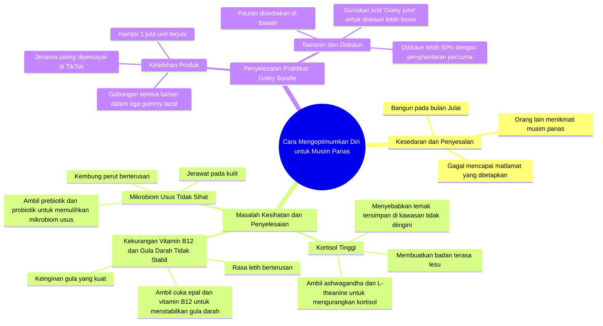

# Unlock Summer Body with Goli Gummies Routine

> 🌐 **Read this in:** **English** · [中文](../../zh-CN/2026-06/tiktok-transcript-code-golijune-goli-ashwagandha-applecidervinegar-probiotics-1f33.md)

> **Creator:** [@chrisorb](https://www.tiktok.com/@chrisorb) · **Views:** 3.4M · **Posted:** 2026-06-15 · **Niche:** fitness
>
> **TL;DR:** Creates immediate FOMO by contrasting others' enjoyment with the viewer's inaction.

[Watch original video →](https://vt.tiktok.com/ZSQCpPruv/)

## Why This Went Viral

## Hook (First 3 Hours)
- **What happens verbatim:** "You wake up and realize it's already July."
- **Hook pattern type:** Scene + contrast (reality vs expectations)
- **Why it makes viewers stop scrolling:** It creates instant relatability. Who hasn't felt left behind? Adding "but you" triggers FOMO and insecurity.

## Emotional Rhythm
- **Guilt & regret** → "but you didn't lock in like you promised"
- **Hope & solution** → "this is what I'm going to do to save myself"
- **Scientific analysis** → cortisol hormone, vitamin B12, blood sugar – triggers "expert" feeling
- **Specific pain points** → bloating, skin breakouts, sugar cravings – highly relatable
- **Climax** → "the problem is, if you buy all these separately..." – builds tension
- **Relief & solution** → Goley Bundle, 50% discount, promo code – immediate solution

## Keyword Density
1. **Cortisol** – scientific trigger, strong for health algorithms
2. **Sugar / sugar cravings** – relatable, high emotion
3. **Bloating** – visual, widely recognized physical issue
4. **Gut microbiome** – health buzzword, attracts interest
5. **Goley Bundle** – product name, SEO for searches
6. **Discount / 50% off** – impulse purchase trigger
7. **Lock in** – motivational slang, viral on TikTok
8. **Summer / July** – seasonal context, FOMO

**Algorithm vs Emotion:** "Cortisol", "vitamin B12", "probiotic" are strong for algorithms (trending health topics). "Bloating", "craving", "tired" are strong for emotion (relatable).

## Why It Went Viral
1. **Instant relatable pain point** – "You wake up and realize it's already July" – everyone has felt left behind. It creates a strong emotional hook in 3 seconds.
2. **Scientific formula + personal testimony** – "High cortisol levels can cause fat to be stored" – it sounds like an expert, but delivered in a personal tone. This boosts credibility without feeling salesy.
3. **Problem → Structured solution** – Each issue (cortisol, sugar, gut) has a specific supplement. Viewers feel "oh, this is for me" without having to think for themselves.
4. **Urgency + discount** – "50% off", "free shipping", "code Goley june" – creates FOMO and drives immediate action. "Before the price goes back up" – triggers fear of missing out.
5. **Proven product** – "Nearly 1 million units sold", "TikTok's most trusted brands" – strong social proof, reduces doubt.

## What You Can Steal
1. **Use "rewind" narrative** – "If we could turn back time one month" – this creates the illusion that you already have experience. Viewers feel like they're getting an exclusive secret.
2. **List specific problems with symptoms** – "Intense sugar cravings and always feeling tired" – don't generalize. The more specific, the more people feel "that's me!"
3. **Pair product with promo code + limited time** – "Code Goley june" + "before the price goes up" – this turns casual viewing into immediate action. Make sure the code is easy to remember (product name + month).

## Mind Map

## Full Transcript (Generated by [TokTranscript](https://toktranscript.com/?utm_source=github&utm_medium=breakdown&utm_campaign=tool_attribution))

> 📝 Transcripts on this page are auto-generated and show the first 60%. Want to transcribe any TikTok in 30 seconds and get the full version? [Try TokTranscript free →](https://toktranscript.com/?utm_source=github&utm_medium=breakdown&utm_campaign=transcript_cta)

You wake up and realize it's finally July. You look outside and see everyone's enjoying their summer but you, and then suddenly it hits you didn't lock in like you said you would. But if we could rewind back just one month, this is what I would do to save myself. High cortisol levels can cause fat to be stored in unwanted areas of the body and make you feel drained. Take ashwagandha and L theanine to help reduce my cortisol levels and balance out my mood. Intense sugar cravings and always feeling tired could be due to a vitamin B12 deficiency and unstable blood sugar levels. So I take apple cider vinegar and vitamin B12 to help stabilize my blood sugar levels. Constant bloating and skin breakouts could be due to a poor microbiome in your gut. So I would take a pre and post probiotic to help restore my gut's microbiome. Problem is, if you tried buying all these separately

*[Read the full transcript on TokTranscript →](https://toktranscript.com/plaza/tiktok-transcript-code-golijune-goli-ashwagandha-applecidervinegar-probiotics-1f33?utm_source=github&utm_medium=breakdown&utm_campaign=transcript_full)*

## Browse More

- All [fitness](../../by-niche/en/fitness.md) breakdowns
- All [Regret & Urgency](../../by-pattern/en/hook-regret-urgency.md) examples

## Video Info

| | |
|---|---|
| Creator | [@chrisorb](https://www.tiktok.com/@chrisorb) |
| Original video | [https://vt.tiktok.com/ZSQCpPruv/](https://vt.tiktok.com/ZSQCpPruv/) |
| Original title | Code: “GOLIJUNE”  #goli #ashwagandha #applecidervinegar #probiotics #... |
| Views | 3.4M (3400000) |
| Posted | 2026-06-15 |
| Duration | 0s |
| Niche | `fitness` |
| Hook pattern | `Regret & Urgency` |
| Original language | `ms` (this page translated by AI) |
| Available languages | en, zh-CN |
| Generated | 2026-06-16 by [TokTranscript](https://toktranscript.com/) |

---

*This breakdown is for educational analysis under fair use. Original video © [@chrisorb](https://www.tiktok.com/@chrisorb). All transcripts are auto-generated and may contain errors.*

*Want to analyze your own TikToks like this? [TokTranscript →](https://toktranscript.com/viral-breakdown?utm_source=github&utm_medium=breakdown&utm_campaign=footer_cta)*