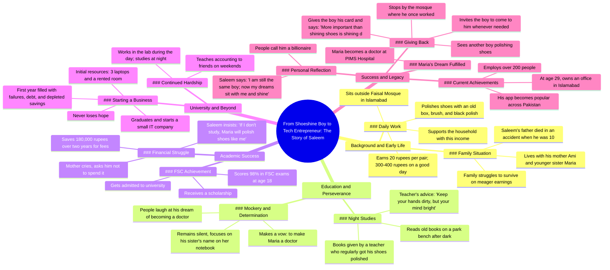

# Boy Shines Shoes Outside Faisal Mosque Islamabad Earns 40...

> 🌐 **Read this in:** **English** · [中文](../../zh-CN/2026-06/tiktok-transcript-creatorsearchinsights-trustgod-faithoverfear-nasirkhan-foryo-271e.md)

> **Creator:** [@nasirkhanofficial124](https://www.tiktok.com/@nasirkhanofficial124) · **Views:** 1.6M · **Posted:** 2026-06-04 · **Niche:** other
>
> **TL;DR:** Immediately paints a poignant picture of a young boy with a shoe shine box, evoking empathy and curiosity.

[Watch original video →](https://vm.tiktok.com/ZS929nDqXV76j-FSqUC/ This post is shared via TikTok Lite. Download TikTok Lite to enjoy more posts: https://www.tiktok.com/tiktoklite)

## Why This Went Viral

## Hook (first 3 seconds)
- **Verbatim opening line:** "اسلام آباد کی فیصل مسجد کے باہر صبح ایک کم عمر لڑکا بیٹھا ہوتا تھا نام تھا سلیم ہاتھ میں پرانا ڈبہ برش اور کالے رنگ کی پالش" (Outside Faisal Mosque in Islamabad, a young boy used to sit every morning. His name was Saleem. In his hand, an old box, brush, and black polish.)
- **Hook pattern:** Scene-setting / Character introduction with vivid detail (specific location + name + object).
- **Why it stops scrolling:** The specificity ("Faisal Mosque," "Saleem," "old box, brush, black polish") creates instant mental imagery and emotional proximity. Viewers are drawn into a real, gritty human story before they can swipe away.

## Emotional Rhythm
- **Beat 1 – Empathy & Sympathy:** The boy's poverty and daily struggle (20 rupees per pair, 300-400 rupees max for the day).
- **Beat 2 – Tension:** Father died when Saleem was 10; people rush him, never ask how he is.
- **Beat 3 – Hope/Inspiration:** The teacher gives him books, says "Keep your mind bright even if your hands are dirty."
- **Beat 4 – Resilience:** Mocked for wanting to be a doctor; he silently vows to make his sister Maria a doctor.
- **Beat 5 – Triumph:** 98% in F.Sc., scholarship, starts an IT company after graduation.
- **Beat 6 – Twist/Climax:** Five years later, his app is popular across Pakistan; he employs 200+ people; Maria is a doctor at PIMS.
- **Beat 7 – Full Circle & Emotional Payoff:** He stops at the mosque, gives his card to a new shoe-shine boy, says: "Shining dreams is more important than shining shoes."
- **Climax moment:** The line "Shining dreams is more important than shining shoes" — it condenses the entire narrative into a quotable, shareable truth.

## Keyword Density
| Word/Phrase | Count (approx.) | Driver |
|-------------|----------------|--------|
| جوتے (shoes) | 6 | Emotional pull (symbol of poverty & humility) |
| پالش (polish) | 5 | Algorithmic reach (unique, visual, searchable) |
| خواب (dreams) | 4 | Emotional pull (aspirational, shareable) |
| ڈاکٹر (doctor) | 3 | Algorithmic reach (high-value profession, searchable) |
| سلیم (Saleem) | 10+ | Emotional pull (character name drives identification) |
| امی/بہن (mother/sister) | 4 | Algorithmic reach (family keywords trigger empathy) |
| پاکستان (Pakistan) | 2 | Algorithmic reach (geo-tag, cultural relevance) |
| کمپنی (company) | 2 | Emotional pull (rags-to-riches narrative) |

- **Algorithmic drivers:** "Poland," "doctor," "Pakistan," "company" — searchable, high-volume terms.
- **Emotional pull:** "Dreams," "shoes," "Saleem," "mother/sister" — create relatability and shareability.

## Why It Spreads
1. **Universal "Rags to Riches" Archetype:** The transcript follows the classic hero's journey (poverty → struggle → mentor → triumph → giving back). This narrative structure is hardwired for virality across cultures.
   - *Concrete line:* "وہی سلیم انتیس سال کا ہے اسلام آباد میں اپنا دفتر ہے اور دو سو سے زیادہ لوگ اس کے ساتھ کام کرتے ہیں" (The same Saleem, 29 years old, has an office in Islamabad and employs over 200 people.)

2. **Emotional Cliffhanger & Payoff Loop:** The story builds tension (father's death, mockery, financial collapse) and releases it in a satisfying climax (success, sister becomes doctor, he helps another boy). This emotional loop triggers dopamine and compels viewers to share.
   - *Concrete line:* "ماریہ وہ اب پیمز ہاسپٹل میں ڈاکٹر ہے" (Maria is now a doctor at PIMS Hospital.)

3. **Quotable "Micro-Wisdom" at the End:** The final line is a self-contained, memorable quote that can be screenshotted, shared, or used as a caption. It acts as a "shareable unit" of the video.
   - *Concrete line:* "جوتے چمکانے سے زیادہ ضروری خواب چمکانا ہے" (Shining dreams is more important than shining shoes.)

4. **Specificity Creates Credibility & Shareability:** Names (Saleem, Maria, Faisal Mosque, PIMS Hospital), numbers (20 rupees, 300-400 rupees, 98%, 1,80,000, 200 people), and concrete details (old box, brush, black polish) make the story feel true and trustworthy. People share what feels real.
   - *Concrete line:* "دو سال کی جمع پونجی ایک لاکھ اسی ہزار اس کے پاس تھی" (He had saved 1,80,000 rupees over two years.)

5. **Social Proof & Aspirational Identity:** The story validates the belief that hard work and education can overcome poverty. Viewers share it to signal their own values (resilience, compassion, hope) and to inspire others.
   - *Concrete line:* "اگر میں نہ پڑھا تو ماریہ بھی میری طرح جوتے پالش کرے گی" (If I don't study, Maria will also shine shoes like me.)

## What You Can Steal
1. **Open with a Specific, Sensory Scene:** Don't start with a generic "This is a story about..." Instead, drop the viewer into a time, place, and object. "Outside Faisal Mosque... old box, brush, black polish." This forces the brain to visualize instantly.
2. **Use the "Mentor's Quote" as a Narrative Anchor:** The teacher's line ("Keep your mind bright even if your hands are dirty") is repeated implicitly throughout. In your own video, introduce a single, memorable line early and echo it at the climax for maximum emotional resonance.
3. **End with a "Full Circle" Moment:** Show the protagonist returning to the original setting (the mosque) and performing a small, symbolic act of kindness (giving a card to another shoe-shine boy). This creates a satisfying narrative loop that viewers instinctively want to share.

## Mind Map

## Full Transcript (Generated by [free TikTok transcript generator](https://toktranscript.com/?utm_source=github&utm_medium=breakdown&utm_campaign=tool_attribution))

> 📝 Transcripts on this page are auto-generated and show the first 60%. Want to transcribe any TikTok in 30 seconds and get the full version? [Try TokTranscript free →](https://toktranscript.com/?utm_source=github&utm_medium=breakdown&utm_campaign=transcript_cta)

اسلام آباد کی فیصل مسجد کے باہر صبح ایک کم عمر لڑکا بیٹھا ہوتا تھا نام تھا سلیم ہاتھ میں پرانا ڈبہ برش اور کالے رنگ کی پالش پورا دن لوگوں کے جوتے چمکاتا ایک جوڑے کے صرف بیس روپے ملتے اگر دن اچھا گزر جاتا تو تین سو چار سو روپے بچ جاتے اور انہی سے گھر کا چولہا جلتا تھا گھر میں صرف امی اور چھوٹی بہن ماریاتی والد ایک حادثے میں اس وقت دنیا سے چلے گئے تھے جب سلیم صرف دس سال کا تھا لوگ آتے جلدی کرو بچے کہہ کر جوتے آگے بڑھا دیتے کسی نے کبھی یہ نہیں پوچھا کہ تمہارا حال کیسا ہے سلیم خاموشی سے کام کرتا رہتا رات کو جب مسجد کے باہر کی روشنیاں مدھم پڑ جاتی وہ پارک کی بینچ پر بیٹھ کر پرانی کتابیں کھول لیتا یہ کتابیں اس ایک استاد نے دی تھیں جو روز اس سے جوتے پالش کرواتا تھا استاد اکثر کہتا ہاتھ میلے ہوں تو کوئی بات نہیں دماغ روشن رکھو دن جوتوں کی پالش رات کتابوں کی روشنی لوگ مذاق اڑاتے یہ بھی کوئی بات ہے جوتے پالش کرنے والا ڈاکٹر بنے گا سلیم خاموش رہتا بس بہن کی کاپی پر لکھا نام دیکھتا اور دل میں ایک عہد دہراتا کہ ماریا کو ڈاکٹر بنانا ہے اٹھارہ سال کی عمر میں اس نے ایف ایس سی میں نائنٹی ایٹ پرسنٹ نمبر حاصل کیے سکالرشپ ملی اور یونیورسٹی میں داخلہ ہو گیا فیس کے لیے دو سال کی جمع پونجی ایک لاکھ اسی ہزار اس کے پاس تھی امی نے روتے ہوئے کہا بیٹا یہ پیسے خرچ نہ کرو باہر مشکل سے چل رہے ہیں سلیم نے مسکرا کر جواب دیا اگر میں نہ پڑھا تو ماریہ بھی میری طرح جو

*[Read the full transcript on TokTranscript →](https://toktranscript.com/plaza/tiktok-transcript-creatorsearchinsights-trustgod-faithoverfear-nasirkhan-foryo-271e?utm_source=github&utm_medium=breakdown&utm_campaign=transcript_full)*

## Browse More

- All [other](../../by-niche/en/other.md) breakdowns
- All [Character introduction with vivid detail](../../by-pattern/en/hook-character-introduction-with-vivid-detail.md) examples

## Video Info

| | |
|---|---|
| Creator | [@nasirkhanofficial124](https://www.tiktok.com/@nasirkhanofficial124) |
| Original video | [https://vm.tiktok.com/ZS929nDqXV76j-FSqUC/ This post is shared via TikTok Lite. Download TikTok Lite to enjoy more posts: https://www.tiktok.com/tiktoklite](https://vm.tiktok.com/ZS929nDqXV76j-FSqUC/ This post is shared via TikTok Lite. Download TikTok Lite to enjoy more posts: https://www.tiktok.com/tiktoklite) |
| Original title | #creatorsearchinsights #trustgod #faithoverfear#nasirkhan #foryoupage  |
| Views | 1.6M (1600000) |
| Posted | 2026-06-04 |
| Duration | 0s |
| Niche | `other` |
| Hook pattern | `Character introduction with vivid detail` |
| Original language | `en` |
| Available languages | en, zh-CN |
| Generated | 2026-06-05 by [TokTranscript](https://toktranscript.com/) |

---

*This breakdown is for educational analysis under fair use. Original video © [@nasirkhanofficial124](https://www.tiktok.com/@nasirkhanofficial124). All transcripts are auto-generated and may contain errors.*

*Want to analyze your own TikToks like this? [try this transcription tool →](https://toktranscript.com/viral-breakdown?utm_source=github&utm_medium=breakdown&utm_campaign=footer_cta)*