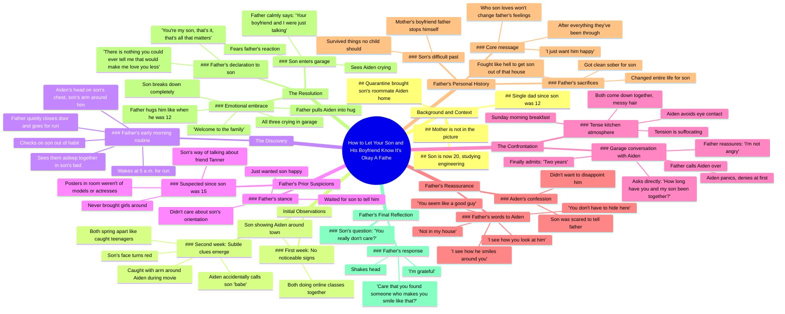

# Dara - Bangaranga, Your Eurovision 2026 Winning Song

> 🌐 **Read this in:** **English** · [中文](../../zh-CN/2026-06/tiktok-transcript-dara-bangaranga-your-eurovision2026-winning-song-eurovisiond-3133.md)

> **Creator:** [@ergerg74](https://www.tiktok.com/@ergerg74) · **Views:** 1.6M · **Posted:** 2026-06-21 · **Niche:** other
>
> **TL;DR:** Opens with a vulnerable, relatable question that immediately hooks the viewer by promising a heartfelt resolution.

[Watch original video →](https://vm.tiktok.com/ZNRTJxFJY/)

## Why This Went Viral

## Hook (first 3 seconds)
- **Verbatim opening line:** "my son and his friend are a couple how do I let them know it's okay"
- **Hook pattern:** Bold claim / Question hybrid — the father states a surprising premise ("my son and his friend are a couple") and immediately frames it as a vulnerable question ("how do I let them know it's okay")
- **Why it stops scrolling:** The line subverts the expected reaction. Most parents would be portrayed as struggling *against* their child's sexuality. This father is struggling *to support* it. The tension between the "scandalous" premise and the father's gentle intent creates instant curiosity.

## Emotional Rhythm
1. **Curiosity** (0:00–0:15) — "my son and his friend are a couple" sets up a taboo situation
2. **Tension** (0:15–1:30) — The father noticing clues (morning babe, arm on couch, sleeping together) creates suspense: *will he confront them?*
3. **Resonance** (1:30–2:00) — The 5 a.m. run / sobriety backstory adds emotional weight and explains *why* this father is different
4. **Climax** (2:00–3:30) — The garage conversation with Aiden: "how long have you and my son been together" → "two years" → the father's calm acceptance
5. **Release / Catharsis** (3:30–end) — The three-way hug in the garage, "welcome to the family" — full emotional payoff
- **Climax moment:** "there is nothing and I mean nothing you could ever tell me that would make me love you less"

## Keyword Density
| Word / Phrase | Count (approx.) | Algorithmic vs. Emotional |
|---|---|---|
| "son" | 15+ | **Emotional** — anchors the father-child bond |
| "Aiden" | 12+ | **Emotional** — humanizes the partner, makes him real |
| "okay" / "happy" | 8+ | **Both** — algorithmic (positive sentiment signal) + emotional (core desire) |
| "scared" / "fear" | 6+ | **Emotional** — drives tension and relief |
| "garage" | 5+ | **Algorithmic** — specific, visual, scene-setting (boosts watch time via mental imagery) |
| "crying" / "tears" | 5+ | **Emotional** — triggers mirror neurons, compels share |
| "two years" | 3+ | **Algorithmic** — specific number boosts credibility and retention |
| "morning babe" | 1 (but pivotal) | **Emotional** — the "slip" that reveals the secret |

## Why It Spreads
1. **Identity-based emotional payoff** — The father says "my son" 15+ times. Viewers who are parents, LGBTQ+ kids, or allies see *their own identity reflected*. The line "you think who he loves is going to change how I feel about him after everything" directly addresses the audience's fear that love is conditional.
2. **The "safe harbor" template** — The video follows a classic narrative arc: secret → tension → discovery → acceptance → catharsis. This structure is neurologically addictive. The climax ("there is nothing you could tell me that would make me love you less") is a *universal emotional promise* that viewers want to believe is possible.
3. **Subversion of the "coming out" trope** — Normally coming out stories are about the child revealing themselves. Here, the father already knows and is waiting. The twist is that *he* is the one who needs to "come out" as accepting. This inversion makes the story feel fresh and share-worthy.
4. **Specificity creates universality** — Details like "eight hours away," "engineering," "quarantine hit in March," "5 a.m. run for eight years since I got sober" make the story feel *real*. Viewers trust it's true, which lowers resistance to sharing. The sobriety detail is a masterstroke — it explains *why* this father is so emotionally available.
5. **The "welcome to the family" line** — This is the shareable soundbite. It's short, inclusive, and emotionally charged. Viewers can clip it and repost it as a standalone moment of acceptance.

## What You Can Steal
1. **The "I already knew" twist** — Instead of the standard "I was scared to tell you" coming out story, flip it: the parent already suspects and is waiting. This creates a *double suspense* (will the child tell? will the parent react well?) and makes the resolution more satisfying. Apply this to any secret-revelation narrative.
2. **The "subverted confrontation" scene** — The garage conversation with Aiden starts as a confrontation ("how long have you and my son been together") but immediately pivots to acceptance ("I'm not angry"). This pattern (direct question → calm response) works for any tense relationship reveal. The key is to *name the tension* explicitly, then defuse it.
3. **The "sobriety backstory" as character shorthand** — The father mentions getting sober and fighting for custody in one sentence. This does three things: (a) explains his emotional maturity, (b) makes him a sympathetic character, (c) adds stakes (he could have lost his son). In any personal narrative, include one sentence of *backstory that explains why you are the way you are*. It makes your reaction feel earned, not random.

## Mind Map

## Full Transcript (Generated by [TokTranscript](https://toktranscript.com/?utm_source=github&utm_medium=breakdown&utm_campaign=tool_attribution))

> 📝 Transcripts on this page are auto-generated and show the first 60%. Want to transcribe any TikTok in 30 seconds and get the full version? [Try TokTranscript free →](https://toktranscript.com/?utm_source=github&utm_medium=breakdown&utm_campaign=transcript_cta)

my son and his friend are a couple how do I let them know it's okay I've been a single dad since my son was 12 his mother isn't in the picture he's 20 now studying engineering at a university eight hours away when quarantine hit in March he called and asked if his roommate Aiden could come stay with us too Aiden's family is back in Canada and he'd be stuck alone in their apartment I said of course they've been here six weeks now and they think they're being subtle the first week I didn't notice anything they kept to themselves mostly my son showing Aiden around town both of them doing online classes from the kitchen table week two is when things started clicking one morning Aiden's making coffee and my son walks in morning babe Aiden says and freezes tries to cover it with a cough I mean uh morning man I'm reading the newspaper I don't look up just say morning boys like I heard nothing I see my son's face go red in my peripheral vision Thursday night we're watching some action movie lights are off I'm in the recliner they're on the couch I get up to grab a beer and in the blue light from the tea I see my son's arm around Aiden's shoulders they spring apart like teenagers caught at prom I grab my beer sit back down anyone else want one no thanks they both say in unison voices a little too high Friday morning I wake up at 5 a m for my run like always I've done this routine for eight years ever since I got sober and fought for custody something makes me check on my son old habit from when he was younger and had nightmares I crack his bedroom door open they're both asleep in his bed Aiden's head on my son's chest my son's arm around him I stand there for maybe 10 seconds then I close the door quietly and go for my run here's the thing nobody knows I've suspected since he was 15 maybe earlier the way he talked about his friend Tanner in high school how he never brought girls around even when his friends did the posters in his room weren't of models or actresses I didn't care I just wanted him happy but I waited for him to tell me I figured he would when he was ready Saturday passes Sunday morning I'm making breakfast and they come down together hair messy both in sweatpants morning my son says morning I say back Aiden immediately goes to pour coffee won't make eye contact the tension in the kitchen is suffocating Sunday afternoon I'm in the garage working on my truck Aiden comes out to throw something away he sees me and turns to leave Aiden I call out hand me that wrench he does his hands shaking a little we stand there in silence for a minute I'm pretending to examine a belt how long have you and my son been together I ask not looking up I hear him inhale sharply sir I we're not I mean I look at him Aiden I'm not stupid and I'm not angry his eyes are wide panic two years he finally whispers we've been together two years I nod slowly that's a long time please don't he starts what be happy my son found someone who clearly cares about him I set down my tools I see how you look at him Aiden I see how he smiles around you Aiden's 

*[Read the full transcript on TokTranscript →](https://toktranscript.com/plaza/tiktok-transcript-dara-bangaranga-your-eurovision2026-winning-song-eurovisiond-3133?utm_source=github&utm_medium=breakdown&utm_campaign=transcript_full)*

## Browse More

- All [other](../../by-niche/en/other.md) breakdowns
- All [Curiosity Gap + Emotional Stakes](../../by-pattern/en/hook-curiosity-gap-emotional-stakes.md) examples

## Video Info

| | |
|---|---|
| Creator | [@ergerg74](https://www.tiktok.com/@ergerg74) |
| Original video | [https://vm.tiktok.com/ZNRTJxFJY/](https://vm.tiktok.com/ZNRTJxFJY/) |
| Original title | DARA - Bangaranga, your #Eurovision2026 winning song! 🇧🇬 #EurovisionD... |
| Views | 1.6M (1600000) |
| Posted | 2026-06-21 |
| Duration | 0s |
| Niche | `other` |
| Hook pattern | `Curiosity Gap + Emotional Stakes` |
| Original language | `en` |
| Available languages | en, zh-CN |
| Generated | 2026-06-22 by [TokTranscript](https://toktranscript.com/) |

---

*This breakdown is for educational analysis under fair use. Original video © [@ergerg74](https://www.tiktok.com/@ergerg74). All transcripts are auto-generated and may contain errors.*

*Want to analyze your own TikToks like this? [TokTranscript →](https://toktranscript.com/viral-breakdown?utm_source=github&utm_medium=breakdown&utm_campaign=footer_cta)*