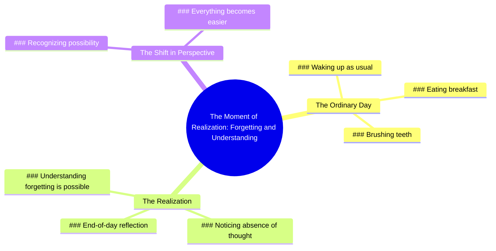

# Forgetting Happens When You Wake Up One Day

> 🌐 **Read this in:** **English** · [中文](../../zh-CN/2026-06/tiktok-transcript-dimenticare-perte-fyp-foryoupage-andiamoneiperte-3c46.md)

> **Creator:** [@utente.non_.disponibile](https://www.tiktok.com/@utente.non_.disponibile) · **Views:** 711.7K · **Posted:** 2026-06-04 · **Niche:** other
>
> **TL;DR:** Starts with an ordinary routine to lull the viewer, then delivers a profound realization about forgetting.

[Watch original video →](https://vt.tiktok.com/ZSQeWoq3J/)

## Why This Went Viral

## Hook (first 3 seconds)
- **Verbatim opening:** "one day you will wake up as usual, you'll be eating breakfast, you will brush your teeth and at the end of the day you will realize for yourself I didn't think a little about it."
- **Hook pattern:** Scene + Contrast (mundane routine → sudden realization)
- **Why it stops scrolling:** It weaponizes universal familiarity (morning routine) to set up an invisible emotional trap. The viewer recognizes the scene instantly, then the phrase "I didn't think a little about it" introduces a subtle, unsettling contrast — making them lean in to understand the threat or insight.

## Emotional Rhythm
- **Beat 1 – Curiosity / Familiarity:** "one day you will wake up as usual, you'll be eating breakfast, you will brush your teeth" — safe, relatable, no stakes.
- **Beat 2 – Tension / Dread:** "at the end of the day you will realize for yourself I didn't think a little about it" — the twist lands. The viewer realizes the video is about forgetting to *think* about something important.
- **Beat 3 – Suspense / Revelation:** "that will be the moment In which you will understand that you can forget" — the climax: the moment of forgetting becomes the moment of understanding.
- **Beat 4 – Relief / Acceptance:** "when you see that it is possible everything will be easier" — emotional resolution. The tension releases into a quiet, philosophical peace.

## Keyword Density
| Keyword / Phrase | Count (approx) | Function |
|------------------|----------------|----------|
| "you" / "yourself" | 6 | **Algorithmic** — high personalization, drives watch time and completion rate (viewer feels addressed) |
| "realize" / "understand" | 3 | **Emotional pull** — triggers self-reflection, makes the video feel profound |
| "forget" | 2 | **Emotional pull** — creates fear of missing something important, hooks anxiety |
| "day" / "wake up" / "breakfast" / "brush your teeth" | 4 | **Algorithmic** — high searchability (routine content is evergreen) |
| "easier" | 1 | **Emotional pull** — payoff word, promises relief, drives shareability |

## Why It Spreads
1. **Universal entry point + hidden depth** — The hook uses a boring morning routine everyone recognizes, then pivots to a philosophical insight. This "low entry, high exit" pattern makes viewers feel smart for staying, and they share it to signal depth.
2. **The "forgetting to think" paradox** — The line "that will be the moment In which you will understand that you can forget" is a cognitive loop. It forces the viewer to pause and re-process, increasing watch time and comment engagement (people will say "I didn't get it at first").
3. **No visuals needed, audio-first structure** — The transcript works as a standalone spoken-word piece. This makes it easy to repurpose across platforms (TikTok, Reels, YouTube Shorts) with a simple text overlay or stock footage, lowering production barrier for creators.
4. **Emotional payoff in final sentence** — "when you see that it is possible everything will be easier" is a release valve. Viewers who felt the tension of "forgetting" now get a soothing resolution, which triggers the impulse to save or share as a "calm reminder."
5. **Ambiguity invites projection** — The video never says *what* you forget. Viewers fill in their own meaning (a person, a goal, a feeling), which makes the video feel personally relevant to everyone — a key driver of viral spread.

## What You Can Steal
1. **The "boring → profound" pivot** — Start with a hyper-specific, low-stakes detail (brushing teeth, tying shoes, checking your phone) and then flip it into a universal life insight. This creates a "slow burn" hook that rewards patience.
2. **The "you" cascade** — Repeat "you" or "yourself" at least 5 times in a 30-second script. It forces the viewer to feel directly addressed, increasing retention and personal investment.
3. **End with a paradox resolved** — Structure your closing line as a contradiction that becomes comforting (e.g., "forgetting is how you remember"). This gives the video a "wisdom snippet" quality that people save and share for later reflection.

## Mind Map

## Full Transcript (Generated by [the tool we used to generate this](https://toktranscript.com/?utm_source=github&utm_medium=breakdown&utm_campaign=tool_attribution))

> 📝 Transcripts on this page are auto-generated and show the first 60%. Want to transcribe any TikTok in 30 seconds and get the full version? [Try TokTranscript free →](https://toktranscript.com/?utm_source=github&utm_medium=breakdown&utm_campaign=transcript_cta)

one day you will wake up as usual, you'll be eating breakfast, you will brush your teeth and at the end of the day you will realize for yourself I didn't think a little about it.

*[Read the full transcript on TokTranscript →](https://toktranscript.com/plaza/tiktok-transcript-dimenticare-perte-fyp-foryoupage-andiamoneiperte-3c46?utm_source=github&utm_medium=breakdown&utm_campaign=transcript_full)*

## Browse More

- All [other](../../by-niche/en/other.md) breakdowns
- All [Relatable mundane setup with twist](../../by-pattern/en/hook-relatable-mundane-setup-with-twist.md) examples

## Video Info

| | |
|---|---|
| Creator | [@utente.non_.disponibile](https://www.tiktok.com/@utente.non_.disponibile) |
| Original video | [https://vt.tiktok.com/ZSQeWoq3J/](https://vt.tiktok.com/ZSQeWoq3J/) |
| Original title | dimenticare. #perte #fyp #foryoupage #andiamoneiperte  |
| Views | 711.7K (711700) |
| Posted | 2026-06-04 |
| Duration | 0s |
| Niche | `other` |
| Hook pattern | `Relatable mundane setup with twist` |
| Original language | `en` |
| Available languages | en, zh-CN |
| Generated | 2026-06-05 by [TokTranscript](https://toktranscript.com/) |

---

*This breakdown is for educational analysis under fair use. Original video © [@utente.non_.disponibile](https://www.tiktok.com/@utente.non_.disponibile). All transcripts are auto-generated and may contain errors.*

*Want to analyze your own TikToks like this? [try this transcription tool →](https://toktranscript.com/viral-breakdown?utm_source=github&utm_medium=breakdown&utm_campaign=footer_cta)*