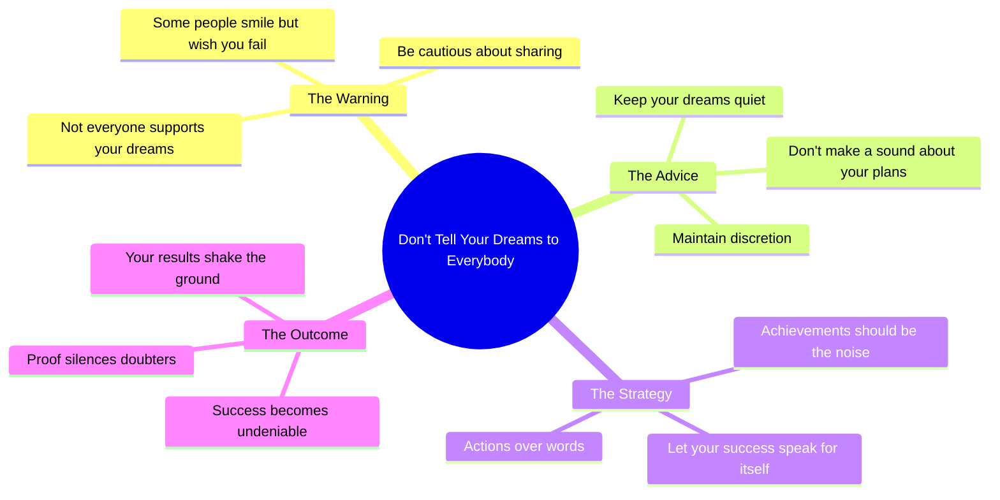

# Don't Tell Your Dreams to Everybody Around

> 🌐 **Read this in:** **English** · [中文](../../zh-CN/2026-06/tiktok-transcript-don-t-tell-your-dreams-capcut-fyp-trend-lyrics-templatecapcu-55fa.md)

> **Creator:** [@newtemplatee](https://www.tiktok.com/@newtemplatee) · **Views:** 9.6M · **Posted:** 2026-06-29 · **Niche:** entertainment
>
> **TL;DR:** Warns against oversharing dreams by highlighting hidden jealousy.

[Watch original video →](https://vm.tiktok.com/ZNRw1k9JF/)

## Why This Went Viral

## Hook (first 3 seconds)
- **Verbatim**: "Don't tell your dreams to everybody around"
- **Hook pattern**: Bold claim / warning
- **Why it stops scrolling**: It triggers immediate self-reflection. The viewer has either been burned by sharing a dream or has a secret ambition they guard. It feels like a direct, whispered truth from someone who knows.

## Emotional Rhythm
- **Curiosity** (0–3s): "Don't tell your dreams" — why? What happens?
- **Tension** (3–6s): "Some people smile, but wanna see you down" — introduces betrayal, jealousy, distrust.
- **Suspense** (6–9s): "Keep it quiet, don't make a sound" — builds a secretive, almost conspiratorial vibe.
- **Climax / Release** (9–12s): "Let your success be what shakes the ground" — the payoff. It flips the warning into a powerful, visual metaphor of silent victory.
- **Resonance** (post-climax): The viewer sits in the feeling of "I will prove them wrong."

## Keyword Density
| Keyword / Phrase | Count (approx.) | Driver |
|------------------|-----------------|--------|
| "Don't tell" | 1 (opening) | Algorithm + emotional pull (negation creates curiosity) |
| "Dreams" | 1 | Emotional pull (aspirational, personal) |
| "Everybody" | 1 | Algorithm (broad, relatable) |
| "Smile" | 1 | Emotional pull (contrast with betrayal) |
| "Down" | 1 | Emotional pull (fear, vulnerability) |
| "Quiet / sound" | 2 | Emotional pull (secret, tension) |
| "Success" | 1 | Algorithm (high-reach keyword) |
| "Shakes the ground" | 1 | Emotional pull + visual hook (memorable, shareable) |

- **Algorithmic reach**: "Dreams," "success" — high-volume, aspirational keywords that platforms reward.
- **Emotional pull**: "Don't tell," "down," "quiet," "shakes the ground" — create contrast, vulnerability, and a cinematic finish.

## Why It Spreads
1. **Universal fear of betrayal** – "Some people smile, but wanna see you down" taps into a near-universal experience. Viewers share it as a warning to friends or to validate their own guardedness.
2. **The "quiet power" fantasy** – "Let your success be what shakes the ground" is a one-liner that feels like a life hack. It’s easily repurposeable as a caption, tweet, or tattoo — which drives cross-platform sharing.
3. **Rhythmic, hypnotic delivery** – The short, punchy lines (4 lines, 12 seconds) create a mantra-like structure. Viewers replay it to absorb the cadence, boosting retention and algorithmic signals.
4. **Low barrier to adoption** – The video doesn’t require context, face, or visuals. Anyone can stitch it, quote it, or remix it, making it remixable content.
5. **Climax lands on a visual metaphor** – "Shakes the ground" is a concrete, shareable image. It’s easy to imagine (and easier to screenshot as a quote), which drives saves and shares.

## What You Can Steal
1. **The "warning → payoff" structure** – Open with a cautionary statement ("Don't…"), build tension with a reason ("because…"), then resolve with a triumphant image ("let…"). This arc works for any aspirational niche (fitness, business, art).
2. **Use rhythmic, short lines** – Keep each line under 5 words. This forces every word to earn its place and makes the video feel like a chant or mantra — highly replayable and quotable.
3. **End with a concrete, visual metaphor** – "Shakes the ground" is not abstract. It’s something you can picture. Replace vague endings ("you'll be happy") with a vivid action ("your silence becomes a storm").

## Mind Map

## Full Transcript (Generated by [free TikTok transcript generator](https://toktranscript.com/?utm_source=github&utm_medium=breakdown&utm_campaign=tool_attribution))

> 📝 Transcripts on this page are auto-generated and show the first 60%. Want to transcribe any TikTok in 30 seconds and get the full version? [Try TokTranscript free →](https://toktranscript.com/?utm_source=github&utm_medium=breakdown&utm_campaign=transcript_cta)

Don't tell your dreams to everybody around Some people smile, but wanna see you down Keep it qui

*[Read the full transcript on TokTranscript →](https://toktranscript.com/plaza/tiktok-transcript-don-t-tell-your-dreams-capcut-fyp-trend-lyrics-templatecapcu-55fa?utm_source=github&utm_medium=breakdown&utm_campaign=transcript_full)*

## Browse More

- All [entertainment](../../by-niche/en/entertainment.md) breakdowns
- All [Cautionary advice with contrast](../../by-pattern/en/hook-cautionary-advice-with-contrast.md) examples

## Video Info

| | |
|---|---|
| Creator | [@newtemplatee](https://www.tiktok.com/@newtemplatee) |
| Original video | [https://vm.tiktok.com/ZNRw1k9JF/](https://vm.tiktok.com/ZNRw1k9JF/) |
| Original title | Don't tell your dreams #CapCut #fyp #trend #lyrics #templatecapcut  |
| Views | 9.6M (9600000) |
| Posted | 2026-06-29 |
| Duration | 0s |
| Niche | `entertainment` |
| Hook pattern | `Cautionary advice with contrast` |
| Original language | `en` |
| Available languages | en, zh-CN |
| Generated | 2026-06-30 by [TokTranscript](https://toktranscript.com/) |

---

*This breakdown is for educational analysis under fair use. Original video © [@newtemplatee](https://www.tiktok.com/@newtemplatee). All transcripts are auto-generated and may contain errors.*

*Want to analyze your own TikToks like this? [try this transcription tool →](https://toktranscript.com/viral-breakdown?utm_source=github&utm_medium=breakdown&utm_campaign=footer_cta)*