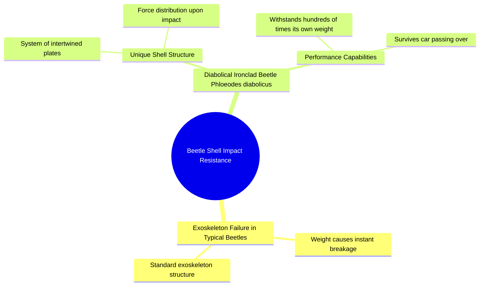

# The World's Strongest Beetle Shell Structure

> 🌐 **Read this in:** **English** · [中文](../../zh-CN/2026-06/tiktok-transcript-el-escarabajo-m-s-fuerte-del-mundo-estadosunidos-datoscurios-e2a1.md)

> **Creator:** [@datosh.2001](https://www.tiktok.com/@datosh.2001) · **Views:** 7.8M · **Posted:** 2026-06-04 · **Niche:** other
>
> **TL;DR:** Sets up a common expectation (beetle breaks) then subverts it with a surprising exception.

[Watch original video →](https://www.tiktok.com/@datosh.2001/video/7575742220318362911?is_from_webapp=1&sender_device=pc&web_id=7618668871714080263)

## Why This Went Viral

## Hook (first 3 seconds)
- **Verbatim opening:** "When you step on a beetle, your weight falls on your exoskeleton and when discovered, it breaks instantly."
- **Hook pattern:** Contrast / "But" pivot
- **Why it stops scrolling:** Starts with a universal, relatable action (stepping on a bug) — everyone has done this. Then immediately subverts expectation by introducing a *different* beetle that doesn’t break. The word "But" signals a twist, forcing the viewer to wait for the payoff.

## Emotional Rhythm
1. **Curiosity + mild disgust** (0–3s): "When you step on a beetle… it breaks instantly." — Familiar, slightly gross.
2. **Intrigue** (4–7s): "But the species *Phloeodes diabolicus* is different." — Name-drop creates authority; viewer leans in.
3. **Tension** (8–12s): "Its shell functions as a system of intertwined plates… that upon receiving an impact the force of the blow." — Sentence is cut mid-phrase, creating a cliffhanger.
4. **Surprise + awe** (13–15s): "…can contain hundreds of times its own weight, even a car passing over." — Climax: the scale jump from "a beetle" to "a car" is absurd and memorable.
5. **Satisfaction** (end): The twist resolves — the "weak" thing is actually super strong.

**Climax moment:** "even a car passing over" — the visual of a car crushing a tiny beetle but failing is the emotional peak.

## Keyword Density
| Word/Phrase | Frequency | Algorithmic Reach vs. Emotional Pull |
|-------------|-----------|--------------------------------------|
| beetle | 3 | **Algorithmic** — high search volume, easy to categorize |
| exoskeleton | 2 | **Algorithmic** — science/biology niche keyword |
| shell | 1 | **Emotional** — visual, relatable |
| intertwined plates | 1 | **Emotional** — vivid, unique mental image |
| hundreds of times its own weight | 1 | **Algorithmic + Emotional** — measurable stat = shareable fact |
| car | 1 | **Emotional** — familiar, high-impact contrast |
| force | 1 | **Algorithmic** — physics/engineering trigger |
| break/breaks | 2 | **Emotional** — tension word, creates stakes |
| weight | 2 | **Algorithmic** — common in "strength" comparisons |
| different | 1 | **Emotional** — subversion, curiosity driver |

**Key insight:** "beetle" and "car" are the two highest-reach words — one is niche (algorithm-friendly), the other is universal (shareable). The contrast between them is the core viral engine.

## Why It Spreads
1. **Universal + Surprising Pairing** — Everyone has stepped on a beetle. The idea that a *beetle* can survive a *car* is so absurd it demands to be shared. *(Line: "even a car passing over")*
2. **Cliffhanger Sentence Structure** — The transcript cuts mid-sentence ("…that upon receiving an impact the force of the blow.") — this forces the viewer to wait for the resolution, increasing watch time and completion rate.
3. **Specific, Memorable Name** — "Phloeodes diabolicus" sounds exotic and scientific. Viewers will Google it, share it, and reference it — it’s a "did you know?" fact with a built-in recall hook.
4. **Scale Jump** — The video goes from "your weight" (personal, small) to "hundreds of times its own weight" (abstract, large) to "a car" (tangible, huge). Each jump re-engages the viewer.
5. **Emotional Payoff** — The twist (weak → invincible) triggers a dopamine hit. Viewers feel smart for learning something new, and share it to appear knowledgeable.

## What You Can Steal
1. **Start with a "Everyone does this, but…" pattern** — Pick a universal action (cracking an egg, dropping a phone, opening a soda) and reveal an exception that breaks the rule. This instantly hooks because it challenges a known truth.
2. **Cut a sentence mid-phrase** — Use an ellipsis or pause right before the key reveal. This forces the viewer to wait for the payoff, increasing retention and completion rate. Example: "But what happens next… will shock you."
3. **End with a tangible, extreme comparison** — Don't just say "it's very strong." Say "it can survive a car." The more absurd and visual the comparison, the more likely it gets shared. Always ask: *What everyday object can I compare this to that no one expects?*

## Mind Map

## Full Transcript (Generated by [the tool we used to generate this](https://toktranscript.com/?utm_source=github&utm_medium=breakdown&utm_campaign=tool_attribution))

> 📝 Transcripts on this page are auto-generated and show the first 60%. Want to transcribe any TikTok in 30 seconds and get the full version? [Try TokTranscript free →](https://toktranscript.com/?utm_source=github&utm_medium=breakdown&utm_campaign=transcript_cta)

When you step on a beetle, your weight falls on your exoskeleton and when discovered, it breaks instantly. But the species floated diabolicals is different. Its shell functions as a system of intertwined plates.

*[Read the full transcript on TokTranscript →](https://toktranscript.com/plaza/tiktok-transcript-el-escarabajo-m-s-fuerte-del-mundo-estadosunidos-datoscurios-e2a1?utm_source=github&utm_medium=breakdown&utm_campaign=transcript_full)*

## Browse More

- All [other](../../by-niche/en/other.md) breakdowns
- All [Contrast & Surprise](../../by-pattern/en/hook-contrast-surprise.md) examples

## Video Info

| | |
|---|---|
| Creator | [@datosh.2001](https://www.tiktok.com/@datosh.2001) |
| Original video | [https://www.tiktok.com/@datosh.2001/video/7575742220318362911?is_from_webapp=1&sender_device=pc&web_id=7618668871714080263](https://www.tiktok.com/@datosh.2001/video/7575742220318362911?is_from_webapp=1&sender_device=pc&web_id=7618668871714080263) |
| Original title | El escarabajo más fuerte del Mundo 🌎  #estadosunidos🇺🇸 #datoscuriosos... |
| Views | 7.8M (7800000) |
| Posted | 2026-06-04 |
| Duration | 0s |
| Niche | `other` |
| Hook pattern | `Contrast & Surprise` |
| Original language | `en` |
| Available languages | en, zh-CN |
| Generated | 2026-06-05 by [TokTranscript](https://toktranscript.com/) |

---

*This breakdown is for educational analysis under fair use. Original video © [@datosh.2001](https://www.tiktok.com/@datosh.2001). All transcripts are auto-generated and may contain errors.*

*Want to analyze your own TikToks like this? [TokTranscript →](https://toktranscript.com/viral-breakdown?utm_source=github&utm_medium=breakdown&utm_campaign=footer_cta)*