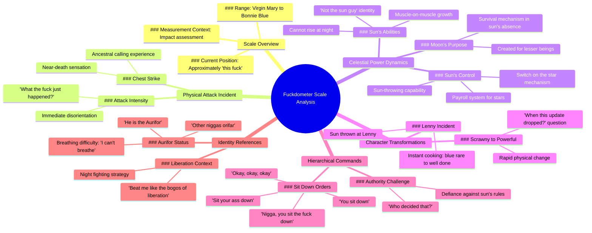

# Escanor's Fuckdometer Scale: From Virgin Mary to Bonnie Blue

> 🌐 **Read this in:** **English** · [中文](../../zh-CN/2026-06/tiktok-transcript-escanor-escanor-sevendeadlysins-7deadlysins-anime-whodecided-579e.md)

> **Creator:** [@jaypierlis](https://www.tiktok.com/@jaypierlis) · **Views:** 271.6K · **Posted:** 2026-06-06 · **Niche:** entertainment
>
> **TL;DR:** Creates immediate curiosity with a bizarre, humorous measurement system.

[Watch original video →](https://vm.tiktok.com/ZNRvrYhqS/)

## Why This Went Viral

## Hook (first 3 seconds)
- **Verbatim opening line:** "So if we take a look at the fuckdometer here, you see that on the scale from Virgin Mary to Bonnie Blue, we were approximately this fuck."
- **Hook pattern:** **Bold claim + visual prop** — the "fuckdometer" is a made-up, absurd scale referencing two polar-opposite cultural figures.
- **Why it stops scrolling:** Instantly disorients the viewer. The word "fuckdometer" is a linguistic novelty. The Virgin Mary vs. Bonnie Blue contrast is shocking, irreverent, and demands explanation. Viewer must watch to decode the joke.

## Emotional Rhythm
1. **Confusion + Shock** (0:00–0:05) — "fuckdometer" and chest hit. Viewer has no context.
2. **Escalating absurdity** (0:05–0:15) — "ancestors calling me home," "sun can't rise at night." The world is breaking logic.
3. **Comic tension** (0:15–0:25) — "Sit your ass down / you sit down" — a fake argument that mirrors playground hierarchy.
4. **Surprise twist** (0:25–0:35) — "The moon was created so lesser beings may survive in his absence." This reframes the entire rant as a cosmic power struggle.
5. **Climax moment** (0:35–0:45) — "He threw a sun at Lenny. Nigga went from blue rare to well done." This is the punchline — a visual, violent, absurd payoff.
6. **Relief + laughter** (0:45–end) — "He was just a scrawny little nigga two seconds ago, man. When this update dropped?" — a gamer/culture reference that lands the joke.

## Keyword Density
| Word/Phrase | Frequency (approx.) | Driver |
|-------------|---------------------|--------|
| "sun" | 5 | **Algorithmic reach** — simple, searchable, ties to "sun" as a character. |
| "nigga" | 4 | **Emotional pull** — cultural authenticity, rhythm, in-group bonding. |
| "fuck" / "fuckdometer" | 3 | **Emotional pull** — shock value, novelty, memorability. |
| "moon" | 2 | **Algorithmic reach** — contrast with "sun," creates a binary hook. |
| "beat" / "hit" | 3 | **Emotional pull** — physical comedy, violent absurdity. |
| "update dropped" | 1 | **Algorithmic reach + emotional pull** — gaming slang, taps into meme culture. |

## Why It Spreads
1. **Unpredictable world-building** — The video creates a fantasy universe (sun is a tyrannical boss, moon is a refuge). This invites remixing, fan theories, and "what if" comments. *Concrete line: "The moon was created so that lesser beings may survive in his absence."*
2. **High-density meme format** — Every 3–5 seconds delivers a new absurd image ("muscles on his muscles," "switch on the star," "blue rare to well done"). This makes it clipable and shareable as a reaction GIF or audio bite.
3. **In-group language** — The use of AAVE, gaming slang ("update dropped"), and cultural references ("Bonnie Blue," "bogos of liberation") signals to a specific audience. This creates a strong "if you get it, you get it" effect, driving shares within that community.
4. **Physical comedy + vocal delivery** — The chest hit, the "ow," the breathlessness ("I can't breathe") add a visceral layer. The video is not just a story — it's a performance. This increases emotional contagion.
5. **Cliffhanger ending** — "When this update dropped?" implies a sequel. Viewers comment "part 2?" or tag friends. This extends the viral lifespan.

## What You Can Steal
1. **Open with a made-up measurement** — Invent a scale (fuckdometer, cringe-o-meter, chaos scale) that references two extreme cultural poles. It forces the viewer to watch to understand the joke.
2. **Use physical comedy to punctuate absurdity** — A sudden slap, a fall, a prop. The chest hit here is the only physical action, but it lands the first laugh. In your next video, add one unexpected physical beat.
3. **End with a cliffhanger that invites a sequel** — "When this update dropped?" is a perfect hook for a follow-up. Always leave one thread dangling so viewers demand more.

## Mind Map

## Full Transcript (Generated by [TokTranscript.com](https://toktranscript.com/?utm_source=github&utm_medium=breakdown&utm_campaign=tool_attribution))

> 📝 Transcripts on this page are auto-generated and show the first 60%. Want to transcribe any TikTok in 30 seconds and get the full version? [Try TokTranscript free →](https://toktranscript.com/?utm_source=github&utm_medium=breakdown&utm_campaign=transcript_cta)

So if we take a look at the fuckdometer here, you see that on the scale from Virgin Mary to Bonnie Blue, we were approximately this fuck. He hit me in the chest. And I had the ancestors calling me home. What the fuck just happened? The sun can't rise at night. And the who decided that? So sit your ass down. Nigga, you sit the fuck down. Okay, okay, okay. You sit down. At high noon, the muscles on his muscles, they grew muscles. He's not the sun guy. What? Hey, what you? Ow! He beat me like the bogos of liberation, nigga! So just fight him at night. Don't you get it? Get what?

*[Read the full transcript on TokTranscript →](https://toktranscript.com/plaza/tiktok-transcript-escanor-escanor-sevendeadlysins-7deadlysins-anime-whodecided-579e?utm_source=github&utm_medium=breakdown&utm_campaign=transcript_full)*

## Browse More

- All [entertainment](../../by-niche/en/entertainment.md) breakdowns
- All [absurd scale](../../by-pattern/en/hook-absurd-scale.md) examples

## Video Info

| | |
|---|---|
| Creator | [@jaypierlis](https://www.tiktok.com/@jaypierlis) |
| Original video | [https://vm.tiktok.com/ZNRvrYhqS/](https://vm.tiktok.com/ZNRvrYhqS/) |
| Original title | Escanor. #escanor #sevendeadlysins #7deadlysins #anime #whodecidedthat  |
| Views | 271.6K (271600) |
| Posted | 2026-06-06 |
| Duration | 0s |
| Niche | `entertainment` |
| Hook pattern | `absurd scale` |
| Original language | `en` |
| Available languages | en, zh-CN |
| Generated | 2026-06-07 by [TokTranscript](https://toktranscript.com/) |

---

*This breakdown is for educational analysis under fair use. Original video © [@jaypierlis](https://www.tiktok.com/@jaypierlis). All transcripts are auto-generated and may contain errors.*

*Want to analyze your own TikToks like this? [try this transcription tool →](https://toktranscript.com/viral-breakdown?utm_source=github&utm_medium=breakdown&utm_campaign=footer_cta)*