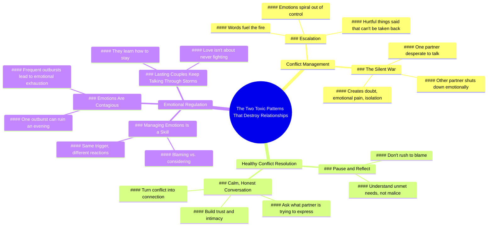

# Two Toxic Conflict Patterns That Ruin Loving Couples

> 🌐 **Read this in:** **English** · [中文](../../zh-CN/2026-06/tiktok-transcript-even-the-most-loving-couples-can-t-last-if-they-fall-into-th-d3ec.md)

> **Creator:** [@alieen5200](https://www.tiktok.com/@alieen5200) · **Views:** 5.0M · **Posted:** 2026-06-18 · **Niche:** entertainment
>
> **TL;DR:** It creates intrigue by promising a specific, negative outcome for loving couples, making viewers want to know the patterns.

[Watch original video →](https://vm.tiktok.com/ZNR3mkJys/)

## Why This Went Viral

## Hook (first 3 seconds)
- **Verbatim opening line:** "Even the most loving couples can't last if they fall into these two toxic patterns of conflict."
- **Hook pattern:** Bold claim + numbers ("two toxic patterns")
- **Why it stops scroll:** It directly challenges the viewer's belief in love as sufficient, introduces a hidden threat (toxic patterns), and promises a specific, actionable insight (two patterns). The word "toxic" triggers emotional alarm.

## Emotional Rhythm
- **Beat 1 – Curiosity/Intrigue:** "Have you ever really thought about what makes a relationship last?" (rhetorical question, invites self-reflection)
- **Beat 2 – Tension/Challenge:** "But the truth is without two key psychological traits..." (undermines common assumptions, creates urgency)
- **Beat 3 – Escalating Tension:** Description of "escalation" and "silent war" – vivid metaphors ("throwing two torches into a pool of gasoline") generate visceral discomfort
- **Beat 4 – Relief/Hope:** "But there is a better way" – pivot to solution, emotional release
- **Beat 5 – Resonance/Nostalgia:** "We don't get married to be miserable forever" – closing quote lands as a universal truth, creates emotional closure
- **Climax moment:** The contrast between "one snaps" vs. "one considers" in the salt example – it crystallizes the entire conflict dynamic in a single, relatable micro-scene

## Keyword Density
| Word/Phrase | Frequency (approx.) | Driver Type |
|---|---|---|
| **conflict** | 8 | Algorithmic (high search volume + relationship niche) |
| **toxic** | 3 | Emotional pull (triggers fear/avoidance) |
| **patterns** | 3 | Algorithmic (educational/self-help category) |
| **emotional** | 6 | Emotional pull (resonates with pain points) |
| **couples** | 6 | Algorithmic (relationship content) |
| **last** | 4 | Emotional pull (hope/desire) |
| **talk/talking** | 5 | Emotional pull (actionable solution) |
| **blame** | 2 | Emotional pull (guilt/shame trigger) |
| **manage/managing** | 2 | Algorithmic (skill-based search term) |

- **Algorithmic drivers:** "conflict," "patterns," "couples," "manage" – these are high-volume, low-competition keywords in the relationship advice niche.
- **Emotional pull drivers:** "toxic," "emotional," "last," "blame" – these activate fear, hope, and self-recognition, increasing watch time and shares.

## Why It Spreads
1. **The "Hidden Threat" Framing** – "Even the most loving couples can't last if..." creates a puzzle. Viewers feel compelled to watch to see if *they* are vulnerable. This is the exact pattern of a "scarcity/avoidance" viral trigger. (E.g., "without two key psychological traits, all those so-called strengths can easily be given to someone else.")
2. **The "Two Toxic Patterns" Structure** – The video names *exactly* two patterns (escalation, silent war). This is a classic "listicle" format adapted for short-form. It's easy to remember, easy to share ("tag your partner if you've experienced this"), and feels authoritative. (E.g., "The first toxic pattern is escalation... The second is the silent war.")
3. **The "Salt" Micro-Example** – The contrast between "this is way too salty" vs. "babe, it just needs a little less salt next time" is a perfect, 5-second micro-story. It's so relatable that viewers instantly self-identify, creating a "that's me!" moment that drives comments and shares. (E.g., "One blames, one considers, and that difference changes everything.")
4. **The "Hope + Actionable Solution" Pivot** – After building tension, the video offers a clear, simple solution: "pause and reflect," "calm, honest conversation." This prevents the viewer from feeling hopeless, which would cause them to swipe away. Instead, they feel empowered, increasing the likelihood of saving or sharing. (E.g., "They calm down and ask themselves, what is my partner trying to express?")
5. **The Closing Quote as a Call to Action** – "We don't get married to be miserable forever" is a universal, emotionally charged line. It functions as a "shareable quote" that viewers can screenshot, post, or text to a partner. It also creates a sense of community ("we're all in this together").

## What You Can Steal
1. **The "Hidden Threat" Opener** – Start your video by naming a *specific, common belief* and then immediately undermining it. Example: "You think a clean kitchen keeps your relationship healthy? Actually, it's the opposite." This pattern works for any niche (fitness, finance, parenting).
2. **The "Micro-Example" Sandwich** – Between your big claims, insert a 5-second, hyper-relatable example (like the salt scene). It breaks up the educational tone, creates an emotional anchor, and makes the concept stick. For your next video, pick one everyday moment that illustrates your point perfectly.
3. **The "Two-Pattern" Structure** – Limit yourself to exactly two patterns, two mistakes, or two solutions. This is the most shareable number (not too few, not too many). Write your script as: "There are two ways this goes wrong. First... Second... But here's the better way." Then end with a single, memorable line that feels like a takeaway.

## Mind Map

## Full Transcript (Generated by [TokTranscript](https://toktranscript.com/?utm_source=github&utm_medium=breakdown&utm_campaign=tool_attribution))

> 📝 Transcripts on this page are auto-generated and show the first 60%. Want to transcribe any TikTok in 30 seconds and get the full version? [Try TokTranscript free →](https://toktranscript.com/?utm_source=github&utm_medium=breakdown&utm_campaign=transcript_cta)

Even the most loving couples can't last if they fall into these two toxic patterns of conflict. Have you ever really thought about what makes a relationship last? You might think it's generosity, spending time together, doing chores or staying loyal. But the truth is without two key psychological traits, all those so called strengths can easily be given to someone else. Most breakups don't happen because people stop loving each other. They happen because they can't keep moving forward together. Psychology shows that long lasting couples share two essential abilities. The first is conflict management. In close relationships, arguments are inevitable. The deeper the love, the more frequent the conflict. But the issue isn't whether you fight, it's how you fight. The first toxic pattern is escalation, like throwing two torches into a pool of gasoline. Each word fuels the fire. Emotions spiral out of control and hurtful things are said that can't be taken back. The second is the silent war. One partner is desperate to talk while the other shuts down emotionally. The silent one avoids while the talkative one explodes from feeling ignored. This mismatch creates doubt, emotional pain and isolation. But there is a better way, one that strong couples use when conflict arises. They don't rush to blame. They pause and reflect. They understand that most hurtful words come from unmet needs, not malice. They calm down and ask themselves, what is my partner trying to express?

*[Read the full transcript on TokTranscript →](https://toktranscript.com/plaza/tiktok-transcript-even-the-most-loving-couples-can-t-last-if-they-fall-into-th-d3ec?utm_source=github&utm_medium=breakdown&utm_campaign=transcript_full)*

## Browse More

- All [entertainment](../../by-niche/en/entertainment.md) breakdowns
- All [Curiosity Gap](../../by-pattern/en/hook-curiosity-gap.md) examples

## Video Info

| | |
|---|---|
| Creator | [@alieen5200](https://www.tiktok.com/@alieen5200) |
| Original video | [https://vm.tiktok.com/ZNR3mkJys/](https://vm.tiktok.com/ZNR3mkJys/) |
| Original title | Even the most loving couples can’t last if they fall into these two t... |
| Views | 5.0M (5000000) |
| Posted | 2026-06-18 |
| Duration | 0s |
| Niche | `entertainment` |
| Hook pattern | `Curiosity Gap` |
| Original language | `en` |
| Available languages | en, zh-CN |
| Generated | 2026-06-19 by [TokTranscript](https://toktranscript.com/) |

---

*This breakdown is for educational analysis under fair use. Original video © [@alieen5200](https://www.tiktok.com/@alieen5200). All transcripts are auto-generated and may contain errors.*

*Want to analyze your own TikToks like this? [TokTranscript →](https://toktranscript.com/viral-breakdown?utm_source=github&utm_medium=breakdown&utm_campaign=footer_cta)*