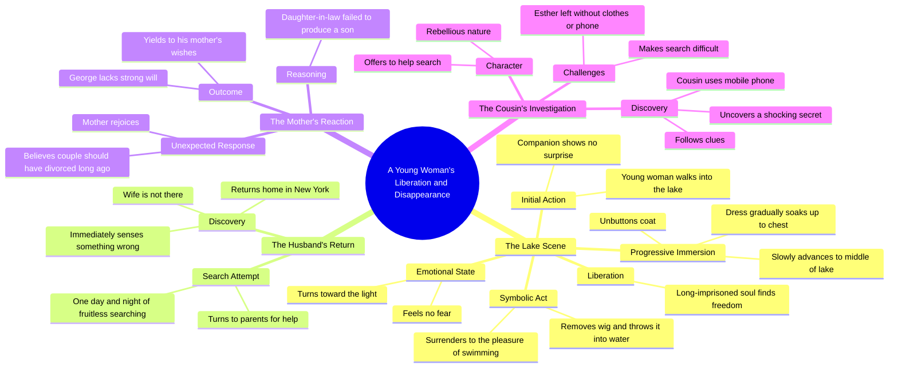

# Young Girl Walks Into Lake in Dress Without Fear

> 🌐 **Read this in:** **English** · [中文](../../zh-CN/2026-06/tiktok-transcript-flim-movie-tvshow-fyp-2dc2.md)

> **Creator:** [@mqosogr1y1](https://www.tiktok.com/@mqosogr1y1) · **Views:** 330.2K · **Posted:** 2026-06-05 · **Niche:** other
>
> **TL;DR:** A woman walking into a lake without explanation creates immediate intrigue and emotional tension.

[Watch original video →](https://www.tiktok.com/@mqosogr1y1/video/7644002596205759777?is_from_webapp=1&sender_device=pc&web_id=7639608621630375438)

## Why This Went Viral

## Hook (first 3 seconds)
- **Verbatim:** "La jeune fille haut assez bas sur la plage sans que sa compagne ne s'en étonne..."
- **Hook pattern:** Scene-setting / cinematic narrative (a slow, visual opening that implies mystery)
- **Why it stops scroll:** The description is deliberately vague and sensory (water, clothing, silence of a companion), creating immediate intrigue. The viewer must watch to understand what is happening and why.

## Emotional Rhythm
- **Beat 1 – Curiosity/Mystery:** The woman walks into water, undressing slowly. No explanation. Viewer is asking: *Why is she doing this?*
- **Beat 2 – Tension + Suspense:** She removes her wig, throws it in the water, swims. The line "son âme longtemps emprisonnée trouva enfin la liberté" signals a deeper emotional release.
- **Beat 3 – Twist / Relief:** The scene cuts to New York — husband returns, wife is gone. The viewer realizes this is a disappearance, not a suicide.
- **Beat 4 – Frustration / Resonance:** The mother-in-law rejoices. The husband gives in to her. This triggers anger and empathy.
- **Beat 5 – Climax:** The cousin finds "un secret bouleversant" — a cliffhanger that demands a next video or rewatch.
- **Climax moment:** "Le cousin pris son portable et en suivant les pistes découvrit 1 secret bouleversant" — the final sentence is the emotional peak.

## Keyword Density
| Keyword / Phrase | Frequency (approx.) | Algorithmic Reach | Emotional Pull |
|------------------|---------------------|-------------------|----------------|
| "liberté" | 1 (but central) | Low | High — core emotional theme |
| "mari" | 2 | Medium | High — relational conflict |
| "mère" | 2 | Medium | High — family tension |
| "secret bouleversant" | 1 (final) | High (clickbait) | Very High — cliffhanger |
| "perruque" | 1 | Low (unique) | High — symbolic, memorable |
| "recherches" | 2 | Medium | Medium — procedural tension |
| "fils" | 1 | Low | High — cultural pressure |
| "New York" | 1 | High (location) | Medium — setting contrast |
| "cousin" | 2 | Medium | Medium — character role |
| "nager" | 1 | Low | High — sensory release |

**Algorithmic drivers:** "secret bouleversant", "mari", "New York" — these trigger curiosity and search relevance.
**Emotional drivers:** "liberté", "perruque", "fils" — these are symbolic, evocative, and culturally loaded.

## Why It Spreads
1. **Cliffhanger + mystery structure:** The final line ("découvrit 1 secret bouleversant") is a classic open loop. Viewers comment, tag friends, or demand part 2. This drives engagement signals (comments, shares, saves).
2. **Cultural taboo + emotional release:** The story involves a woman escaping a controlling marriage, a mother-in-law who values only a male heir, and a husband who capitulates. This triggers strong emotional reactions (anger, empathy, validation) — the kind that makes people share.
3. **Visual + narrative contrast:** The serene lake scene (freedom, water, wig removal) vs. the tense New York scene (missing person, family conflict) creates a striking emotional whiplash. This contrast is highly shareable because it feels cinematic and unexpected.
4. **The wig as a symbol:** The wig removal is a powerful visual metaphor for shedding identity. It is easy to describe, easy to visualize, and emotionally resonant — making it a quotable moment that viewers repeat in comments.
5. **The "good character" (cousin) vs. "bad family":** The cousin is the only ally. This creates a clear moral line — viewers root for the cousin and against the mother-in-law. This moral clarity fuels engagement (people comment "I hope the cousin finds her").

## What You Can Steal
1. **Open a video with a slow, sensory scene that raises a question.** Don't explain the stakes immediately. Let the viewer ask "What is happening?" before you reveal the conflict. This buys you 5–10 seconds of retention.
2. **End every video with a cliffhanger that promises a secret or revelation.** Use a line like "découvrit un secret bouleversant" or "what I found next changed everything." This drives saves, shares, and part 2 requests.
3. **Use a single, powerful symbol (like the wig) to represent the emotional core.** A tangible object that the audience can visualize and discuss makes your story more quotable and shareable. Bonus if the object is visually striking or culturally loaded.

## Mind Map

## Full Transcript (Generated by [TokTranscript](https://toktranscript.com/?utm_source=github&utm_medium=breakdown&utm_campaign=tool_attribution))

> 📝 Transcripts on this page are auto-generated and show the first 60%. Want to transcribe any TikTok in 30 seconds and get the full version? [Try TokTranscript free →](https://toktranscript.com/?utm_source=github&utm_medium=breakdown&utm_campaign=transcript_cta)

la jeune fille haut assez bas sur la plage sans que sa compagne ne s'en étonne elle défaite ensuite les boutons de son manteau et avance lentement vers le milieu du lac elle ou imprégna progressivement sa robe puis monta jusqu'à sa poitrine et terre n'éprouvait aucune peur tourne et vers la lumière elle retire sa perruque et la jeta dans l'eau puis se laissa aller au plaisir de nager son âme longtemps emprisonnée trouva enfin la liberté à New York son mari rentra chez lui et ne trouva pas sa femme il compris aussitôt que quelque chose clochait après 1 journée et 1 nuit de recherche infructueuse il retourna demander de l'aide à ses parents contre toute attente

*[Read the full transcript on TokTranscript →](https://toktranscript.com/plaza/tiktok-transcript-flim-movie-tvshow-fyp-2dc2?utm_source=github&utm_medium=breakdown&utm_campaign=transcript_full)*

## Browse More

- All [other](../../by-niche/en/other.md) breakdowns
- All [Mysterious Action](../../by-pattern/en/hook-mysterious-action.md) examples

## Video Info

| | |
|---|---|
| Creator | [@mqosogr1y1](https://www.tiktok.com/@mqosogr1y1) |
| Original video | [https://www.tiktok.com/@mqosogr1y1/video/7644002596205759777?is_from_webapp=1&sender_device=pc&web_id=7639608621630375438](https://www.tiktok.com/@mqosogr1y1/video/7644002596205759777?is_from_webapp=1&sender_device=pc&web_id=7639608621630375438) |
| Original title | #flim #movie #tvshow #fyp  |
| Views | 330.2K (330200) |
| Posted | 2026-06-05 |
| Duration | 0s |
| Niche | `other` |
| Hook pattern | `Mysterious Action` |
| Original language | `en` |
| Available languages | en, zh-CN |
| Generated | 2026-06-06 by [TokTranscript](https://toktranscript.com/) |

---

*This breakdown is for educational analysis under fair use. Original video © [@mqosogr1y1](https://www.tiktok.com/@mqosogr1y1). All transcripts are auto-generated and may contain errors.*

*Want to analyze your own TikToks like this? [TokTranscript.com →](https://toktranscript.com/viral-breakdown?utm_source=github&utm_medium=breakdown&utm_campaign=footer_cta)*